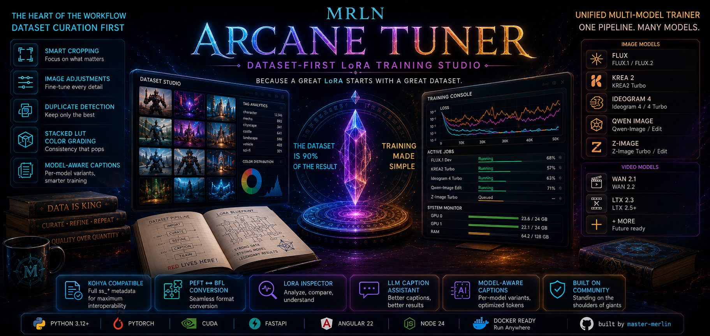

# MRLN Arcane Tuner



> **Dataset-first LoRA training studio** — because a great LoRA starts with a great dataset.

`v0.7.9-beta` · PyTorch 2.12.1 local / 2.11.0 container · CUDA 13.0 local / 12.8 container (+cu126 fallback) · Angular 22 · Node 24 · FastAPI

**Author:** [master-merlin](https://github.com/master-merlin) · **Repository:** [github.com/master-merlin/mrln-arcane-tuner](https://github.com/master-merlin/mrln-arcane-tuner)

---

## Why This Exists

Every LoRA trainer will tell you: **the dataset is 90 % of the result**. Yet most training tools treat dataset management as an afterthought — a folder of images you dump somewhere and hope for the best.

MRLN Arcane Tuner started as a personal experiment to fix that. The goal was simple: build a workflow where dataset curation is the **heart and center** of the process, not a chore you skip through to get to training. From smart cropping and image adjustments to duplicate detection and stacked LUT color grading — the dataset pipeline is where most of the R&D effort lives.

The training engine, job management, and LoRA tools grew organically around that core — because once your data is good, training should be straightforward.

---

## Acknowledgments

This project wouldn't exist without the incredible open-source community that pioneered LoRA training for diffusion models. A sincere thank you to:

- **[kohya-ss](https://github.com/kohya-ss/sd-scripts)** — Pioneered the entire LoRA training ecosystem. The Kohya metadata format (`ss_*` keys) is the de-facto standard for LoRA checkpoint interoperability, and MRLN Arcane Tuner writes these keys for full compatibility with ComfyUI, A1111, and other inference tools.
- **[Ostris](https://github.com/ostris/ai-toolkit)** — The Ideogram 4 driver's Qwen3-VL feature extraction is a faithful port of ai-toolkit's `get_qwen3_vl_features` (MIT License), and the `diffusion_model.` LoRA key convention this project saves in is ai-toolkit's. Credited in [`ideogram4/driver.py`](backend/app/engine/models/families/ideogram4/driver.py); full licence text in [`NOTICE`](NOTICE).
- **[Nerogar](https://github.com/Nerogar/OneTrainer)** — Inspiration for the unified multi-model trainer architecture that supports multiple model families through a single pipeline.
- **[Hugging Face / diffusers](https://github.com/huggingface/diffusers)** — Key mapping logic for PEFT-to-BFL LoRA conversion is derived from `lora_conversion_utils.py`. Credited in [`flux2/saver.py`](backend/app/engine/models/families/flux2/saver.py).
- **[rockerBOO / lora-inspector](https://github.com/rockerBOO/lora-inspector)** — Inspiration for the LoRA inspection tooling (format detection, weight statistics, layer analysis). Credited in [`lora_tools.py`](backend/app/engine/utils/lora_tools.py).
- **[NyxAwroo / IMG-Dataset-Refiner](https://github.com/NyxAwroo/IMG-Dataset-Refiner)** — Inspiration for the model-aware caption workflow — per-model caption variants, architecture-aware token budgets, tag analytics, and LLM-assisted caption refinement.

> **Note:** MRLN Arcane Tuner is a personal experiment and is **not intended to compete** with any of these projects. They are community pillars. This tool simply explores a different angle — dataset quality first.

---

## Installation

### Prerequisites

| Requirement   | Version              | Notes                     |
| ------------- | -------------------- | ------------------------- |
| Python        | 3.12+                | With `venv` support       |
| NVIDIA GPU    | Ampere+ (RTX 30xx)   | CUDA 13.0 (driver R580+); see container note below for cloud hosts |
| Node.js       | 24+ (LTS)            | Required by Angular 22 / TS 6 |
| npm           | 10+                  | Comes with Node.js        |

### Scripted Install (Recommended)

The install scripts create a virtual environment, install PyTorch with CUDA support, and install all Python dependencies.

**Windows:**
```cmd
cd backend
install.bat
```

**Linux / macOS:**
```bash
cd backend
chmod +x install.sh
./install.sh
```

Then install the frontend:
```bash
cd frontend
npm install
```

### Manual Install

```bash
# 1. Create and activate a virtual environment
cd backend
python -m venv venv
# Windows: venv\Scripts\activate
# Linux:   source venv/bin/activate

# 2. Install PyTorch with CUDA 13.0 (local dev; needs an R580+ driver).
#    The published container ships CUDA 12.8 (cu128, Blackwell-capable) with a
#    cu126 fallback for older host drivers — see "Run as a container" below.
pip install torch==2.12.1 torchvision==0.27.1 \
    --index-url https://download.pytorch.org/whl/cu130

# torchaudio has no 2.12-series wheel yet (maintenance mode) and its own
# metadata pins torch==2.11.0, so it must be installed --no-deps or pip would
# downgrade torch back to 2.11.0.
pip install torchaudio==2.11.0 --no-deps \
    --index-url https://download.pytorch.org/whl/cu130

# 3. Install remaining Python dependencies. torch/torchvision/torchaudio
#    (installed above) and three packages whose declared metadata is wrong must
#    be excluded from this bulk install and added back with --no-deps:
#    scenedetect (its GUI opencv-python dep would clobber the pinned
#    opencv-python-headless), sam3 (a stale huggingface-hub<1.0 ceiling), and
#    hpsv2 (its pytest dev deps leaked into its install requirements and would
#    abort the resolve against our own pytest pin). grep -v filters them out
#    the same way install.sh does.
#    Windows users: skip this bash step and run backend\install.ps1 or
#    backend\install.bat instead, which do the equivalent filtering natively.
grep -ivE '^[[:space:]]*(scenedetect|sam3|hpsv2|torch|torchvision|torchaudio)([[:space:]=<>!~#]|$)' \
    requirements.txt > /tmp/requirements.filtered.txt
pip install -r /tmp/requirements.filtered.txt
for pkg in scenedetect sam3 hpsv2; do
    pip install --no-deps "$(grep -iE "^[[:space:]]*${pkg}[[:space:]]*==" requirements.txt | sed -E 's/#.*$//' | tr -d '[:space:]')"
done

# 4. Install frontend dependencies
cd ../frontend
npm install
```

### Starting the Application

**Backend:**
```cmd
cd backend
start_backend.bat          # Windows
./start_backend.sh         # Linux / macOS
```

The backend creates required directories (`datasets/`, `models/`, `models/upscale/`, `outputs/`) and a default `settings.json` on first launch.

**Frontend:**
```bash
cd frontend
npm run start
```

Or enable **auto-start** in Server Settings — the backend will launch the frontend and open your browser automatically on first start.

The frontend runs on `http://localhost:4200` by default. Both ports are configurable in Server Settings.

### Updating an existing install

```cmd
update.bat                 :: Windows
.\update.ps1               :: Windows (PowerShell)
./update.sh                # Linux / macOS
```

Pulls the latest `main`, then brings your installed dependencies back in line
with it — reinstalling backend packages if `requirements.txt` moved, running
`npm ci` if the frontend lockfile moved, and rebuilding the SPA if this install
serves a built one.

It compares **what is installed against what the checkout declares**, rather
than looking at what a given pull happened to change, so it also repairs drift
from any other cause — a branch switch, an interrupted install, or simply
having skipped a few releases.

| | |
|---|---|
| `--check` | report what is out of date and change nothing (exit 1 if anything is) |
| `--no-pull` | skip git; only bring dependencies in line with the checkout you have |
| `--build` / `--no-build` | force or skip the production frontend build |

It will stop rather than touch a working tree it does not own: it refuses if you
have uncommitted changes, and only ever fast-forwards — it will not merge,
reset or stash. If your branch has diverged from `origin`, that is left to you.

**Inside the container, use the in-app updater instead** (Server Settings →
Update). The container owns its own checkout and restarts itself once running
tasks have drained; the script detects the container and stops rather than
having two updaters write to one checkout.

---

## Run as a container on RunPod

The app ships as a single Docker image that serves the API, the WebSocket log
stream, media, and the Angular UI **from one port over HTTPS**. RunPod is the
example provider here, but the same image works on any host with an HTTPS
ingress proxy.

### How it works

- One `uvicorn` process serves everything at one origin: `/` (UI), `/api`,
  `/api/ws`, `/media`. The frontend uses **same-origin** URLs, so it works
  behind RunPod's per-port proxy with zero config.
- **HTTPS is handled by RunPod's proxy** (Cloudflare terminates TLS). The
  container itself only serves plain HTTP on `0.0.0.0` — no certificates to
  manage.
- Persistent data (SQLite DB, datasets, models, outputs) lives on a mounted
  volume so it survives pod restarts.

### 1. Get the image

The published image is on Docker Hub — you can use it directly, no build
required:

```
mastermerlin/mrln-arcane-tuner:latest             # rolling latest (CUDA 12.8 / cu128)
mastermerlin/mrln-arcane-tuner:0.7.9-beta        # pinned version (CUDA 12.8 / cu128)
mastermerlin/mrln-arcane-tuner:0.7.9-beta-cu126  # fallback for legacy R560–R565 drivers
```

The default image bundles **CUDA 12.8 (cu128) · PyTorch 2.11.0 · Python 3.12**
(runtime) and a **Node 24 / Angular 22** production build of the UI. cu128 ships
**Blackwell (sm_120/sm_100)** kernels plus Hopper/Ada/Ampere, and needs an
**R570+** host driver — which Blackwell cards require anyway, so it covers the
whole modern fleet. The `-cu126` tag is for older hosts pinned to **R560–R565**
drivers (no Blackwell support).

> **"no kernel image is available for execution on the device"** on a Blackwell
> card (e.g. RTX PRO 6000) means you're on an older cu126 image — pull `latest`
> (cu128).

**Building your own** (only needed if you've modified the code). The CUDA target
is parameterized via build args (default cu128):

`GIT_SHA` is **required** — the image is built from a specific commit rather
than from whatever the branch points at, so two builds of the same tag contain
the same code and the image records which. A build without it fails immediately
rather than quietly tracking a moving branch.

```bash
SHA=$(git rev-parse HEAD)   # the full 40-char commit; a short sha is refused

# Primary (cu128 — Blackwell + modern fleet). Tag with version and latest.
docker build --build-arg GIT_SHA="$SHA" \
    -t mastermerlin/mrln-arcane-tuner:0.7.9-beta -t mastermerlin/mrln-arcane-tuner:latest .
docker push mastermerlin/mrln-arcane-tuner:0.7.9-beta
docker push mastermerlin/mrln-arcane-tuner:latest

# Fallback (cu126 — legacy R560–R565 drivers).
docker build --build-arg GIT_SHA="$SHA" \
    --build-arg CUDA_BASE=12.6.3 --build-arg TORCH_CUDA=cu126 \
    -t mastermerlin/mrln-arcane-tuner:0.7.9-beta-cu126 .
docker push mastermerlin/mrln-arcane-tuner:0.7.9-beta-cu126
```

The commit must already be **pushed to the remote** — the build clones it, so a
local-only commit fails the build rather than baking in code nobody else can
retrieve.

**Ollama** (the optional caption-refinement sidecar) is installed by piping
`ollama.com/install.sh` into a root shell, which is an **unpinned third-party
script executing at build time**. For a build you intend to publish, pin it:

```bash
# Get the digest once, then pass both — one without the other is refused.
curl -fsSL https://github.com/ollama/ollama/releases/download/<tag>/ollama-linux-amd64.tgz | sha256sum
docker build --build-arg GIT_SHA="$SHA" \
    --build-arg OLLAMA_VERSION=<tag> --build-arg OLLAMA_SHA256=<digest> ...
```

`--build-arg INSTALL_OLLAMA=0` skips it entirely; the app starts fine without
it and simply reports the sidecar as disabled.

**The container runs as UID 10001, not root.** The entrypoint starts as root
only long enough to take ownership of the mounted data volume, then drops. If
you mount a volume whose contents are owned by a different UID, files created by
an earlier root-run container may need `chown -R 10001:10001` once.

### 2. Create the pod on RunPod

- **GPU:** any NVIDIA Ampere+ GPU, **including Blackwell** (RTX 50xx / RTX PRO
  6000 Blackwell). The default image is built for **CUDA 12.8** (cu128) and
  needs an **R570+** host driver — standard on current cloud hosts and mandatory
  for Blackwell anyway. On a legacy host stuck on **R560–R565**, use the
  `:0.7.9-beta-cu126` tag instead (no Blackwell support). Avoid CUDA 13 in the
  container: it needs R580+ and its forward-compat layer breaks cuBLAS on older
  drivers.
- **Container image:** `mastermerlin/mrln-arcane-tuner:latest`
- **Volume (strongly recommended):** attach a **network volume mounted at
  `/workspace`**. The SQLite DB, `datasets/`, `models/`, `outputs/`, **and the
  Hugging Face cache** (`hf-cache/`) are stored there, so base models /
  encoders download only once and your work survives restarts. *Without a
  volume the container runs but all data — including multi-GB model downloads —
  is lost when the pod stops.*
- **Expose HTTP port:** add `8000` to the pod's **Expose HTTP Ports** field.
- **Environment variables:**

  | Variable | Purpose | Default |
  |---|---|---|
  | `MRLN_AUTH_TOKEN` | Require this token to access the app. **Required in the container** — see the breaking-change note below. | _unset — the container will not start_ |
  | `MRLN_BIND_HOST` | Address to serve on. The container needs `0.0.0.0` to be reachable at all; local installs default to loopback. | `0.0.0.0` (container) |
  | `PORT` | Internal port (match the exposed HTTP port). | `8000` |
  | `MRLN_DATA_DIR` | Persistence root (DB, datasets, models, outputs, HF cache). | `/workspace` |
  | `HF_TOKEN` | Hugging Face token — set it if you train/pull **gated** models (e.g. some FLUX weights). | _unset_ |
  | `HF_HOME` | Hugging Face cache location. Auto-set to `$MRLN_DATA_DIR/hf-cache` so downloads persist on the volume — only override to relocate the cache. | `/workspace/hf-cache` |
  | `CUDA_VISIBLE_DEVICES` | Pin a specific GPU on multi-GPU pods. | _all_ |

### 3. Open the app

RunPod exposes the port at:

```
https://[POD_ID]-8000.proxy.runpod.net
```

Open it; you'll get a sign-in page — enter the token once and a cookie keeps
you signed in.

> ### ⚠ Breaking change in this release: the container needs `MRLN_AUTH_TOKEN`
>
> Earlier versions started an **unauthenticated** server on `0.0.0.0` when
> `MRLN_AUTH_TOKEN` was unset. On a RunPod pod that proxy URL is public, so
> anyone who guessed it had full control of your datasets, models and GPU — and
> nothing said so.
>
> The app now **refuses to start** when it is bound to an address other machines
> can reach and no token is set. If a pod that used to work stops with a message
> naming `MRLN_AUTH_TOKEN`, that is this change, and the fix is in the message:
>
> * set `MRLN_AUTH_TOKEN` to a long random string (what you want on RunPod), **or**
> * set `MRLN_BIND_HOST=127.0.0.1` for a private, machine-local run.
>
> **Local installs are unaffected in normal use:** `start_backend` now binds
> loopback by default instead of `0.0.0.0`, so it starts with no token as
> before. It used to publish an open server onto every network you joined,
> including untrusted wifi. To reach a local install from another machine, set
> both `MRLN_AUTH_TOKEN` and `MRLN_BIND_HOST=0.0.0.0`.

### Notes & caveats

- **Proxy timeout:** RunPod's Cloudflare proxy closes any single request that
  takes longer than ~100 seconds. The log WebSocket and normal API calls are
  fine; training runs server-side and is unaffected. Very large single uploads
  through the proxy can hit this limit — for big datasets, place them on the
  `/workspace` volume directly.
- **GPU selection:** the app auto-detects the GPU. To pin one on a multi-GPU
  pod, set `CUDA_VISIBLE_DEVICES`.
- **Other providers:** any platform that exposes a container HTTP port over
  HTTPS works — point its ingress at port `8000` and (optionally) set
  `MRLN_AUTH_TOKEN`.

---

## Architecture

MRLN Arcane Tuner is a full-stack application with a FastAPI backend and an Angular frontend connected via REST API and WebSocket.

```
┌──────────────────────────────────────────────────────┐
│                  Angular 22 SPA                      │
│    43 Standalone Components · Signals · Tailwind     │
└──────────────────┬────────────────┬──────────────────┘
                   │ REST           │ WebSocket
┌──────────────────┴────────────────┴──────────────────┐
│                FastAPI Backend                       │
│    9 Route Domains · Structured Logging · Middleware │
├─────────────┬────────────┬───────────┬───────────────┤
│ Dataset     │ Training   │ AI        │ System        │
│ Manager     │ Engine     │ Services  │ Settings      │
├─────────────┴────────────┴───────────┴───────────────┤
│          PyTorch · Diffusers · PEFT · SQLite         │
└──────────────────────────────────────────────────────┘
```

For the full component and API route inventory, see [`docs/ARCHITECTURE.md`](docs/ARCHITECTURE.md).

---

## Features

### 🎯 Dataset Management — The Heart of the Tool

The dataset pipeline is designed to get your images from raw collection to training-ready with maximum control. See [`docs/datasets-guide.md`](docs/datasets-guide.md) for the full storyline: Library, Browse, Details, Analyze, and the mass caption/mask/edit modals.

#### Multi-Dataset Scanning
Automatic directory scanning with image–caption pairing. Supports `.png`, `.jpg`, `.webp` images with paired `.txt` caption files. Incremental and full rescan modes.

#### Cover Image
The library card and workspace details footer both need one representative image, and by default that's just whatever the scanner enumerates first. A pin control (left of *Adjust image* in a grid tile's top-right cluster, left of *Adjust* in the details footer) lets you choose it instead — it's a toggle, so unpinning re-elects the automatic choice immediately. The pin is persisted (`datasets.preview_pinned`, `PUT /datasets/{name}/preview`) and **survives a rescan** — every scan used to overwrite the cover with the next enumerated file, which is what made pinning worth having in the first place. If the pinned file is later deleted, the next scan clears the pin and falls back rather than showing a hole. Library and workspace-grid covers are served from a sized thumbnail rendition, not the full training source.

#### Image Manipulation
A non-destructive adjustment pipeline, twelve operations deep, that renders into
a saved overlay rather than touching the source file until you explicitly
Save, Bake in, or apply it to other images ("Mass edit"):

| Stage                | Controls                                                                  |
| -------------------- | -------------------------------------------------------------------------- |
| White Balance         | Temperature / tint                                                        |
| Curves                | Per-channel Bézier curves (master + individual R/G/B)                     |
| Color & Tone          | Hue rotation, saturation, contrast                                        |
| HSL                   | Selective hue/saturation/lightness control per color range                |
| Sharpen               | Unsharp mask / kernel / high-pass, with radius, amount and threshold      |
| Vignette              | Amount, midpoint, feather, circular or rectangular shape                  |
| Lens                  | Barrel distortion and vertical/horizontal keystone correction, auto-crop  |
| Stacked LUT           | Apply `.cube` LUT files, tetrahedral interpolation, adjustable strength   |
| Color Match           | Match tone/color to a reference image (CDF or wavelet method); always applies first, not reorderable |

Three further stages run a model rather than a formula, so results can vary
run to run — Denoise, Face Restore and Upscale (restoration/upscale models
you supply, tile-based). Every enabled operation is individually toggleable
and drag-reorderable (except Color Match). Cropping is a **separate,
destructive** editor — it changes the image's aspect-ratio bucket, so it is
not part of this pipeline.

All adjustments include a real-time canvas preview with live histogram visualization.

#### Smart Cropping
Resolution-aware aspect-ratio bucketing with visual crop preview. Images are automatically grouped into optimal width×height buckets (divisible by 32) matching your target training resolutions.

**Bucketing modes:**
- **Kohya**: Each image appears in one bucket (closest aspect ratio match)
- **Multi**: Each image appears in every qualifying bucket for maximum latent diversity

#### Dataset Analysis
- **Harmonize files** — canonical JPG conversion + `<slug>_00001` renaming, with
  captions/masks/controls following along; pixels are untouched
- **Duplicate detection** — perceptual hash similarity scoring to find near-duplicate images
- **Per-image enable/disable** — toggle individual images in or out of training without deleting them

#### Versioning & Caching
Dataset version bumping invalidates latent and text embedding caches, ensuring training always uses current image state. Cache admin UI lets you inspect and purge cached data.

#### Neural Upscaling
Tiled neural upscaling using ESRGAN and SwinIR models for images that need higher resolution before training.

---

### 📁 Projects
Group the datasets, templates and job history for one LoRA effort so you stop re-picking the same dataset and re-configuring the same training settings for every run. A project scopes its own branched caption/mask/training/adaptive-targeting templates (independent copies of the global ones), links existing datasets without moving files, and exposes a three-step Quick Train flow for launching a run without leaving the page. Export bundles a project's templates and datasets (embed / reference / exclude, chosen per dataset) into one portable zip; the same import wizard detects whether a zip is a dataset, a template bundle or a full project. See [`docs/projects-guide.md`](docs/projects-guide.md).

---

### 🧩 Templates
A saved configuration you reuse instead of re-deciding it every time — a caption system prompt, masking parameters, a training config per model definition, or a set of adaptive-targeting knobs. Created where you tune it (the Datasets tab's caption/masking settings, the Training screen's Template Selection and Adaptive Layer Targeting cards) and listed together on one `/templates` screen, Global or scoped to a project, with per-row edit / edit-JSON / branch / delete plus export and import (single template or a filtered bundle, with an import plan that flags name clashes and missing model definitions first). See [`docs/templates-guide.md`](docs/templates-guide.md).

---

### 🤖 AI Services

Integrated AI models for automated dataset annotation, running as GPU-backed batch services:

#### Auto-Captioning
| Model               | Specialty                                                                           |
| ------------------- | ----------------------------------------------------------------------------------- |
| **Florence-2**      | Fast, reliable descriptions. Multiple detail levels.                                |
| **JoyCaption Beta** | 12 caption types (descriptive, prompt-style, tag lists). Extensive control options. |
| **Qwen3-VL**        | Large vision-language model for nuanced descriptions. Configurable variant (4B/8B). |
| **Youtu-VL**        | Tencent's vision-language model with fine-grained parameter control.                |

All models support batch processing with real-time progress, custom system prompts, and per-model template management.

#### Auto-Masking
| Model       | Approach                                                                                          |
| ----------- | ------------------------------------------------------------------------------------------------- |
| **SAM 3**   | Text-prompted segmentation (Meta's Segment Anything). Multi-mask output.                          |
| **RemBG**   | Background removal with 15+ model variants (BiRefNet, ISNet, U2Net, BRIA). Alpha matting support. |

Supports batch mass-apply across entire datasets.

---

### ⚙️ Training Configuration

Training is configured through a **dynamic JSON Schema-driven UI** — the form auto-generates from model-family definitions, so new fields appear automatically without frontend code changes. See [`docs/training-guide.md`](docs/training-guide.md) for the full storyline: picking a model, attaching datasets, reading the VRAM estimate, Adaptive Layer Targeting, and every field on the form grouped as the screen groups them.

#### Supported Model Families

**29 families, 54 shipped definitions.** A *family* is an architecture with its own loader, driver, trainer, sampler and saver; a *definition* is one concrete checkpoint of it, declared in YAML. Archetypes, capability flags and the shared support packages are in [ARCHITECTURE.md](docs/ARCHITECTURE.md#model-families).

This table is generated from `backend/app/engine/models/families/` and pinned by `backend/tests/test_readme_family_table.py`, so a family added without a row here fails the gate. It listed three of twenty-eight until 2026-08-28 — there is no text-encoder column because populating it accurately for every family means reading every loader, and twenty-five blanks would say less than no column at all.

**Image — 20 families**

| Family | Definitions shipped |
| --- | --- |
| `boogu_image` | Boogu-Image 0.1 Base · Boogu-Image 0.1 Edit · Boogu-Image 0.1 Turbo |
| `chroma` | Chroma1 Base · Chroma1 HD |
| `dreamlite` | DreamLite Base · DreamLite Mobile |
| `ernie_image` | ERNIE Image (Base 8B) |
| `flux1` | FLUX.1 Dev · FLUX.1 Kontext Dev · FLUX.1 Schnell |
| `flux2` | Flux 2 (Dev) · Flux 2 (Klein Base 4B) · Flux 2 (Klein Base 9B) |
| `hidream_o1` | HiDream-O1-Image (Full) |
| `ideogram4` | Ideogram 4 (fp8, 9.3B) |
| `krea2` | Krea-2 Raw · Krea-2 Turbo |
| `longcat_image` | LongCat-Image |
| `lumina2` | Lumina-Image 2.0 |
| `microsoft_lens` | Microsoft Lens (Base 3.8B) |
| `nucleus_image` | Nucleus-Image |
| `omnigen2` | OmniGen2 |
| `ovis_image` | Ovis-Image 7B |
| `prx` | PRX 512 T2I (SFT) |
| `prx_pixel` | PRX Pixel T2I |
| `qwen_image` | Qwen-Image 2512 · Qwen-Image-Edit 2509 · Qwen-Image-Edit 2511 |
| `sdxl` | Illustrious-XL v2.0 · NoobAI-XL v1.1 · Stable Diffusion XL Base |
| `zimage` | Z-Image Base · Z-Image De-Turbo (ostris) |

**Video — 8 families**

| Family | Definitions shipped |
| --- | --- |
| `bernini_r` | Bernini-R 14B (Video Edit, MoE) · Bernini-R 1.3B (Video Edit) |
| `hunyuan_video15` | HunyuanVideo 1.5 480p I2V · HunyuanVideo 1.5 480p T2V |
| `kandinsky5` | Kandinsky 5.0 I2V Pro SFT 5s · Kandinsky 5.0 T2V Lite SFT 5s |
| `ltx2` | LTX 2.3 (Lightricks) · LTX 2.5 (Lightricks) |
| `minimax_h3` | MiniMax H3 (text → video+audio) · MiniMax H3 (first/last frame → video+audio) · MiniMax H3 (reference → video+audio) — **not selectable in this release:** the family ships as a scaffold (loader, video contract, vendored model classes) and training lands in a later one, so the three definitions are gated out of the model pickers |
| `wan21` | WAN 2.1 I2V 14B 720P · WAN 2.1 I2V 14B 480P · WAN 2.1 T2V 14B · WAN 2.1 T2V 1.3B |
| `wan22` | WAN 2.2 I2V A14B (MoE) · WAN 2.2 T2V A14B (MoE) |
| `wan22_ti2v_5b` | WAN 2.2 TI2V 5B (Dense) |

**Audio — 1 family**

| Family | Definitions shipped |
| --- | --- |
| `ace_step15` | ACE-Step 1.5 (Turbo) · ACE-Step 1.5 XL (Base) |

#### 🧪 Experimental: Edit (Paired) & Video Training

> ⚠️ **Available but experimental.** These features ship and pass the test
> suite, but are still being validated on real end-to-end training runs. Treat
> results as beta-quality and expect rough edges.

- **Edit / paired-image training** — two-image (control → target) edit datasets
  and captioning for instruction-edit models (Flux.1 Kontext, Qwen-Image-Edit):
  paired-pair production, two-image VLM captioning, and edit-aware training.
- **Video training** — LoRA training for video diffusion models: **WAN 2.1**
  (T2V / I2V), **WAN 2.2** (dual high/low-noise experts, single-run
  auto-switch, dual LoRA output), and **LTX 2.3** (T2V / I2V, optional joint
  audio). Backed by a video dataset-curation layer: lazy clip preview,
  LosslessCut cutlist import, scene-detect auto-split, non-destructive in-app
  trim, per-clip health checks, and multi-frame auto-captioning.

#### Optimizers

MRLN Arcane Tuner supports a wide range of optimizers, from proven defaults to cutting-edge research:

**Standard (Adam-family):**
- **AdamW** / **AdamW8bit** — Reliable baselines. 8bit variant uses ~50% less optimizer VRAM.
- **RAdam** — Automatic variance-based warmup, no manual warmup steps needed.
- **StableAdamW** — RMS-based gradient scaling eliminates need for gradient clipping.

**Adaptive Learning Rate:**
- **Prodigy** — Automatically discovers optimal LR. Set learning rate to `1.0`.
- **ProdigyPlusSF** — Prodigy + Schedule-Free + factored second moments. Features cautious updates, OrthoGrad, FOCUS, SPEED, and per-group step size adaptation. Lowest memory overhead of the adaptive optimizers.

**Memory-Efficient:**
- **Lion** — Sign-based, ~50% less state memory than AdamW.
- **Adafactor** — Factored second moments for extremely low memory on large models. Supports relative step scaling.

**Second-Order:**
- **SophiaH / SophiaG** — Hutchinson trace / Gauss-Newton Hessian approximation. Faster convergence on some tasks. ⚠️ High VRAM — may OOM on 9B+ models.
- **Shampoo** — Kronecker-factored preconditioned gradients. ⚠️ High VRAM.

**Advanced:**
- **AdEMAMix** — Dual EMA (fast β1 + slow β3) for long-horizon convergence.

#### Timestep Sampling Strategies

| Strategy           | Best For                                                                                                             |
| ------------------ | -------------------------------------------------------------------------------------------------------------------- |
| **logit_normal**   | Default for flow matching (Flux). Mid-range focus.                                                                   |
| **uniform**        | Equal probability baseline.                                                                                          |
| **sigmoid**        | Simplified logit-normal with fixed parameters.                                                                       |
| **cosmap**         | Cosine-mapped smooth distribution.                                                                                   |
| **mode**           | Configurable mid-range emphasis.                                                                                     |
| **flux_shift**     | Resolution-dependent shifting. Original Flux recipe.                                                                 |
| **radc**           | Resolution-Aware Dynamic Curriculum. Progressive coarse-to-fine learning. Best for multi-phase curriculum training.  |

**RADC** is a standout feature — it progressively shifts the noise focus from high-noise (learning structure and composition) to low-noise (refining details and textures) over the course of training, with optional resolution-aware weighting for multi-resolution datasets.

#### Adaptive LoRA Layer Targeting
Periodically measures how much each LoRA module's effective weight is still changing (an EMA-smoothed, windowed norm) and freezes the ones that have stopped moving, so late-stage updates are confined to the modules still learning. **Off by default.**

Selection runs **per projection group** — every block's `to_v` is ranked against the other `to_v`s, never against the feed-forward projections. Raw ‖ΔW‖² is not comparable across matrix shapes: under grouped-query attention a `to_v` delta has an order of magnitude fewer elements than an `ff.gate` delta, so a single global ranking would retire the entire text-conditioning pathway on shape alone. Each group also carries its own share of the `min_active_pct` floor, so no pathway can be eliminated wholesale.

**This is a regularizer, not a speedup — it does not reduce step time.** Freezing pins a module's learned delta; it does not remove the module. The forward pass is unchanged by design: a frozen module's delta is part of the model, and dropping it would silently revert what that module learned. The backward pass still runs through every block down to the earliest module that is still active, and since the modules that keep learning are usually spread across the full depth, there is rarely a cold prefix for autograd to skip. What you gain is capacity control — fewer modules can absorb new information during the phase where a LoRA is most prone to memorizing training specifics. Note also that freezing stops *further* drift in a module; it never walks back drift that already happened.

Two action modes: **freeze** flips `requires_grad` in place; **rebuild** additionally checkpoints and relaunches the same job with the optimizer rebuilt over only the kept parameters, reclaiming optimizer-state VRAM you can then spend on batch size or resolution. In both modes every checkpoint and the exported LoRA still contain all modules.

Conservative / Balanced / Aggressive presets are fully editable and save as your own templates. The narrowing is plotted live on the training curve and summarized afterward in Training Stats, which lists the earliest still-active block per event — the number that tells you whether any backward work could have been skipped at all. Watch `min_active_pct` too: once the active set reaches that floor, later events are no-ops.

#### LoRA Parameters
- **Network rank** (dim): 4–128+. Controls adapter capacity. Rank 16 is a solid default.
- **Network alpha**: Scaling factor for LoRA influence. Start with `alpha = rank / 2`.
- **Targeted layers**: Select specific transformer blocks to receive LoRA adapters — train only the layers that matter for your concept.

#### VRAM Management
- **Model quantization**: FP8, NF4, INT8, INT4 for the frozen base model
- **Text encoder quantization**: Independent quantization for TEs
- **Gradient checkpointing**: ~30–50% VRAM reduction at ~20–30% speed cost
- **Block swapping**: Granular per-block CPU offloading with adjustable percentage
- **VAE / TE offloading**: Move inactive components to CPU after caching
- **Latent caching**: Pre-encode images through VAE, cache to disk
- **Text embedding caching**: Cache TE outputs for all captions, unload TE from VRAM

#### Template System
Save, load, and manage training configurations as templates per model definition. Auto-save on job creation.

#### Checkpointing & Resume
Full checkpoint support including LoRA weights, optimizer state, scheduler, GradScaler, EMA shadow weights, and latent/embedding cache manifests. Resume training with selective cache re-use.

---

### 📊 Job Queue & Monitoring

See [`docs/jobs-guide.md`](docs/jobs-guide.md) for the full storyline: reading a
running job's live metrics and samples, the two-mode Resume dialog, downloading
a finished LoRA, and the cross-run Training Statistics modal.

#### Multi-Job Queue
- Create, start, stop, pause, resume, and soft-stop training jobs
- Soft-stop: finish the current step, save checkpoint, then stop cleanly
- Restart failed or stopped jobs from last checkpoint

#### Real-Time Monitoring
- **Live loss chart** — interactive uPlot chart with loss and learning rate curves
- **Training Curves window** — `All · 1k · 500 · 100` narrows how much of the run the chart shows; it's a view over the data, so the KPI rail (best loss, convergence) stays keyed to the whole run regardless of the window
- **Re-read from disk (`⟳`)** — re-reads the saved curve, including on a running job. The trainer only rewrites `loss_history.json` at the end of a run and flushes `step_metrics` every 50 steps, so a live re-read is accurate to the last flush, not to the instant
- **Adaptive chip** — `Adaptive: n/m layers`, next to the `live` chip, for runs using adaptive layer targeting
- **Elapsed & started-at** — the job header reads `<elapsed> elapsed · started <time>`. Elapsed comes from the trainer, not wall-clock-minus-start: it's real run time (paused time excluded, and the offset from earlier sessions of a resumed run carried forward), so a pause doesn't inflate it and a backend restart doesn't lose it
- **Sample images** — periodic generation previews at configurable intervals
- **Structured logs** — real-time WebSocket streaming of JSON-formatted training events

#### Job History
SQLite-backed persistent tracking of all training runs:
- Full training configuration snapshot
- Step-by-step metrics (loss, LR, ETA)
- Checkpoint locations and metadata
- Final LoRA output paths

---

### 🔍 LoRA Tools

See [`docs/tools-guide.md`](docs/tools-guide.md) for the full storyline:
Inspect's Speed Training Suggestion and per-layer norm graphs, copying a
targeted layer list, and Resize's SVD rank change with the path roots both
tools are restricted to.

#### Inspect
Analyze any `.safetensors` LoRA file without loading a model:

- **Format detection** — Kohya, ai-toolkit (Ostris), PEFT
- **Rank & alpha extraction** — from metadata or weight shapes
- **Per-layer analysis** — Frobenius norms, effective delta W=B@A, magnitude, strength
- **Layer relevance scoring** — identify which layers carry the most learned information
- **Weight statistics** — per-component (UNet, TE) average magnitude and strength
- **Training metadata** — parsed Kohya-style `ss_*` keys (optimizer, LR, schedule, resolution, etc.)
- **Tag frequency** — from `ss_tag_frequency` metadata
- **Block config** — variable per-block rank/alpha detection (DyLoRA-like)

#### Resize
SVD-based rank change (up or down) with proportional alpha scaling. Reconstructs the effective weight delta `W = B @ A`, decomposes via truncated SVD, and re-factors to the target rank.

#### Targeted Layer Training Workflow
Combine **Inspect** results with **Targeted Layer Training** — inspect a reference LoRA to identify which layers learned most, then configure your next training run to target only those layers for more efficient, focused learning.

---

### 🖥️ Server Settings

See [`docs/server-guide.md`](docs/server-guide.md) for the full storyline:
the health KPI rail, restart and in-app updates, Connection/Models settings,
the LLM Refine Endpoint's Save & Test, and the live, filterable Server Logs
card.

- **Backend & frontend port configuration** — set in Server Settings; the backend reads the saved port on its next start (the platform's own port outranks it inside a container)
- **Log level control** — adjust structured logging verbosity at runtime
- **Frontend auto-start** — optionally launch the Angular dev server and open a browser on backend startup
- **System restart** — restart the backend from the UI. Started by `start_backend.bat` or the container entrypoint, the server exits and that same terminal (or container) starts it again, with the SPA reconnecting on its own. Started by hand with `uvicorn`, a launcher restarts it instead, reports progress in that terminal and keeps the full record in `backend/restart.log`. After updating the code, stop a server started by `start_backend.bat` and start the bat afresh once: `cmd` reads a batch file from disk as it runs, so a changed bat must not be restarted from under a running one.
- **GPU monitoring** — real-time GPU utilization and VRAM usage display

---

## Documentation

Per-domain guides, each walking one screen end to end:

- [**datasets-guide.md**](docs/datasets-guide.md) — Library, Browse, Details, Analyze, mass caption/mask/edit
- [**projects-guide.md**](docs/projects-guide.md) — grouping datasets/templates/jobs, Quick Train, export/import
- [**templates-guide.md**](docs/templates-guide.md) — the four template domains and the `/templates` screen
- [**training-guide.md**](docs/training-guide.md) — model selection, the dynamic form, Adaptive Layer Targeting
- [**jobs-guide.md**](docs/jobs-guide.md) — the queue, running-job detail, Training Statistics, job history
- [**tools-guide.md**](docs/tools-guide.md) — Inspect and Resize
- [**server-guide.md**](docs/server-guide.md) — health, restart/update, Connection/Models, Server Logs

Detailed architecture documentation, including full API route inventory and component listing:

- [**ARCHITECTURE.md**](docs/ARCHITECTURE.md) — System architecture, API routes, frontend components, conventions

---

## Author

Created and maintained by **[master-merlin](https://github.com/master-merlin)**.

Repository: **[github.com/master-merlin/mrln-arcane-tuner](https://github.com/master-merlin/mrln-arcane-tuner)** — issues, contributions, and discussion are welcome there.

---

## License

MRLN Arcane Tuner is licensed under the **Apache License 2.0**. The full text is
in [`LICENSE`](LICENSE).

Third-party code vendored into this repository keeps its own licence. Those
attributions — Apache-2.0 and MIT — are listed in [`NOTICE`](NOTICE), together
with the upstream each component came from.

### Model weights are licensed separately — check before you train

MRLN Arcane Tuner ships **no model weights**. It downloads them, on your
instruction, from the upstream repository named in each model definition. Those
weights carry **their own licences, which are not this project's licence**.

Two things vary per model, and they are **independent**, so neither answers the
other:

- **Access** — some repositories are gated: you must accept the terms on
  HuggingFace and set `HF_TOKEN` before a download will succeed.
- **Permitted use** — some weights are non-commercial.

`black-forest-labs/FLUX.1-schnell` shows why the two are separate: it is
Apache-2.0 **and** still gated.

The application does not check, gate, or enforce any of this — it cannot know
your intended use, and the agreement is between you and the model's publisher.
The table below is **information, not enforcement**. Verified against the
HuggingFace model API on 2026-08-25; upstream terms can change, so treat the
model page as authoritative.

**Restricted — read the terms before you train something you intend to sell:**

| Family | Upstream weights | Licence | Access |
|---|---|---|---|
| `ideogram4` | [`ideogram-ai/ideogram-4-fp8`](https://huggingface.co/ideogram-ai/ideogram-4-fp8) | `ideogram-4-non-commercial` — **non-commercial** | open |
| `flux1` | [`black-forest-labs/FLUX.1-dev`](https://huggingface.co/black-forest-labs/FLUX.1-dev) | `flux-1-dev-non-commercial-license` — **non-commercial** | **gated** — you must accept the agreement on HuggingFace first |
| `flux2` | [`black-forest-labs/FLUX.2-dev`](https://huggingface.co/black-forest-labs/FLUX.2-dev) | `flux-non-commercial-license` — **non-commercial** | **gated** |

**Permissive (verified):** `hidream_o1`
([`HiDream-ai/HiDream-O1-Image`](https://huggingface.co/HiDream-ai/HiDream-O1-Image),
MIT) · `sdxl`
([`stabilityai/stable-diffusion-xl-base-1.0`](https://huggingface.co/stabilityai/stable-diffusion-xl-base-1.0),
OpenRAIL++) · `boogu_image`
([`Boogu/Boogu-Image-0.1-Base`](https://huggingface.co/Boogu/Boogu-Image-0.1-Base),
Apache-2.0 as tagged upstream).

**Everything else — check the model page.** The families here draw on roughly
fifty upstream repositories (Wan, Qwen, Kandinsky, LTX-2, ACE-Step, OmniGen2,
Lumina, Chroma, ERNIE, Z-Image, Krea, LongCat, Nucleus, Ovis, PRX, DreamLite,
HunyuanVideo, Bernini-R, Lens and others), each with its own terms, and some
are **gated** or **regionally restricted**. The upstream repository for every
model is named in its definition under
`backend/app/engine/models/families/<family>/definitions/`.

Two things worth being explicit about:

- **A licence on this application grants you nothing regarding a model's
  weights.** They are separate works under separate terms.
- **The terms usually follow through to what you train.** A LoRA trained on
  non-commercial weights is generally still bound by those terms, so if you
  plan to sell or commercially deploy an adapter, check the base model's
  licence *before* you spend the GPU hours, not after.

### Vendored third-party code

Some model families vendor a small amount of upstream Python (a transformer
forward, a scheduler, a cache helper) under
`backend/app/engine/models/families/<family>/vendor/`, because the released
`diffusers` does not carry that architecture. Each file names its upstream and
revision in its header.

**[`NOTICE`](NOTICE) is the authoritative list** of what is vendored and under
whose terms — it is kept in step with the tree, and duplicating it here would
only give the two copies a chance to drift apart.

Third-party dependencies installed from PyPI and npm keep their own licences;
the CI gate publishes an inventory of both on every run.
