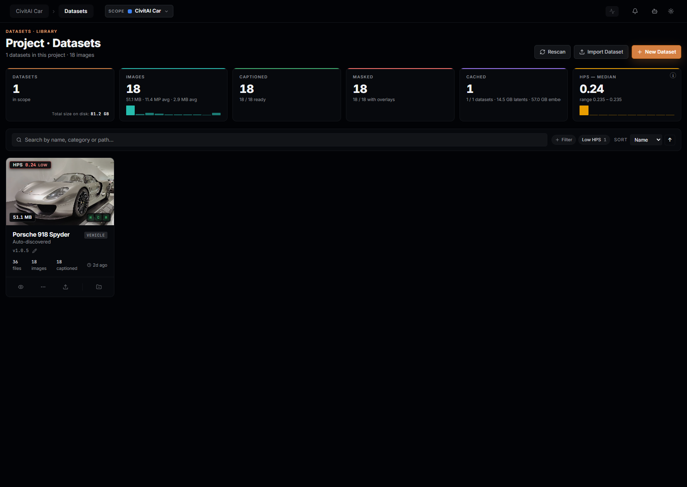
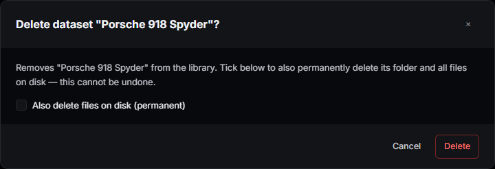
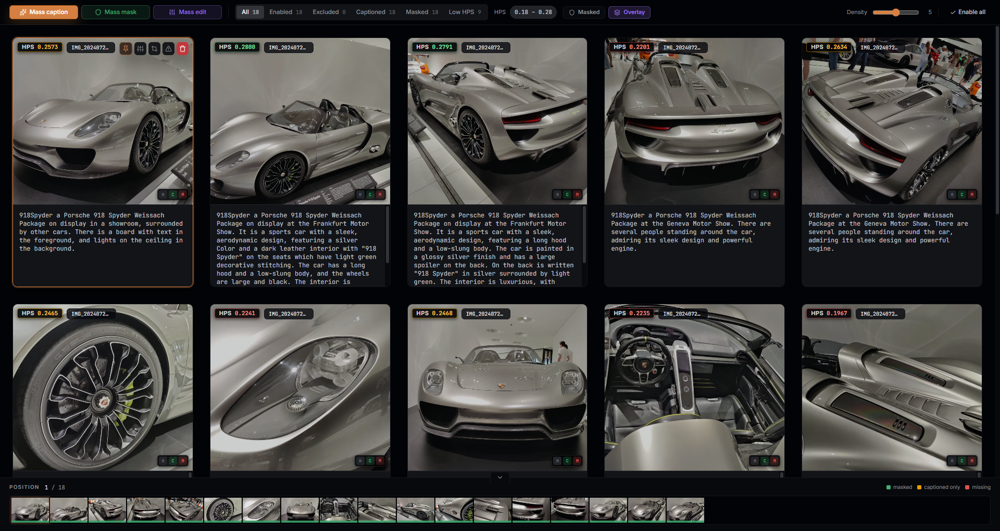
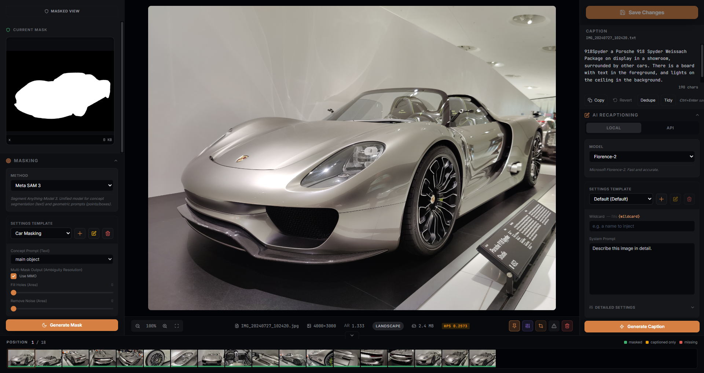
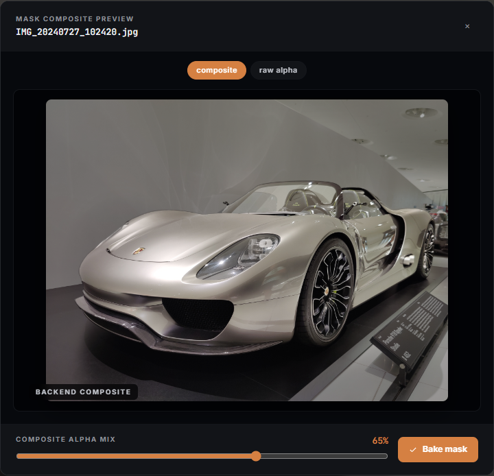
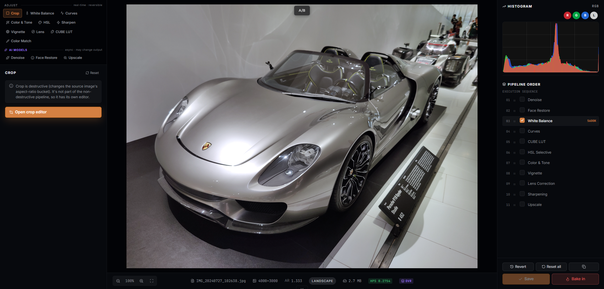
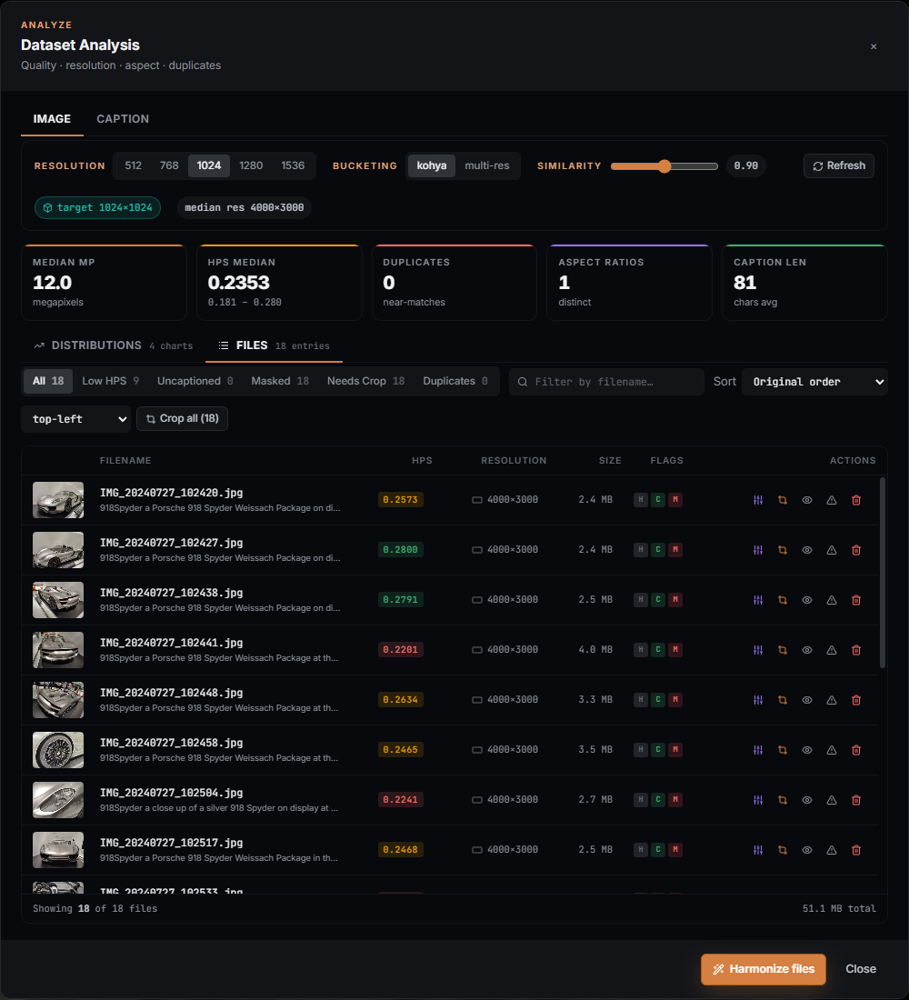
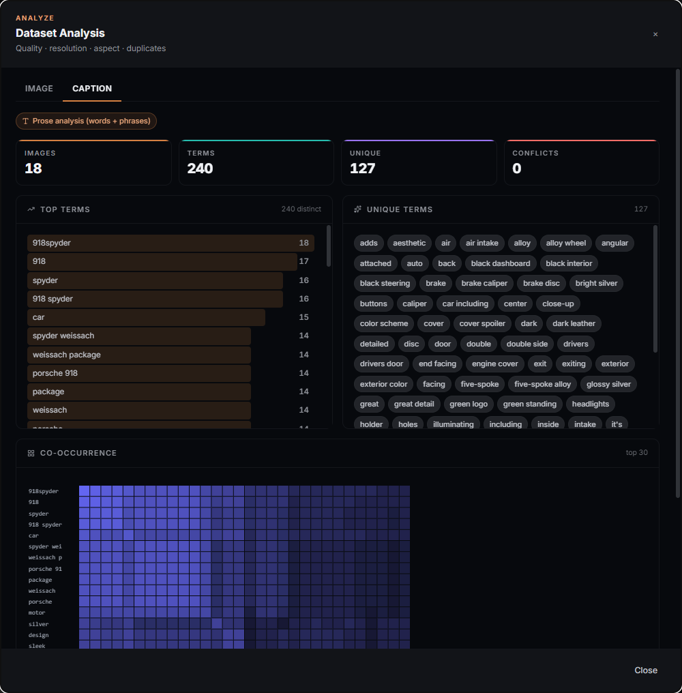
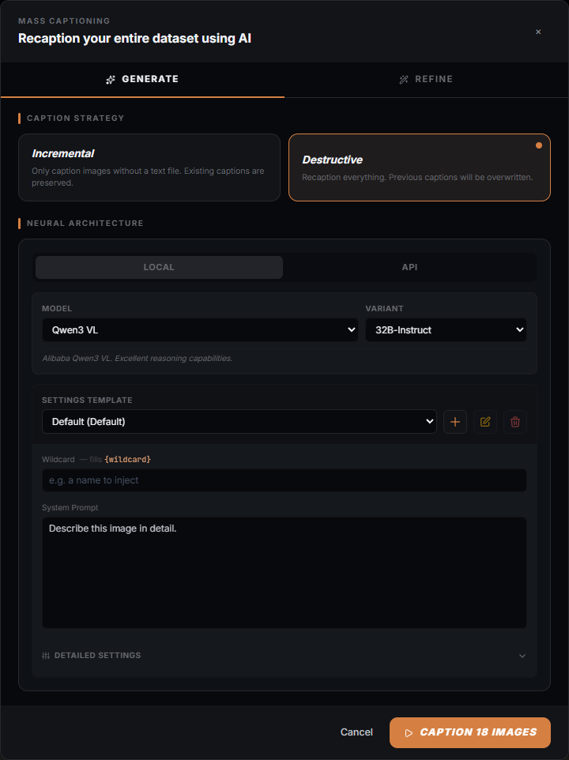
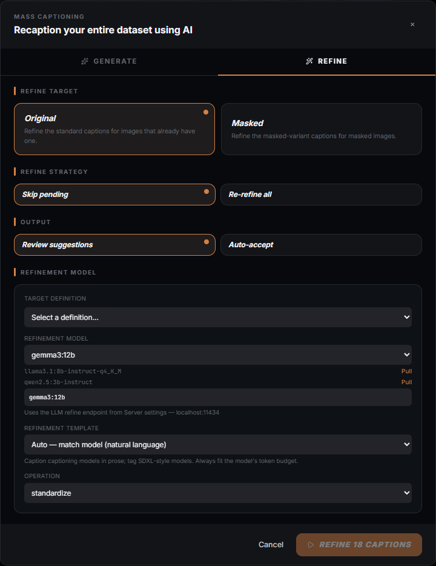

# Datasets

The Datasets tab is where every LoRA starts: bring images (or video, or audio)
into the app, caption them, mask them, score them, fix their color and crop,
and decide which ones are ready to train on. Nothing here touches your files
without telling you first — every operation that rewrites something on disk
says so, and the destructive ones ask you to confirm.

This guide covers the two screens that make up the Datasets tab (the
**Library**, where every dataset lives, and the **Workspace**, where you work
on one dataset at a time) and the modals reachable from both — captioning,
masking, cache administration, the Analyze panel, and the confirm dialogs
that guard anything permanent.

## What you can actually do with it

- Scan a folder of images (or a `.zip`) into a dataset, matching each image to
  its `.txt` caption automatically.
- Generate captions with a local vision model, an OpenAI-compatible API, or
  refine existing captions with a local LLM (Ollama) — one image or the whole
  dataset.
- Generate segmentation masks with SAM 3 (text-prompted) or remove backgrounds
  with RemBG, one image or the whole dataset.
- Apply non-destructive color, tone and restoration adjustments to one image
  (or crop it, destructively, to a target resolution) and copy that same
  adjustment recipe onto many other images ("Mass edit").
- Harmonize a dataset's filenames and file format into a canonical sequence,
  and batch-crop every image to a shared target resolution.
- See where a dataset's quality, resolution and near-duplicates sit, per
  image, before you spend GPU time training on it.
- Track disk usage per model / version / cache type and clear exactly the
  slice you don't need anymore.

## The Library screen

Opens at `/datasets` (the app's default route). The header shows **Dataset
Library** in Global scope, or **Project — Datasets** inside a project scope,
plus the dataset count and image count for the active scope, **Rescan**
/ **Import Dataset** / **New Dataset** buttons and, when the library needs it,
a **Repair cache** banner (see "Thumbnail cache repair" below). There is no
density control here — density only applies to the Workspace Browse grid
(below), one dataset at a time.

### KPI rail

Six tiles, each aggregated over the datasets currently visible (scope +
search + filters all narrow this, so the tiles change as you filter):

- **DATASETS** — count in scope.
- **IMAGES** — total media files across those datasets.
- **CAPTIONED** — total files with a caption.
- **MASKED** — total files with a mask.
- **CACHED** — datasets with a training cache (latents / text embeddings) on
  disk. Its sub-line and the corner "calculating…" state come from
  `GET /datasets/cache/stats`, a whole-library disk sweep the backend answers
  once at startup; while it is running the tile honestly says "calculating"
  rather than showing a placeholder zero.
- **HPS — MEDIAN** — median HPSv2 quality score across visible datasets, with
  a mini-histogram and range. Scores cluster around 0.2–0.3; a score below
  0.27 counts as "low" everywhere in this screen (the Low HPS filter and the
  histogram tone both use that threshold).

### Search, filters and sort

The search box matches name, category, description, trigger word, notes and
tags — whatever you type is checked against all of those, not just the name.

Four smart filter chips appear only when they would match something in the
current scope: **Needs captioning** (at least one uncaptioned image),
**Needs masking** (at least one unmasked image), **Low HPS** (median score
below 0.27), and **Missing** (the dataset's folder or files are gone from
disk — cards in this state also carry a `MISSING` badge). The **+ Filter**
picker adds category or tag chips on top of those. Sort is Name / Created /
Images / HPS, ascending or descending.

### Per-dataset card

Each card shows a cover thumbnail (served from a sized rendition, not the
full training source — the library never round-trips full-resolution images
just to draw a grid), an HPS badge, the dataset's total size on disk, three
readiness pills (**H**armonized / **C**aptioned / **M**asked, each with a
file-count tooltip), its name, category, version tag, and file/image/caption
counts with a "last scanned" timestamp.

A pinned cover (set from inside the workspace) survives a rescan and clears
itself automatically if the pinned file is ever deleted — you never see a
cover pointing at a file that no longer exists.

Hovering a card reveals its action row:

| Action | What it does |
| --- | --- |
| **Open workspace** | Opens the dataset for browsing/captioning/masking/editing (see below). |
| **Add to a project** | Links the dataset into a project without moving or copying files. |
| **Edit metadata** | Opens the dataset form (name, category, trigger word, tags, description, notes) pre-filled. |
| **Rescan files** | Opens the Rescan modal (incremental or full). |
| **Analyze dataset** | Opens the Analyze modal — distributions, near-duplicates, per-file table, Harmonize, Crop all. |
| **Cache administration** | Opens the Cache modal. Disabled ("No cache data") when the dataset has never been cached. |
| **Download as zip** | Streams a plain zip of the dataset's files. |
| **Export (portable zip + metadata)** | One click, no picker — downloads the dataset's own portable archive (see "Move on" below). |
| **Upload images to this dataset** | Adds files to the existing dataset (matches the same import path as drag-and-drop). |
| **Delete from library** | Opens the delete confirm (see below). Rewrites nothing until you confirm. |

Selecting one or more cards (the checkbox in the top-left corner) replaces
the per-card actions with a bulk bar: **Select all**, **Clear**, **Add to
project**, **Rescan** (each selected dataset gets an incremental/"safe"
rescan — bulk always uses the safe mode; a full rescan is a per-dataset
action only), and **Delete** in Global scope (**Remove from project** inside
a project scope).

### Delete — global scope vs. project scope

What "Delete" does depends on where you are. Inside a project scope it only
**removes the dataset from that project** — the dataset and its files are
untouched, and the confirm dialog says so.

In global scope, deleting opens one dialog with an opt-in checkbox instead of
a second confirmation click:

Left unticked, the dataset only disappears from the library (its folder and
files stay on disk — nothing is rewritten). Ticked, the folder and every file
in it are deleted permanently. **This is the one control in the Library
screen that destroys data outside the app's own database**, and the dialog's
wording reflects that.

### New Dataset / Import

**New Dataset** opens the dataset form to create an empty dataset (you add
files afterward). **Import Dataset** accepts a `.zip` either uploaded from
the browser or already sitting on the server's filesystem (path mode); on a
name collision it offers Rename or Overwrite instead of just failing.

#### Dataset form (Create / Edit)

| Field | Accepts | Notes |
| --- | --- | --- |
| **Name** | Letters, digits, space, `-`, `_` | Forbidden characters (`< > : " / \ | ? *`) are rejected inline; the sanitized name is also checked against existing dataset names so `"Foo (bar)"` and `"Foo bar"` are treated as the same folder name. |
| **Type** | Standard / Edit (paired) | Standard = single training images. Edit is for image-edit models (Kontext, Qwen-Edit): a `control/` folder holds the "before" image, matched by filename, and captions describe the edit rather than the subject. |
| **Category** | A standard list (vehicle / person / style / object / landscape), a previously-used category, or a typed custom one | Purely organizational — drives the "+ Filter" category chips. |
| **Trigger word** | Free text, or generated from the dataset name via the wand button | The token baked into captions for LoRA activation. |
| **Tags** | Free-form chips, comma or Enter to confirm | |
| **Description / Notes** | Free text | Notes are meant for training hints (LR, rank, prompt tips) — internal, not used by the trainer. |

### Thumbnail cache repair

If the library's thumbnail cache and the dataset files on disk disagree (a
rename the cache never followed, files removed outside the app), a banner
reports the affected dataset and byte counts. Its **Repair cache** action
adopts renames it can prove (a byte-identical file at a new path) and only
deletes the entries it cannot reconcile — it does not touch your source
images.

## The Workspace

Opened from a dataset's **Open workspace** action, or by clicking a card.
It is an overlay on top of the Library (closing it returns you to the same
scroll position), not a separate route.

The top bar shows the dataset's name, version (click the version tag to bump
the MAJOR version; the pencil opens a manual version editor), and a
"ready for training" count when the active model definition can tell you one.
To its right: the project-membership pill, the active project/model-context
switcher, and — always available regardless of mode — **Analyze**, **Cache**
(disabled with "No cache data" until the dataset has been cached once) and
**Rescan**. Edit-kind (paired) datasets also get a **Pairs** button (control/
target pairing health and manual re-match).

### Browse / Details / Edit modes

A segmented control switches the workspace body between three modes:

- **Browse** — the dataset as a grid (density-adjustable, 3–7 columns) with
  per-image caption editing inline, mass-action buttons, filter chips and a
  filmstrip at the bottom.
- **Details** — a single-image, larger view (loaded lazily) for closer
  caption/mask editing and per-image trim controls. See
  [Details — one image, closely](#details--one-image-closely) below.
- **Edit** — the per-image, non-destructive adjustment pipeline (loaded
  lazily): twelve stacked operations from white balance to AI upscaling, plus
  the separate, destructive crop editor. See
  [Edit — non-destructive adjustments](#edit--non-destructive-adjustments)
  below. Nothing in the pipeline is written until you Save, Bake in, or run
  Mass edit — edits are a recipe, not in-place pixel writes, until one of
  those explicit actions applies them.

### Browse-mode toolbar

- **Mass caption**, **Mass mask**, **Mass edit** — open the corresponding
  batch modal (below).
- For datasets containing video: **Cut list** (split a video into clips from
  an imported cut list) and **Scene detect** (auto-detect cuts and split),
  plus a clip-health chip that reports frame-rule warnings per clip.
- Filter chips: **All / Enabled / Excluded / Captioned / Masked / Low HPS**,
  each with a live count.
- **Masked** / **Overlay** toggles — swap the grid to show masked images (or
  edited overlays) instead of originals. Disabled when the dataset has none.
- **Enable all** — re-includes every excluded image (excluding an image keeps
  it in the dataset but skips it at training time; this is the bulk undo for
  that).

### Density

A slider in the Browse toolbar sets how many columns the grid uses, from 3
(fewest, largest tiles) to 7 (most, smallest tiles), defaulting to 5. Fewer
columns trade sweep speed for per-tile detail — easier to judge a crop, a
mask overlay or a caption at a glance; more columns trade detail for an
overview of more of the dataset at once. The setting lives on the workspace
session, not on the dataset: it resets to 5 the next time you open a
workspace, even for the same dataset.

### Filmstrip

A scrubber along the bottom of the workspace, color-coded per image
(masked / captioned-only / missing), for jumping directly to any image's
position without scrolling the grid.

### Details — one image, closely

Once you've swept the grid, Details is where you settle on any one image —
click a tile, or switch the mode segment to Details, and the workspace splits
into three panes: masking on the left, the image itself in the center, and
its caption on the right. Prev/Next (or the filmstrip) step through the
dataset without leaving the mode.

**The mask pane** shows the current mask as a thumbnail if one exists, with
hover actions to preview the masked composite or delete the mask; if there is
none, it shows "No mask detected" and a collapsible mask-generation panel
below (SAM 3 by default, same model choices as Mass mask) so you can mask
just this one image without opening the batch modal. A "Masked view" toggle
at the top swaps the center image for the masked version — the same toggle
that lives in the Browse toolbar, mirrored here.

**The center pane** is the image (or video, with trim handles) at whatever
zoom you set, plus a footer strip: pin as library cover, open the Adjust
editor (switches to Edit mode on this image), open Crop, exclude from
training, or delete the entry outright. Excluding is reversible from the
Browse toolbar's "Enable all"; delete is not.

**The caption pane** is a fuller surface than the Browse grid's inline
editor, not the same one just resized: a Save Changes button, Copy / Revert
/ Dedupe / Tidy actions, a character count, and a collapsible **AI
Recaptioning** panel (Local/API model choice, settings template, wildcard,
system prompt, a **Generate Caption** button) that captions this one image
without opening Mass caption — useful when a caption needs real edits, or a
one-off AI regenerate, rather than a quick generate-and-move-on.

**Judging whether an image is worth keeping** is what this mode is for: with
the mask, the full-size image and the caption all in view at once, you can
see in one glance whether the mask is clean, the caption matches what SAM
found, and the image itself is sharp enough to train on — three separate
"good enough?" checks the Browse grid's small tiles can't answer on their
own.

### Mask preview

Opened from the Details mode mask pane — the hover preview icon opens the
**composite** view (mode `preview`), clicking the mask thumbnail itself
opens the **raw alpha** view (mode `mask`). Two tabs at the top switch
between them.

In composite mode, a slider controls how strongly the mask is mixed over the
source image (0-100%, live re-render) — useful for judging mask edges before
you commit to it. **Bake mask** writes a masked image file at the current
mix; it's the only irreversible action in the modal, and is disabled when
there's no raw mask to bake. Raw-alpha mode instead shows the mask file's
resolution and size on disk, with no bake action — it's a read-only check
that the mask itself (not a composite) is what you expect.

### Similar images

Reachable from the Analyze modal's Files tab, per-row "view near-duplicates"
action, or from the Distributions tab's duplicate clusters ("View this
cluster" / "Review all") (see [Analyze](#analyze) below) — opens a cluster of
the original
image plus every near-duplicate the similarity search found, each tagged
with its similarity percentage and a higher-res / lower-res / same-res badge
against the original. **Delete** on a card is permanent: the image, its
caption and any mask are removed from disk immediately, no confirm beyond
the button itself — the modal's footer says so. Use it to thin out
near-duplicate bursts (a burst-mode shoot, or the same subject re-captioned)
without the mask/caption editing detour the grid would otherwise want.

### Edit — non-destructive adjustments

Once an image earns its keep in Details, Edit is where you correct it —
switch the mode segment to **Edit**, or use Details' center-pane footer
shortcut, and the workspace becomes a 3-pane editor: operation tabs on the
left, the live-rendered canvas in the center, a histogram and the pipeline
order on the right.

The left panel groups twelve operations under two headers:

- **Adjust** (real-time, reversible) — White Balance, Curves, Color & Tone,
  HSL, Sharpen, Vignette, Lens, CUBE LUT, Color Match — nine operations.
- **AI Models** (async, may change output) — Denoise, Face Restore, Upscale:
  each runs a model rather than a formula, so a result can vary run to run.

Every one of those twelve writes into a single non-destructive **overlay
recipe** — nothing on disk changes until you explicitly commit it. The right
panel's **Pipeline order** list shows every operation, in the order it
renders, each with a checkbox (on/off) and a drag handle to reorder it; Color
Match is the one exception — it always applies first and is not reorderable,
since everything else in the recipe renders against its output.

**Crop** is not part of this pipeline. Cropping changes the image's
aspect-ratio bucket, which the trainer depends on, so it gets its own
destructive editor (from the Crop tab, from Details' footer, or from
Analyze's Files tab): drag the crop window or a corner handle — resizing
snaps to 32px, the training-friendly increment — pick a target aspect ratio
from a preset list or Auto (the dataset's majority AR), or jump straight to
one of nine quick origins. **Apply Crop** rewrites the source file
immediately; nothing else in Edit mode does.

Once a recipe looks right:

- **Save** writes the overlay (a rendered PNG plus the recipe that produced
  it) — reversible, since **Revert** deletes it and restores the original.
- **Reset all** clears every panel back to its default without touching a
  previously saved overlay until you Save again.
- **Bake in** replaces the source file with the overlay's render and clears
  the recipe — the one irreversible action here, behind its own confirm.
- On Edit-kind (paired) datasets only, **Save → control** copies the
  rendered overlay into one of the dataset's control slots instead of the
  source file — a second, edited version of the pair, without touching the
  original control image.
- **Copy** puts the recipe as JSON on the clipboard, for comparing or
  reproducing a look outside the app.

The canvas footer's **OVR** toggle switches the image between its edited
version and the original — the same before/after check the Browse grid and
Details mode use, wherever an overlay exists.

## Validate — check before you train

Editing changes pixels; validating tells you whether the dataset is actually
ready. Three signals feed that judgment, and all three surface right on the
tile so you never have to leave the grid to see them.

### HPS quality score

Every image gets an HPSv2 aesthetic score, **but only as a side effect of a
rescan** — there's no separate "score this dataset" button, so a freshly
imported dataset shows no HPS pill until its first rescan runs (Full or
Incremental both score). Once scored, each tile carries an **HPS** pill in
its header band, colour-coded to the same bands the Low-HPS filters use:

| Score | Colour |
| --- | --- |
| ≥ 0.27 | green (success) |
| 0.24 – 0.27 | amber (warning) |
| < 0.24 | red (danger) |

The card-level badge on the Library screen is the dataset's median; the
**Low HPS** filter chip (Library and Browse-mode toolbar) and the smart
filter on the Library screen both key off that same 0.27 line. A red or
amber pill isn't a verdict on its own — it's a flag to open Details and look
at the actual image before deciding whether to exclude it.

### State pills and badges

Every tile carries the same three-letter **H / C / M** readiness pills
(Harmonized / Captioned / Masked) as the Library card, but per-image instead
of per-dataset — hover any pill for a tooltip explaining exactly why it's lit
or grey (Harmonized means the file already matches the dataset's majority
aspect ratio **and** needs no outstanding crop; a file still waiting on Crop
all reads as un-harmonized even if its ratio already matches). An **OVR**
badge in the corner marks a tile with a saved Edit-mode overlay; on edit
(paired) datasets, a pair badge shows the control-slot count or an amber
**UNPAIRED** warning when a target has no control image and would be skipped
at training time.

### Exclude — skip an image without deleting it

Every tile's action row carries an exclude toggle (the crossed-out warning
icon) alongside pin / adjust / crop / delete. Excluding an image keeps it and
its caption and mask on disk untouched — it just gets skipped at training
time, and the tile dims to signal that. It's the reversible middle ground
between "keep it" and **Delete entry** (which removes the file for good):
exclude anything you're unsure about, come back to it later, and use
**Enable all** in the Browse toolbar as the bulk undo. The **Excluded** filter
chip isolates everything currently skipped so a pass doesn't get lost in the
full grid.

### Reading the two review surfaces together

The **Analyze** modal (below) is where you read the dataset in aggregate —
distributions, near-duplicate clusters, and the caption vocabulary's own
Top-terms / Orphan-tags / Contradictions view. **Mask preview** (above) is
where you check one mask's edge quality before trusting it. Between the tile
pills, Analyze's Files/Caption tabs, and Mask preview, the workspace gives
you dataset-wide, per-image and per-mask review without a fourth screen.

## Modals reachable from the Workspace

### Analyze

Opened via the **Analyze** button (top bar) or a card's **Analyze dataset**
action. Two top-level tabs, **Image** and **Caption**.

#### Image tab

Two sub-tabs:

**Distributions** — resolution and aspect-ratio breakdowns, an HPS
histogram, and near-duplicate clusters (adjustable similarity threshold,
default 0.90). Bucketing controls (resolution 512/768/1024/1280/1536,
Kohya-bucket vs. multi-resolution mode) drive which crop targets the
"needs crop" flag and Crop-all compute against.

**Files** — every image as a row: resolution, orientation, HPS, caption
preview, flags, with its own filter chips (All / Low HPS / Uncaptioned /
Masked / Needs Crop / Duplicates), search-by-filename and sort. Per-row
actions: view near-duplicates, open the per-image adjust editor, open detail,
delete, open the crop-preview modal for that one image, or toggle it excluded
from training (the same exclude flag Details' footer sets).

Two destructive batch actions live here, both behind a confirm dialog and
both queued as a background task you can watch progress on:

- **Harmonize files** — converts every image to JPG and renames the whole
  dataset (plus captions, masks, masked copies and control images) to a
  canonical `<slugified-dataset-name>_00001.jpg` sequence (e.g. "Porsche 918
  Spyder" → `porsche_918_spyder_00001.jpg`). **It does not resize or crop
  pixels** — that is what Crop all is for. Audio pairs are left untouched.

  

- **Crop all** — crops every image the analysis pass flagged as needing it to
  its target resolution, from a chosen anchor. The underlying default is
  center, but the anchor dropdown itself opens showing **top-left** — a
  display bug (the select renders before its options on first paint), not
  what actually gets used unless you touch the dropdown. Pick the anchor
  explicitly rather than trusting what's shown. This is the one action that
  resizes pixels; Harmonize deliberately does not.

Both dialogs say, in the same sentence, that the action **rewrites files on
disk and cannot be undone** — read the message before confirming, since this
is exactly the least-discoverable, most-destructive corner of the product the
Analyze panel guards.

#### Caption tab

Everything the Files tab shows you about images, the Caption tab shows you
about the words on them: a KPI strip (Images / Terms-or-Tags / Unique-or-
Orphans / Conflicts), a Top terms frequency card, a second card that's
**Unique terms** in prose mode or **Orphan tags** in tag mode, a
Contradictions list when any exist, and a co-occurrence heatmap of which
terms show up together.

A chip at the top tells you which style it's reading: **Prose analysis**
(free-text captions, split into words and phrases) or **Tag analysis**
(comma-separated tags). If a model-aware caption definition is active, a
second chip names it — the analytics are then run over that definition's own
variant captions, not the general caption.

Read this tab after a caption pass, before training: a tall Orphan-tags list
usually means a typo or a one-off tag worth folding into an existing one, and
a non-empty Contradictions list is the caption vocabulary disagreeing with
itself (e.g. both `red_car` and `blue_car` on visually identical crops).

### Rescan

Opened via the **Rescan** button or a card's **Rescan files** action.

Two modes:

- **Incremental Scan** ("safe") — detects new and removed files; keeps
  captions, masks and HPS scores.
- **Full Rescan** — recomputes hashes, HPS and metadata; cached entries
  (latents / text embeddings) are dropped and will be rebuilt at next
  training. Captions and mask files are never deleted by either mode. Full
  Rescan can take several minutes on a large dataset and runs as a background
  task — closing the modal does not cancel it.

### Cache administration

Opened via the **Cache** button/action (disabled when the dataset has no
cache yet).

Shows disk usage broken down by **model → version → cache type**
(`.cache/{model}/{version}/{type}/…` on disk — latents, text-embeddings te1,
te2, etc.), so you can clear exactly the version or type you no longer need
instead of wiping the whole `.cache/` folder. Every purge is behind its own
confirm dialog and cannot be undone — the cache rebuilds automatically the
next time you train or analyze, just not for free.

### Mass caption

Once a dataset is curated, captioning it one tile at a time in the grid
doesn't scale — **Mass caption**, in the workspace toolbar, runs an AI
captioner over the whole set as a background task. It opens with two tabs,
**Generate** and **Refine**.

#### Generate

**Caption strategy** picks the candidates: **Incremental** (only images that
don't have the caption this run would write yet — with model-aware captions
on, "have" means "have this definition's variant"; otherwise it means the
general `<stem>.txt`) or **Destructive** (recaption every candidate,
overwriting what's there). Whichever definition is active in the header's
Model-aware toggle decides *where* the run writes: with it off, every caption
lands in the general `<stem>.txt`; with a structured-caption definition
active, it writes the per-definition variant (`captions/<definition_id>/`)
instead, so switching models never touches another model's captions.

**Neural architecture** — the engine that does the captioning — opens on
**Local** for a fresh project; after that, the tab and model you last used
*in this project* are remembered and win (the preference is saved per
project, so a project that last captioned via an API provider reopens on
API). Local is a model that runs on your own GPU, chosen from Youtu-VL,
Florence-2, Qwen3 VL (with an instruct/thinking size picker, 4B–32B) or
JoyCaption, each with its own parameter schema (temperature, top-p, max
tokens, task/caption type, and — JoyCaption only — two dozen fine-grained
content toggles). Switch to **API** to send images to a hosted vision model
instead — OpenAI, Anthropic, Gemini, OpenRouter, or any OpenAI-compatible
server (Ollama, LM Studio, vLLM) via "Local / Custom" — which needs a
reachable endpoint and, for the hosted providers, a saved key; an
unconfigured provider disables Start until you fix it. Either mode shares the
same **Settings Template** picker below it (clone, rename or delete a
template of wildcard + system prompt + parameters per model) and, with a
structured-caption definition active, an extra "Additional instructions"
field scoped to just this run.

The Start button's label carries the count and the reason: *"Caption N
images"* when there's work to do, *"No images to caption"* once Incremental
finds nothing left, or *"Checking existing captions…"* while it's still
confirming which images already have this definition's variant (model-aware
Incremental waits for that answer rather than guess and risk overwriting).
Once started, it runs as a background task with live per-image progress in
the Task Center; captions land back in the grid as they're written, so the
inline caption box on each tile (Browse-mode toolbar, above) is how you
re-read and spot-check the results afterward.

#### Refine

Refine doesn't generate new captions — it rewrites *existing* ones with a
local LLM via Ollama. **Refine target** (Original vs. the masked-variant
captions), **Refine strategy** (Skip pending — only captions without an
unreviewed suggestion already — vs. Re-refine all) and **Output** (stage each
result as a suggestion to accept/reject, or Auto-accept straight to the
variant) come first; **Refinement model** picks the target definition (which
caption vocabulary to refine), the installed Ollama model (with **Pull**
buttons for curated tags not yet installed), a **Refinement template**
(Auto matches the definition's family — tags for CLIP/SDXL, natural language
otherwise) and the operation preset (`standardize` or `synonym_merge`).

Refine needs a live endpoint with the chosen model installed on it — Start
stays disabled until a target definition and a model are picked, and if the
endpoint is down or the model missing, the same sentence the backend would
refuse the run with appears (in the panel while picking, or as a toast if a
request still slips through): which one is missing and where to fix it
(start Ollama, or configure/pull it on the Server screen).

### Structured caption editor

Some captioning models (currently Ideogram 4's model-aware re-caption) write
a *structured* JSON caption instead of a plain sentence — a high-level
description plus separate style (aesthetics, lighting, medium, a render
field), a color palette, a background description and a list of individual
scene elements, each of which can carry its own bounding box on the image.
Once a definition's caption format is structured, a tile whose caption
parses as that JSON shows a compact summary in the grid with an expand icon
(**Edit full structured caption**) instead of a plain caption box.

Clicking it opens a wide two-pane editor: the image with its element
bounding boxes overlaid (and a draw toggle to add or resize one) on the
left, the structured fields on the right — high-level description, style,
palette, background, an **Add element** list, and (for anything the form
doesn't cover) a raw-JSON escape hatch. **Save** writes the edited JSON back
as the caption; **Cancel** or Esc discards the edit. This is reachable both
from the Browse grid tile and from the Details-mode caption sidebar, sharing
the same modal.

### Mass mask

Opened via the workspace's **Mass mask** button. Three tabs: **Generate**
(SAM 3 — text-prompted concept, multi-mask output toggle, hole-fill and
noise-removal area thresholds; or RemBG — model variant from a fixed list,
post-process smoothing, optional alpha matting with foreground/background
thresholds), **Apply** (apply an already-generated mask set), and **Caption**
(caption the *masked* images specifically — writes to `masked/<stem>.txt`,
alongside the mask files, so it never overwrites the original captions).

### Mass edit

Opened via the workspace's **Mass edit** button. Lets you pick one image
whose non-destructive adjustment recipe — any combination of Edit mode's
twelve operations, whichever are enabled on that image — you want to clone, then
apply that exact recipe to many target images in one batch. This is how a
color grade, a denoise pass or an upscale you tuned on one photo gets applied
consistently across a dataset without re-tuning it per image. Only images
with an existing overlay recipe appear as sources; targets already carrying
an overlay are flagged (they will be overwritten) but not excluded.

## Move on — export, train, and where the LoRA lands

Once a dataset reads clean in Validate, there are two ways to move it
forward: take it out of the app, or take it into a training run.

### Export — a portable archive

**Download as zip** (Library card actions, above) streams a plain zip of the
files as they sit on disk — no manifest, just the folder contents. **Export
(portable zip + metadata)** is the one you want for round-tripping into
another install or another machine: it's a single click with no picker, and
it packages the dataset's own folder — images, captions (both the general
`.txt` files and any `captions/<definition>/` variants), masks, control
images and any saved Edit-mode overlays — plus a `manifest.json` describing
the dataset's database fields (name, category, trigger word, tags,
description, notes, and so on). Two things never ride along: the
`.cache`/`.thumbnails` folders (derived data that regenerates on first use)
and anything that only makes sense on the machine that made it — the
dataset's internal id, its filesystem path, and its cache/scan bookkeeping
reset on the receiving end. The Library toolbar's **Import Dataset** button
reads that same manifest back in, so a
dataset exported from one install lands ready to browse — not re-imported
from scratch — on another.

### Selecting a dataset into a training run

The Training screen's per-dataset row (its **Concepts** group) is where a
prepared dataset actually gets used: pick it by name from a dropdown that's
scoped to the datasets attached to the current project (or, outside a
project, every dataset in the library), then set a caption prefix and a
caption-dropout rate for that dataset specifically. A training config can
carry more than one dataset row — each with its own prefix and dropout — so
several curated datasets can feed one run without merging their folders.
Nothing here duplicates files: the trainer reads straight from the dataset's
own folder, which is why the curation work above (harmonize, caption, mask,
exclude) has to be finished before the run starts, not after.

### Where a finished LoRA lands

A training run writes its checkpoints to `outputs/<lora name>_<definition
id>/`, named from the job's own LoRA name and the model **definition** it
trained against (e.g. `mylora_krea2-raw`) — one folder per definition, not
per family, and not the dataset's name, since one dataset can feed runs
against several definitions. The Jobs screen is where you
get the file back out: each checkpoint row carries a **Download LoRA
.safetensors** action, so you don't need to go find the output folder on
disk to use what you trained.

## Recipes

**Bring in a folder of photos and get them training-ready.** New Dataset →
name it → drag the folder in (or Upload images) → Open workspace → Mass
caption (Generate) → Mass mask (Generate, if the model family needs masks) →
Analyze to check HPS/resolution/duplicates before you train.

**Fix a dataset with mixed filenames and mixed resolutions.** Analyze →
Harmonize files (renames + normalizes format, does not touch pixels) → Crop
all (resizes to the bucket target) — in that order, since Harmonize's
canonical names are what the crop-target lookup and Analyze's Files tab key
off afterward.

**Clear disk space without losing work.** Cache administration → clear the
specific model/version/type you no longer train against. Captions and masks
are never touched by a cache purge; only the trainer's derived latents/text
embeddings are, and they regenerate automatically.

## What survives an update

Captions, masks, tags, categories, trigger words, notes, dataset version
numbers and pinned covers are stored in the app's own database and dataset
folders — an app update never touches them. A **Full Rescan** intentionally
drops the training cache (latents/text embeddings), which is expected to
regenerate; it never drops captions or masks.

## Where things live

Each dataset is a folder under the app's `datasets/` directory, named after
its sanitized dataset name. Captions live beside their images as `.txt`
files (or under a `captions/<definition>/` folder when a caption is tied to a
specific model-family variant rather than the general one). Masks and their
matching masked-variant captions share one `masked/` subfolder
(`masked/<stem>.png` and `masked/<stem>.txt`); control images (for Edit-kind
datasets) and the training cache each have their own subfolder inside the
dataset directory — nothing here reaches outside the dataset's own folder.
