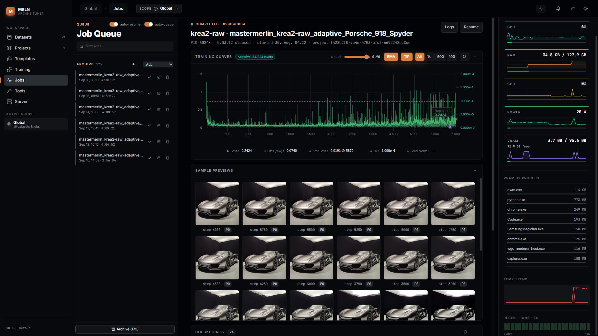
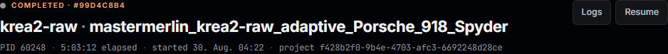
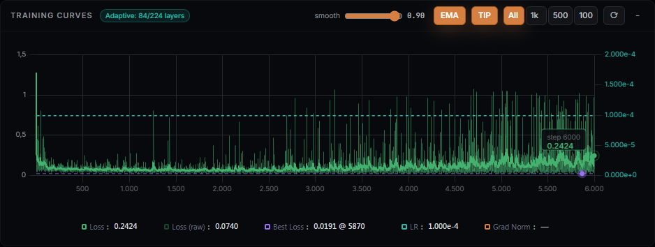
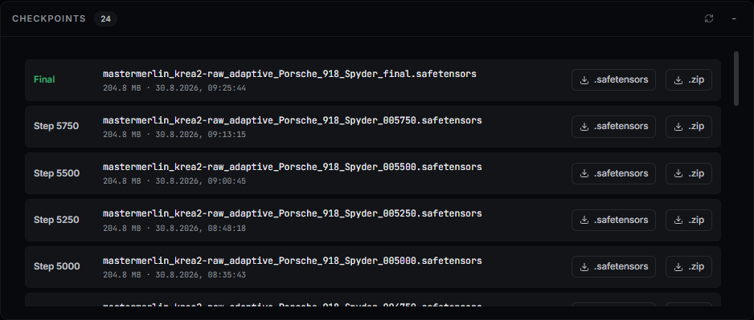
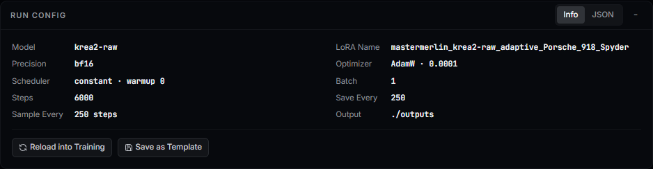
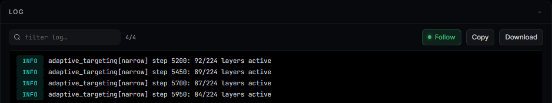
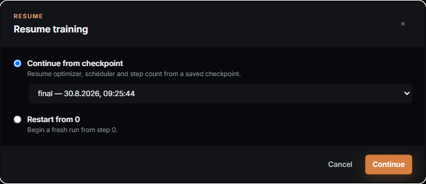
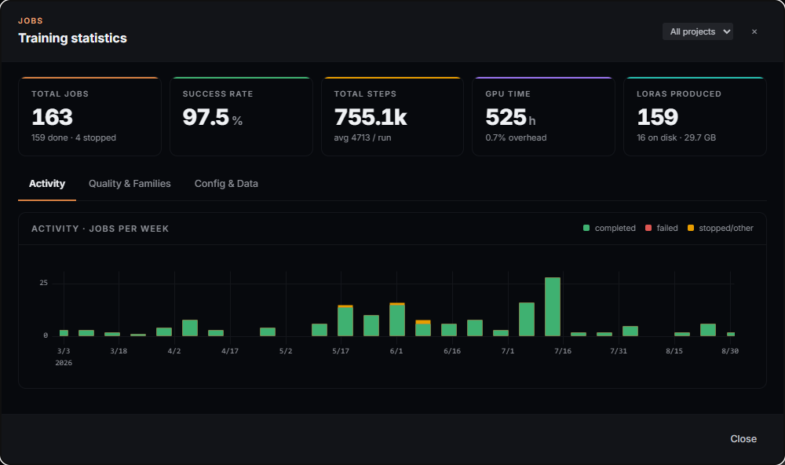
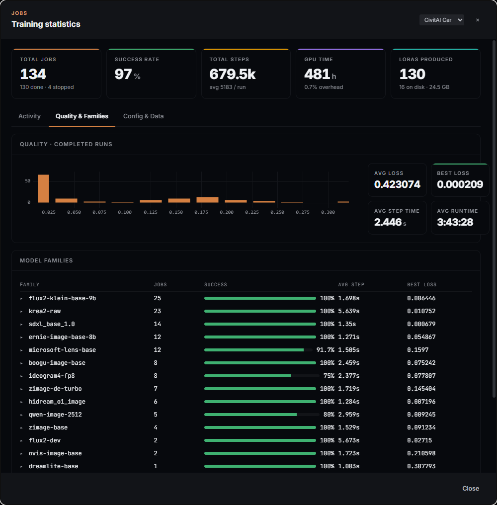
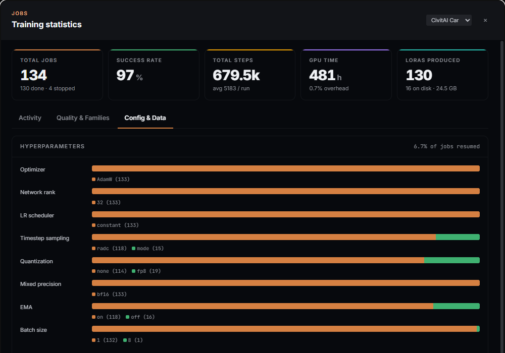

# Jobs

The Jobs screen is where a queued run becomes a finished LoRA. Every job
started from the [Training screen](training-guide.md) (full form or Quick
Train, see [`docs/projects-guide.md`](projects-guide.md)) lands here first,
and stays here afterward — this is also the archive of everything you have
ever trained.

## What you can actually do with it

- Watch a job move **pending → running → completed/failed/stopped**, with a
  live phase readout during the slow parts (model load, latent caching,
  sampling) before the first training step even lands.
- Read **live loss, best-loss, step-time and resolution curves**, plus an ETA
  and a finish-time estimate, without leaving the page.
- **Pause**, **resume**, **soft-stop** (checkpoint then stop cleanly) or
  **hard-stop** a running job from either the queue or the detail header.
- **Resume** a stopped or failed job two ways on the same job record: restart
  from step 0, or continue from a specific saved checkpoint with its
  optimizer/scheduler/step state intact.
- Watch **sample preview images** (or video/audio previews) appear as the run
  hits its sampling cadence, grouped by prompt when a run samples more than
  one.
- Download a finished LoRA's `.safetensors`, or a full resumable checkpoint
  `.zip` you can carry to another machine.
- Open **Training Statistics** for the cross-run picture: activity over time,
  loss distribution and per-family success rates, hyperparameter spread, and
  records (longest run, most steps, best loss).
- **Reload a run's config into Training**, or **save it as a template**,
  straight from its Run Config panel — no need to re-open the original job.

## The shape of the screen

Three panes. A **Job Queue** on the left lists every job in three groups —
Running, Pending, Archive (completed/failed/stopped) — with per-row controls
that don't require opening the job. The **center pane** is the selected
job's detail: header, live phase and KPI row for a running job (the KPI row
only renders once live metrics exist — a completed job's header instead
shows its terminal state and elapsed/started time with no KPI row), then
collapsible cards for Training Curves, Sample Previews, Checkpoints, Run
Config and Log. A **System Monitor** on the right shows live GPU/VRAM
readouts, shared with the rest of the app.

## The queue, left to right

### Running

Each running job is a compact card: name, model, a loss-status chip (or the
raw status if no loss data yet), a progress bar with `step/total_steps` and
an ETA, and — while the backend is mid-phase (loading, caching, sampling) —
a one-line `status_label` readout. **Pause/Resume**, a **soft-stop** icon
(save a checkpoint, then stop) and a **stop** icon (asks Soft or Hard before
acting) sit on every running card, so you never have to open a job just to
slow it down.

### Pending

Each pending card shows its position (`next up` / `#N in queue`), with
**Start now**, **move up/down** to reorder, **edit config** (JSON, for jobs
that haven't started) and **delete**. Two toggles at the top of the pane —
**auto-resume** (relaunch a run from its last checkpoint if it dies to a
transient GPU fault) and **auto-queue** (start the next pending job
automatically when the GPU goes idle) — apply to the whole queue, not one
job.

### Archive

Completed, failed and stopped jobs collapse into a compact "recent" list by
default; **Archive (N)** expands it to the full history, scoped by the
project selector next to it (`All` or one project). A failed row shows its
error as a tooltip on a red `failed` tag; a stopped row gets an amber tag; a
completed row gets a checkmark. Failed/stopped rows carry **Resume** (if a
resumable checkpoint exists) or **Restart**, plus edit-config and delete.
The chart icon at the top of the Archive header opens **Training
Statistics** (below).

Training jobs are a separate queue from the topbar's **Task Center**, which
tracks the shorter background operations dataset work kicks off (rescans,
captioning batches, masking, harmonize) — a training run never shows up
there, and a Task Center job never shows up here.

## The selected job's detail pane

### Header

Status dot, uppercase status and a short job id; the model definition and
LoRA name; a `PID` when the process is live; **elapsed** and **started**
times; the owning project if the job is project-scoped. Elapsed is real run
time as the trainer accounts for it — paused time excluded, and time from
earlier sessions of a resumed run carried forward — deliberately a different
number from wall-clock-since-start, which "started" gives you instead.

Actions on the header depend on the job's state: **Logs** always; a running
or paused job gets **Pause/Resume**, **Save & stop** (checkpoint then stop
gracefully) and **Stop**; an archived job with a resumable checkpoint gets
**Resume** (opens the two-mode dialog below), otherwise **Restart** (reuse
the existing output) and, unless the output folder is gone, **Restart
fresh** (delete the output folder first, then restart from scratch —
confirmed, since it deletes files).

### Live phase, failures and diagnostics

*(No frame here — this strip only exists on a live or failed run; the
reference job used throughout this guide is a completed one, so the strip
doesn't render.)*

While the backend reports a phase before or between training steps (loading
the model, caching latents, running a sampling pass), a **phase strip**
shows it with a progress bar when the backend gives a percentage. A failed
run shows its error message in a copyable strip with a **View full log**
shortcut. Any warnings the engine raised about the run's configuration
appear in their own diagnostics strip. If an archived job's output folder is
no longer on disk, a note says so and sample previews are unavailable —
persisted metrics still show.

### KPI row

*(No frame here — the row only renders for a run that's still reporting live
metrics; the reference completed job carries none, per `metrics()`
returning empty for a finished run.)*

**Step** (with a progress bar and `n/total` sub-label), **Loss** (with a
convergence chip — success/warning/danger — and a sparkline), **Best Loss**,
**Step Time**, **Resolution** (when the run reports one, with megapixels)
and **ETA** (with a projected finish time once one is known). Each tile's
sparkline reflects the same windowed data as Training Curves below it.

### Training Curves

The full loss/LR chart, with per-curve controls: a **smoothing** slider,
**EMA/SMA** toggle (SMA-only if the run didn't enable EMA), a **TIP** toggle
to show values at the curve's tip, a **window** selector (`All · 1k · 500 ·
100` steps — a view over the data; the KPI tiles above stay keyed to the
whole run regardless of this setting) and a **reload from disk** button
(`⟳`) — useful on a running job, since the trainer only rewrites the full
history at the end of a run and flushes step metrics every 50 steps, so a
live reload is accurate to the last flush, not to the instant. When [Adaptive
Layer Targeting](training-guide.md#adaptive-layer-targeting) is active on
this run, an `Adaptive: n/m layers` chip sits next to the `live` indicator.

### Sample Previews

Preview images (or video/audio previews for those model families) appear as
the run hits its sampling cadence. When a run samples more than one prompt,
a group-by-prompt toggle appears and each prompt gets its own strip labeled
`P0`, `P1`, … A running job's controls here let you change the sampling
**cadence** live, **pause/resume sampling** without pausing training, or
**refresh** to pull in new samples. Click any tile to open it full-size —
video plays muted with a mute toggle, audio gets native controls, and the
prompt (and lyrics, for audio families that use them) shows underneath.

### Checkpoints

Every saved checkpoint for the run: step (or `Final`), file size, save time,
a **`.safetensors`** download (the LoRA weights) and, for a resumable
checkpoint, a **`.zip`** download of the full training state (optimizer,
scheduler, EMA, cache manifests) you can move to another machine to
continue training there.

### Run Config

Toggle between a **key/value grid** and **raw JSON**. A pending job's config
is editable in place (invalid JSON blocks Save); a running or paused job's
is read-only, since the backend rejects config changes to a job already in
flight. Two actions work from any job's config: **Reload into Training**
(loads it into the Training screen's form without creating a template) and
**Save as Template** (stores it as a reusable training template — see the
[Templates guide](templates-guide.md)).

### Log

The full structured log, collapsed by default. A filter box narrows it live;
**Follow** sticks to the bottom until you scroll up, then re-engages once
you scroll back down; **Copy** and **Download** work on whatever the filter
currently shows.

## Resume, plainly

Resume only appears where a resumable checkpoint exists (a checkpoint saved
with its full training state, not just the LoRA weights). It offers two
modes on the **same job record** — nothing new is created either way:

- **Continue from checkpoint** — pick a saved checkpoint from the dropdown
  (newest first); the run picks its optimizer, scheduler and step count back
  up from there.
- **Restart from 0** — begins a fresh run from step 0, with an opt-in
  **wipe previous output** checkbox (unchecked by default) that deletes the
  prior checkpoints, samples and logs — data loss you have to ask for.

## Training Statistics

Opened from the Archive header's chart icon. A cross-job view, global by
default and narrowable to one project, with three tabs:

- **Activity** — jobs per week as a stacked chart (completed / failed /
  stopped), plus five KPI tiles: total jobs, success rate, total steps, GPU
  time and LoRAs produced.

  

- **Quality & Families** — a loss-distribution histogram, average
  loss/step-time/runtime, and a per-family table (jobs, success rate, average
  step time, best loss) that expands into a per-run table on click. A run row
  expands further into its own **Adaptive** section when it used adaptive
  layer targeting — the durable per-run event history (step, kind,
  active/total layers, active %, earliest active block) plus a small chart,
  absent entirely (not just hidden) for a run that never used the feature.

  

- **Config & Data** — hyperparameter spread (optimizer, network rank, LR
  scheduler, timestep sampling, quantization, mixed precision, EMA, batch
  size) as segmented bars, the datasets trained on most, and records (longest
  run, most steps, best loss). A **Reconcile from disk** button backfills
  LoRA file counts and sizes for older runs recorded before that data was
  tracked live.

  

## Recipes

**Recover from a GPU fault mid-run.** Turn on **auto-resume** in the queue
header before you start a long run — a transient driver reset (TDR) then
relaunches the job from its last checkpoint instead of leaving it dead in
the queue.

**Free up the GPU without losing progress.** **Save & stop** on the header
(or the soft-stop icon on the queue card) finishes the current step, saves a
checkpoint, then stops — the job moves to Archive with a resumable
checkpoint waiting.

**Try a small config tweak without re-doing the whole form.** On a pending
job, **edit config** (JSON) directly in the queue; on a finished job, open
Run Config and **Reload into Training** to make the change in the full form
instead.

**Keep a job's setup for the next dataset.** From that job's Run Config,
**Save as Template** — see the [Templates guide](templates-guide.md) for
where it shows up afterward.

## What survives an update

A job's configuration is a snapshot taken when it queued — a later template
edit or app update never changes a job already queued, running or archived.
Job history, metrics, checkpoints and adaptive-targeting records live in the
app's database and survive restarts; only a deleted output folder (or a
deliberate **Restart fresh**) removes the files themselves.

## Where things live

Job state, step metrics, checkpoint metadata and the durable adaptive-
targeting record are written by the trainer as the run goes and read back by
`job_manager.py` and the jobs routes; the queue itself (running/pending
ordering, auto-resume/auto-queue) is in-memory on the backend and rebuilt
from the database on restart. A finished LoRA's `.safetensors` lands under
`outputs/<lora_name>_<model_part>` — `model_part` is the trained
**definition id**, not the family (e.g. `krea2-raw`), so one folder exists
per definition even when several definitions share a family — downloadable
from the Checkpoints card on this screen.
