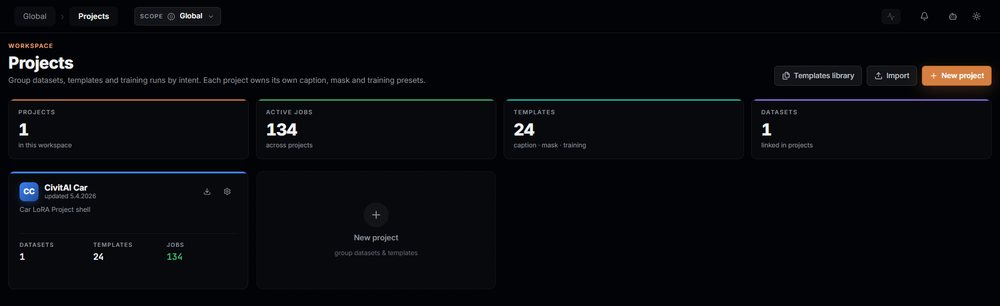
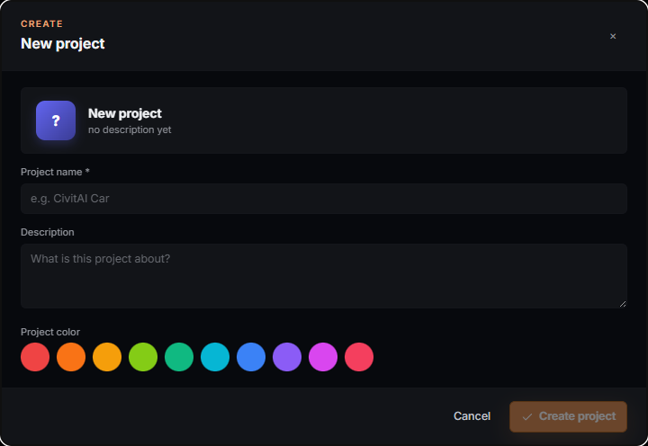
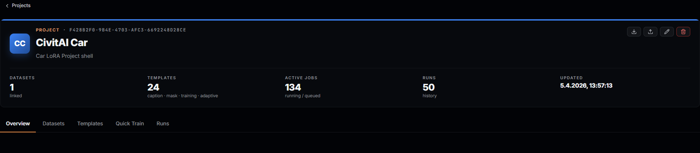
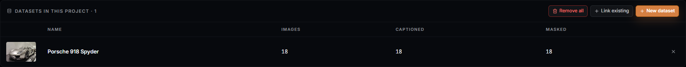
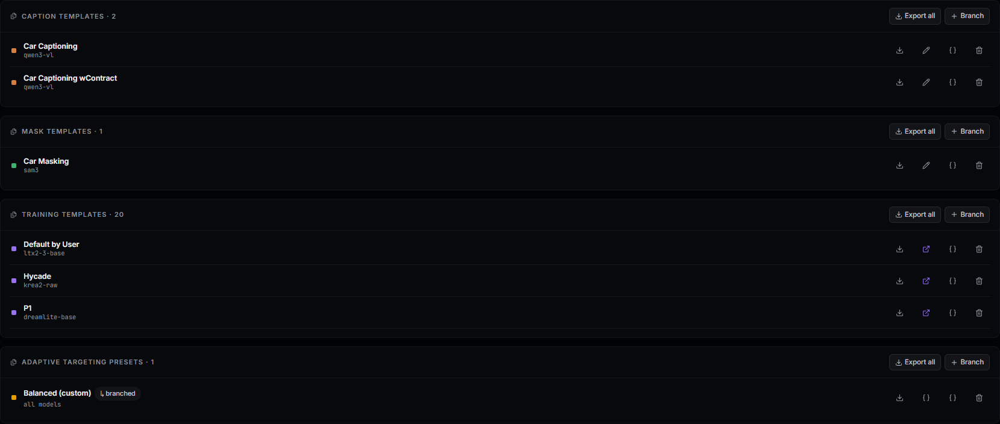

# Projects

A project is a reusable way of working, not a folder for one LoRA. The thing
that makes it durable is configuration, not data: branch a caption template,
a mask template, and a training template per model family into a project
once, tuned to how a particular client or subject wants their LoRAs done, and
those branches stay put in the project's own template rows independent of
any dataset. Datasets pass through — link one in, train from it, unlink it
when you're done — while the project keeps the decisions. Two clients who
each want their captions written a certain way and their training tuned for
two different model families can each have a project that remembers that;
when either one comes back with a new batch of photos, you link the new
dataset in and nothing else has to be re-decided.

## What you can actually do with it

- Branch a global caption/mask/training/adaptive-targeting template into the
  project so it's tuned for this client or subject without touching the
  shared original — and keep more than one training template per project
  (one per model family you train this client against; templates are keyed
  by project **and** model definition, so they don't collide).
- Create a project, link one or more existing datasets to it (or create a
  dataset directly inside it), and everything downstream — Training, Quick
  Train, the Analyze panel — can be scoped to just that project instead of
  your whole library.
- Launch a training run in three steps from a project's Quick Train tab
  without leaving the page, picking up whichever branched template already
  matches the dataset's model family, or hand the same picks to the full
  Training screen for finer control.
- Export a project (its branched templates plus its datasets, chosen
  per-dataset as embedded / referenced / excluded) as one portable zip, and
  import it — or a lone dataset zip, or a lone template zip — back in through
  the same wizard, so a client's whole way-of-working travels to another
  machine intact.
- See, at a glance, how many datasets, templates and active jobs belong to
  each project, and how many runs it has produced.

## The Projects screen

Opens at `/projects`. The header's **Templates library** button jumps to the
global `/templates` screen; **Import** opens the same import wizard described
below, scoped to no project in particular; **New project** opens the create
dialog.

### KPI rail

Four tiles aggregated across every project in the workspace: **PROJECTS**
(count), **ACTIVE JOBS**, **TEMPLATES** (caption · mask · training, summed
across projects) and **DATASETS** (datasets linked into any project — a
dataset can belong to more than one project, and one that belongs to none
isn't counted here). A tile reads **"—"** rather than a misleading `0` when
none of the projects it's aggregating carry a `stats` block yet (the first
load hasn't resolved statistics for them).

### Project cards

Each card shows a colored accent bar, initials badge, name, "updated" time,
its description (or "No description." if you left it blank), and a
three-column stat row — **Datasets**, **Templates**, **Jobs** (jobs turns
green when greater than zero). Hovering reveals **Export project** and **Edit
project** icon buttons in the card's top-right; clicking the card anywhere
else opens it. A dashed **New project** card sits at the end of the grid.

### New project / Edit project dialog

| Field | Accepts | Notes |
| --- | --- | --- |
| **Project name** | Required, non-empty after trimming | Shown in the preview card at the top of the dialog as you type. |
| **Description** | Free text, optional | Shown on the card and in the project header; falls back to a placeholder when empty. |
| **Project color** | One of 10 fixed swatches | Colors the card's accent bar, the header band and the initials badge. There is no custom color picker. |

In edit mode a **Delete project** button appears in the footer (left-aligned,
destructive style) and opens the same confirm dialog described below.

## The project detail screen

Opens at `/projects/:id` (click a card, or navigate to a project from the
scope switcher). The header repeats the project's color, initials and name,
its raw id, and four actions: **Export project**, **Import into project**
(the same wizard as the Projects-screen Import button, but pre-scoped so
imported templates and datasets land in this project), **Edit project**, and
**Delete project**. Below that, a five-cell stat strip: **Datasets**,
**Templates** (caption · mask · training · adaptive, summed), **Active jobs**,
**Runs** (this project's job history count) and **Updated**.

Five sub-tabs follow the order you'd actually use them in — **Overview →
Datasets → Templates → Quick Train → Runs**:

### Overview

A **Recent activity** panel lists this project's five most recent runs (name,
status, when) with an honest "No activity yet for this project." when there
are none — never fabricated rows. A **Quick actions** panel jumps straight to
the Quick Train, Datasets or Templates tab.

### Datasets

A table of every dataset linked to the project (name, cover thumbnail, image
/ captioned / masked counts) with a **✕** to unlink each one. Unlinking only
removes it from the project — the dataset and its files are untouched, same
guarantee as the Datasets Library's project-scope delete. **Link existing**
opens a picker over datasets already in your library that aren't linked to
this project yet (disabled when there are none left to add); **New dataset**
creates one directly inside the project. **Remove all** clears every link at
once, behind its own confirm, disabled when the project has no datasets to
remove.

### Templates

One section per template domain — **caption, mask, training, adaptive
targeting** — each showing only this project's own (branched) templates, not
the global ones. Per section: **Export all** (zips every template in that
section; hidden when the section is empty) and **Branch**, which opens a
picker of the *global* templates in that domain and copies your choice into
the project as an independent, editable copy (a `↳ branched` chip marks it
afterward, and the template that's currently the active default for a domain
carries an `active` chip). Per template row: export, edit (the icon and
title adapt to the domain — training templates get a distinct edit
affordance), edit raw JSON, and delete (project templates only — branching
never mutates the global original).

### Quick Train

A three-step guided flow for firing off a run without the full Training
screen: **① pick a dataset** linked to this project (via the same
schema-driven datasets form the Training screen uses), **② pick a project
training template** (with a live estimate panel once one and a dataset are
both chosen), **③ name and launch** — LoRA prefix/suffix with a wand button
that derives them from the dataset, a LoRA name field that supports
`{placeholder}` substitution with a live filename preview, and a trigger-word
field that can pull the dataset's own trigger word or suggest one from its
name. **Full configuration** hands your picks to the Training screen instead
of launching directly; **Start training** queues the job (disabled until a
template, a dataset and a name are all set).

### Runs

Every job this project has produced, each row pairing the job's dataset cover
thumbnail with the shared run-summary component (the same one used on the
Jobs screen). **Open in Jobs ›** jumps to the full Jobs queue.

## Export, import and delete

**Export project** opens a check/uncheck modal: every project template,
grouped by domain, and every linked dataset with a per-dataset choice of
**embed** (bundle the actual files), **reference** (record the name only —
the default) or **exclude**. The result downloads as one `<project
name>.project.zip`.

**Import** (Projects-screen header, or a project's own **Import into
project**) accepts a dataset zip, a template-bundle zip, or a full project
zip, and detects which one it is from the archive's contents. A project
import shows you what it's about to create — new templates (renameable, with
per-entry "skip if a definition it needs isn't installed" and similar
guards), linked or missing dataset references, and a name-conflict choice
(**Rename** or **Overwrite**) for the project itself and, separately, for any
dataset name collision.

**Delete project** — reachable from the Projects grid card menu, the project
detail header, or the edit dialog — always opens the same confirm dialog,
and its wording is exact about what happens: *"Datasets and images are kept;
project-specific settings are removed."* Deleting a project never touches
dataset files; it removes the project record and its branched templates. If
the project you delete is your active scope, scope drops back to Global and
you're returned to the Projects list.

## Recipes

**Set up a client once.** New project → name it and pick a color → Templates
tab → Branch a caption template for how they like things captioned, and a
training template per model family you train them against (each one keyed to
its own model definition, so a second model's template doesn't overwrite the
first). This is the work that only has to happen once per client.

**A new dataset arrives.** Datasets tab → New dataset (or Link existing) →
Quick Train, which already offers the project's own branched templates —
nothing about captioning style or training settings needs deciding again.
Repeat this recipe alone for every future batch from the same client.

**Reuse a project's setup for a variant client.** Export the project
(templates as embed, datasets as reference so the zip stays small) → Import
into a fresh project → the branched templates come across; swap in the new
client's dataset and adjust only what's actually different for them.

**Clean up after a project is done.** Datasets tab → Remove all (datasets
stay in the library, just unlinked) → Delete project from the header. Nothing
on disk is touched either way.

## What survives an update

Projects, their branched templates, dataset links and job history are stored
in the app's own database — an app update never touches them. Deleting a
project removes its own branched templates but never the global templates
they were branched from, and never any dataset's files.

## Where things live

A project is a database record, not a folder — it has no directory of its
own. Its branched templates are rows in the same template tables as the
global ones (tagged with the project's id); its linked datasets are still
ordinary folders under the app's `datasets/` directory, exactly as described
in the Datasets guide, just referenced by this project's dataset-link table
rather than owned by it.
