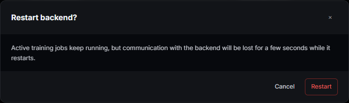

# Server

The Server tab is where the app talks about itself: whether the backend
process is healthy, how it's configured, where the LLM caption-refine
endpoint points, and a live tail of its own logs. Nothing here touches a
dataset or a job — it's the one screen that's about the app, not your data.

## What you can actually do with it

- **Read live health** — status (from the WebSocket connection itself, so it
  can't show a stale "Healthy" while the backend is actually down), process
  uptime, how many model definitions are registered (gated ones included),
  and how many jobs are currently running or paused.
- **Restart the backend** from a confirm dialog, with a global lock overlay
  while it comes back up.
- **Check for and apply an in-app update** — resets this checkout to the
  latest code on the tracked remote branch (discarding any local changes to
  it — see the warning below), rebuilds the frontend, and restarts once
  background tasks drain, all from a banner that tracks the update's own
  state (pulling → building → pending restart → restarting).
- **Change connection settings** — backend/frontend ports (Backend Port takes
  effect on the next backend restart; Frontend Port needs the frontend
  process itself restarted, which **Restart server** does not do — see
  Connection below), log level (applied immediately, no restart), and whether
  the frontend dev server auto-launches on a cold start.
- **Set the default model download path** and toggle **global offline
  mode**, which makes the model-definition resolver cache-only — it does not
  block every outbound request app-wide (see Models below).
- **Save a Hugging Face token** for downloading gated models — write-only,
  never read back; the field shows `(token saved)` once one exists, and an
  `HF_TOKEN` environment variable, if set, always wins over it.
- **Configure the LLM refine endpoint** (Ollama, or an OpenAI-compatible
  LM Studio server) that powers caption refine elsewhere in the app, and pick
  a default model — installed-model discovery and **Pull** are Ollama-only
  today (see LLM Refine Endpoint below).
- **Filter, follow and download the server's own logs** live, without
  leaving the browser.

## The shape of the screen

Header with a **Restart server** button (and, when self-update is available
for this install, **Check for updates** / **Update & restart**), a four-tile
health KPI rail,
then three cards stacked top to bottom: **Connection + Models** settings side
by side, the **LLM Refine Endpoint** card, and **Server Logs**.


## Health KPI rail

Four tiles, refreshed once on load and again whenever the WebSocket
reconnects (not on a poll timer — polling `/system/health` on an interval
would flood the log viewer this same screen renders with its own access-log
lines):

- **Status** — Healthy / Offline, read straight off the live socket
  connection.
- **Uptime** — this backend process's own uptime, ticking forward locally
  between fetches.
- **Models** — every registered model definition, gated ones included; the
  Training screen's dropdown lists fewer, since it hides gated definitions.
- **Active Jobs** — running plus paused jobs, across every project.

## Restart, updates



**Restart server** asks for confirmation, then restarts the backend process
and shows a global lock overlay until it's back — it stays locked even if
you navigate away from this tab while it's restarting.

**Check for updates** and **Update & restart** appear in the header whenever
this install is a recognized git checkout with a reachable remote — that's
"self-update is possible here," not "an update is ready." **Check for
updates** is what tells you whether you're actually behind; run it (or wait
for its automatic check) before assuming the buttons mean something changed.

**Before you use Update & restart:** it runs `git fetch` and then
`git reset --hard origin/<branch>` against this checkout, discarding any
local, uncommitted changes to the app's own files — no confirmation dialog
asks first, and there is no undo once it runs. Only use it on a deployment
you don't hand-edit; a development checkout should be updated with `git
pull` from a terminal instead. If the pulled commit changed
`requirements.txt`, backend Python dependencies are reinstalled before the
restart, which adds time to the update. Background/dataset tasks are drained
before the restart; training jobs are not paused for it — they run as
independent subprocesses and reconnect automatically once the backend is
back. A banner tracks the update through pulling the latest code, building
the frontend, waiting for tasks to drain, and restarting.

## Connection

For a repo install, the running branch, commit and whether the checkout is
dirty are shown here too — worth a glance before you press Update & restart
above.

- **Backend Port** — applies the next time the backend restarts (Restart
  server, or a cold app start). Inside a container, this field is read-only:
  the platform's own port mapping outranks it, and the field says so.
- **Frontend Port** — takes effect only the next time the frontend process
  itself is started; **Restart server** restarts the backend, not the
  Angular dev server, so a change here needs a full app restart (or a manual
  restart of the frontend process) before it's live.
- **Log Level** — DEBUG / INFO / WARNING / ERROR, applied immediately with no
  restart.
- **Auto-Start Frontend** — launch the Angular dev server and open a browser
  automatically the next time the backend cold-starts.

## Models

- **Default Model Path** — the base directory new model downloads land in;
  also the folder picker's starting point. Browsable or typed directly; it
  must already exist on the server's own filesystem — saving a path that
  doesn't returns an error rather than creating it.
- **Global Offline Mode** — makes the model-definition resolver cache-only:
  loading a model through the normal definition path uses only what's
  already cached and never reaches out to Hugging Face. It is not a
  blanket network block — a few caption/mask loaders and at least one model
  family call Hugging Face directly regardless of this setting, so it's
  closer to "prefer cache for model weights" than "airplane mode."
- **Hugging Face Token** — authenticates downloads of gated model weights
  (some FLUX checkpoints, for example). Write-only: the field never shows the
  saved value back to you, only `(token saved)` once one exists. An
  `HF_TOKEN` environment variable, if set on the machine, takes precedence
  over whatever's saved here.

## Access in a container or remote deployment

A container build refuses to bind its only reachable address (`0.0.0.0`)
without an access token — an unauthenticated port on a public URL is not a
safe default. If `MRLN_AUTH_TOKEN` is unset, or still the placeholder `123`
published in the getting-started template, the container generates a random
one on boot, saves it to the data volume so it survives a restart, and
prints it once in the pod's boot log:

```
[entrypoint]  ACCESS TOKEN: <value>
```

Sign in with that value. A token you set yourself in `MRLN_AUTH_TOKEN` is
never replaced and never printed.

## LLM Refine Endpoint

Configures the local LLM (Ollama or LM Studio) that powers caption refine
elsewhere in the app:

- **Provider** — Ollama or LM Studio; picking one fills **Base URL** with
  that provider's usual default if the field is empty. Chat inference goes
  through the OpenAI-compatible `/v1/chat/completions` path either provider
  serves, so refine itself works the same way on both.
- **Base URL** — the endpoint's address.
- **Default model** — a picker populated by probing the endpoint on load (not
  only on Save & Test, so an empty picker doesn't silently mean "untested").
  Models already installed on the endpoint are listed as installed; picking
  one that isn't installed offers a **Pull** action. If the previously-saved
  model has since disappeared from the endpoint, it still shows in the list
  as an orphan entry rather than silently reverting to blank. Discovery and
  **Pull** talk to Ollama's own management API regardless of which provider
  is selected — against a real LM Studio endpoint the picker may show
  nothing installed and Pull won't do anything; install and manage models in
  LM Studio itself, then just point Base URL at it for inference.
- **Save & Test** — persists the settings, then probes the endpoint and
  reports whether it's reachable.

## Server Logs

A live-tailed, filterable view of the backend's own structured log stream:

- **Filter box** — free-text search across the visible lines.
- **Level chips** — INFO / WARNING / ERROR / DEBUG / CRITICAL, toggle any
  combination on or off.
- **Follow** — keep the view pinned to the newest line as more arrive.
- **Wrap** — wrap long lines instead of horizontal-scrolling them.
- **Download** — save everything currently loaded as a text file.
- **Clear** — asks for confirmation, then truncates the backend log file on
  disk; the viewer empties because the file did. Download first if you want
  to keep it.

## Recipes

**Point the app at a local LLM for caption refine.** Install Ollama or LM
Studio, start it, set the Base URL here, pick a model, Save & Test — refine
then works from the Datasets tab without any cloud API key.

**Diagnose a stuck or failed job without leaving the browser.** Filter Server
Logs to ERROR while the job runs, or Follow the live stream during a restart
to watch it come back up.

**Move the app to a different port.** Set Backend Port, save, then Restart
server — that's live immediately. A Frontend Port change needs a full app
restart (not just Restart server) before it takes effect.

## What survives an update

Everything on this screen is app configuration, not job or dataset data — it
lives in the same settings store as the rest of the app and survives a
restart or an in-app update the same way. The Hugging Face token and LLM
endpoint settings persist server-side; only the raw token value itself is
never sent back to the browser once saved.

## What's next

Backend healthy, storage path set, credentials in place if you need them —
head to [`docs/projects-guide.md`](projects-guide.md) to create a project,
or straight to [`docs/training-guide.md`](training-guide.md) if a dataset is
already ready to train.

## Where things live

- Screen shell: `frontend/src/app/screens/server-screen/`.
- Connection + Models settings: `frontend/src/app/components/system/server-control/`.
- LLM endpoint: `frontend/src/app/components/system/llm-endpoint-settings/`.
- Server Logs: `frontend/src/app/components/system/live-log-viewer/`.
- Restart lifecycle: `frontend/src/app/services/system-control.service.ts`.
- Update lifecycle: `frontend/src/app/services/system-update.service.ts`.
