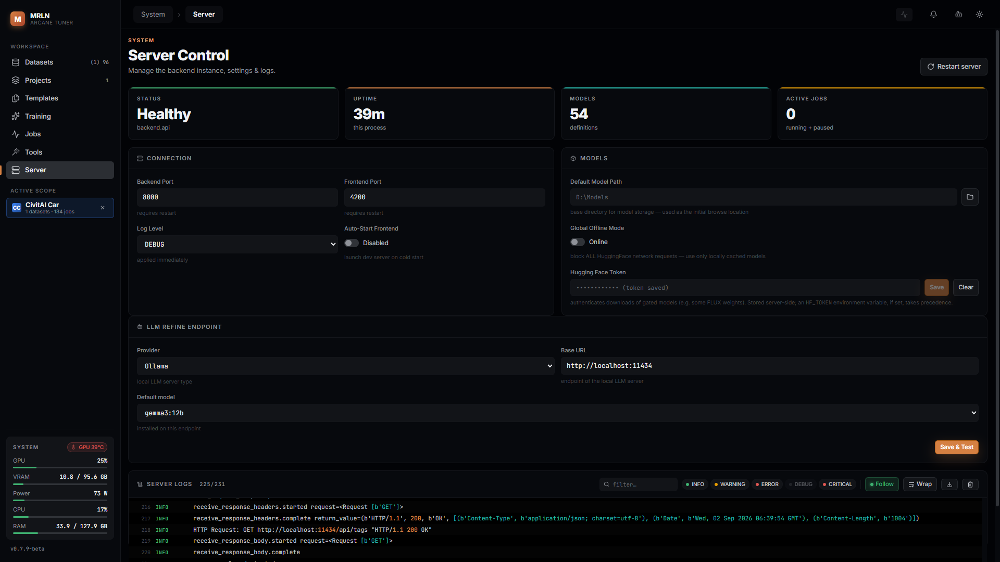

# Server

The Server tab is where the app talks about itself: whether the backend
process is healthy, how it's configured, where the LLM caption-refine
endpoint points, and a live tail of its own logs. Nothing here touches a
dataset or a job — it's the one screen that's about the app, not your data.

## What you can actually do with it

- **Read live health** — status (from the WebSocket connection itself, so it
  can't show a stale "Healthy" while the backend is actually down), process
  uptime, how many model definitions are loaded, and how many jobs are
  currently running or paused.
- **Restart the backend** from a confirm dialog, with a global lock overlay
  while it comes back up.
- **Check for and apply an in-app update** — pulls the latest code, rebuilds
  the frontend, and restarts once any in-flight tasks drain, all from a
  banner that tracks the update's own state (pulling → building → pending
  restart → restarting).
- **Change connection settings** — backend/frontend ports (take effect on the
  next restart), log level (applied immediately, no restart), and whether the
  frontend dev server auto-launches on a cold start.
- **Set the default model download path** and toggle **global offline
  mode**, which blocks every outbound HuggingFace request app-wide.
- **Save a Hugging Face token** for downloading gated models — write-only,
  never read back; the field shows `(token saved)` once one exists, and an
  `HF_TOKEN` environment variable, if set, always wins over it.
- **Configure the LLM refine endpoint** (Ollama or LM Studio) that powers
  caption refine elsewhere in the app, pick a default model, and pull one
  onto the endpoint if it isn't installed yet.
- **Filter, follow and download the server's own logs** live, without
  leaving the browser.

## The shape of the screen

Header with a **Restart server** button (and, when an update is available,
**Check for updates** / **Update & restart**), a four-tile health KPI rail,
then three cards stacked top to bottom: **Connection + Models** settings side
by side, the **LLM Refine Endpoint** card, and **Server Logs**.

## Health KPI rail

Four tiles, refreshed once on load and again whenever the WebSocket
reconnects (not on a poll timer — polling `/system/health` on an interval
would flood the log viewer this same screen renders with its own access-log
lines):

- **Status** — Healthy / Offline, read straight off the live socket
  connection.
- **Uptime** — this backend process's own uptime, ticking forward locally
  between fetches.
- **Models** — how many model definitions the backend has loaded.
- **Active Jobs** — running plus paused jobs, across every project.

## Restart, updates

**Restart server** asks for confirmation, then restarts the backend process
and shows a global lock overlay until it's back — it stays locked even if
you navigate away from this tab while it's restarting. (The exact restart
mechanics are being reworked separately; this guide only covers what the
button does from your side.)

When the app detects it's behind the repo, **Check for updates** / **Update &
restart** appear in the header, and a banner tracks the update through
pulling the latest code, building the frontend, waiting for in-flight tasks
to drain, and restarting.

## Connection

- **Backend Port / Frontend Port** — both require a restart to take effect.
  Inside a container, the Backend Port field is read-only: the platform's own
  port mapping outranks it, and the field says so.
- **Log Level** — DEBUG / INFO / WARNING / ERROR, applied immediately with no
  restart.
- **Auto-Start Frontend** — launch the Angular dev server and open a browser
  automatically the next time the backend cold-starts.

## Models

- **Default Model Path** — the base directory new model downloads land in;
  also the folder picker's starting point. Browsable or typed directly.
- **Global Offline Mode** — blocks *every* outbound HuggingFace request across
  the whole app, forcing every model load to use only what's already cached
  locally.
- **Hugging Face Token** — authenticates downloads of gated model weights
  (some FLUX checkpoints, for example). Write-only: the field never shows the
  saved value back to you, only `(token saved)` once one exists. An
  `HF_TOKEN` environment variable, if set on the machine, takes precedence
  over whatever's saved here.

## LLM Refine Endpoint

Configures the local LLM (Ollama or LM Studio) that powers caption refine
elsewhere in the app:

- **Provider** — Ollama or LM Studio; picking one fills **Base URL** with
  that provider's usual default if the field is empty.
- **Base URL** — the endpoint's address.
- **Default model** — a picker populated by probing the endpoint on load (not
  only on Save & Test, so an empty picker doesn't silently mean "untested").
  Models already installed on the endpoint are listed as installed; picking
  one that isn't installed offers a **Pull** action. If the previously-saved
  model has since disappeared from the endpoint, it still shows in the list
  as an orphan entry rather than silently reverting to blank.
- **Save & Test** — persists the settings, then probes the endpoint and
  reports whether it's reachable.

## Server Logs

A live-tailed, filterable view of the backend's own structured log stream:

- **Filter box** — free-text search across the visible lines.
- **Level chips** — INFO / WARNING / ERROR / DEBUG / CRITICAL, toggle any
  combination on or off.
- **Follow** — keep the view pinned to the newest line as more arrive.
- **Wrap** — wrap long lines instead of horizontal-scrolling them.
- **Download** — save everything currently loaded as a text file.
- **Clear** — asks for confirmation, then truncates the backend log file on
  disk; the viewer empties because the file did. Download first if you want
  to keep it.

## Recipes

**Point the app at a local LLM for caption refine.** Install Ollama or LM
Studio, start it, set the Base URL here, pick a model, Save & Test — refine
then works from the Datasets tab without any cloud API key.

**Diagnose a stuck or failed job without leaving the browser.** Filter Server
Logs to ERROR while the job runs, or Follow the live stream during a restart
to watch it come back up.

**Move the app to a different port.** Set Backend Port and/or Frontend Port,
save, then Restart server — both changes need that restart to take effect.

## What survives an update

Everything on this screen is app configuration, not job or dataset data — it
lives in the same settings store as the rest of the app and survives a
restart or an in-app update the same way. The Hugging Face token and LLM
endpoint settings persist server-side; only the raw token value itself is
never sent back to the browser once saved.

## Where things live

- Screen shell: `frontend/src/app/screens/server-screen/`.
- Connection + Models settings: `frontend/src/app/components/system/server-control/`.
- LLM endpoint: `frontend/src/app/components/system/llm-endpoint-settings/`.
- Server Logs: `frontend/src/app/components/system/live-log-viewer/`.
- Restart lifecycle: `frontend/src/app/services/system-control.service.ts`.
- Update lifecycle: `frontend/src/app/services/system-update.service.ts`.
