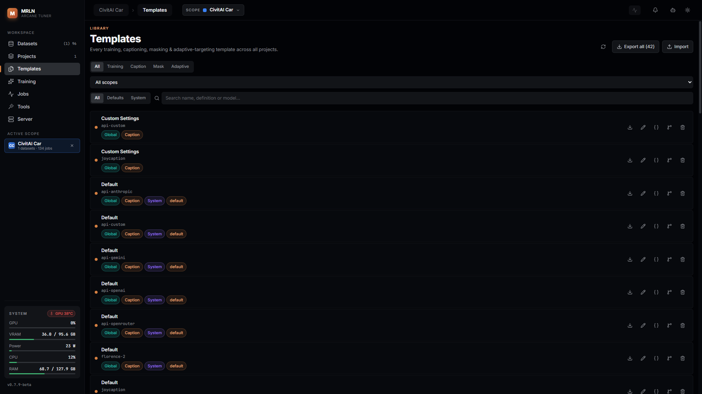
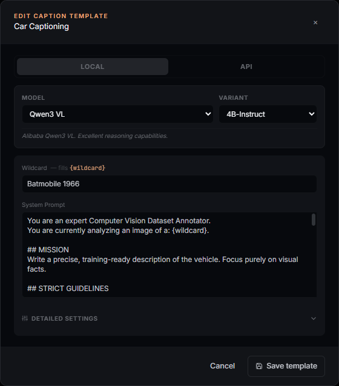

# Templates

A **template** is a saved configuration you reuse instead of re-deciding it every
time: a captioning system prompt, a set of masking parameters, a full training
config for one model family, or a set of adaptive-targeting knobs. Once you have
one client's caption style, training settings and layer-targeting preference set
up the way they want it, the next dataset from that client reuses all of it —
nothing has to be re-decided.

This guide covers the `/templates` screen (the one library that lists every
template, across every project) and the places templates are created and edited
— the caption/masking settings panels on the Datasets tab, the training form's
Template Selection card, and the Adaptive Layer Targeting card — plus export and
import.

## What you can actually do with it

- See every caption, masking, training and adaptive-targeting template you have,
  Global or scoped to one project, in one filterable list.
- Save the settings you just tuned as a new template, right where you tuned
  them (captioning/masking on the Datasets tab, training and adaptive targeting
  on the Training screen) — no separate "create template" flow.
- **Branch** a Global or another project's template into the project you have
  open, so you can tweak it there without touching the original.
- Edit any template in place — captioning and masking through the same settings
  dialog you tuned them in, training through the Training screen, and any
  template's raw JSON through a JSON editor.
- Export one template, or every template matching your current filter, as a
  portable bundle; import a bundle back in (into a specific project, or
  Global) with a plan step that flags name clashes and missing model
  definitions before anything is created.

## The four domains

Every template belongs to exactly one domain, and belongs either to no project
(**Global** — the scope chip reads "Global") or to one project:

- **Caption** — a system prompt, a wildcard substitution value and a captioning
  model choice, for one of the caption backends (Florence-2, JoyCaption,
  Qwen3-VL, Youtu-VL, or one of the API backends).
- **Mask** — SAM 3 or RemBG masking parameters.
- **Training** — a full training config for one model definition
  (`definition_id`), scoped by both project **and** definition: a project can
  hold a separate training template per model definition it trains, which is
  what lets one project "know how to train two different models" for one
  client (a family with two definitions needs two templates).
- **Adaptive** — the Adaptive Layer Targeting knob dict (warm-up share, energy
  kept, floor, heat smoothing, measurement interval, freeze-vs-rebuild action).
  There are three read-only factory presets (**Conservative**, **Balanced**,
  **Aggressive**), seeded once as Global rows that apply to any model — a
  project has none of its own until you branch one; editing a preset branches
  it into your own copy first.

Every template also carries a `readonly` flag (a factory default you cannot
delete, only branch or copy from) and an `is_default` flag (the one applied
automatically when nothing else is chosen). A `branched_from` marker shows on
any template created by branching another one.

## The `/templates` screen

The library at `/templates` lists **every** template across every project —
it is the one place to see, in one screen, everything you have set up. Each row
shows the template name, the model or definition it applies to (`all models`
for an adaptive preset that is not model-specific), and a row of chips: the
scope (`Global` or the project name), the domain (`Training`, `Caption`,
`Mask`, `Adaptive`), `System` for a read-only factory row, `↳ branched` if it
was branched from another template, and `default` if it is the one auto-applied.

Filters along the top narrow the list by domain, scope (`All scopes`,
`Global`, or one project), a **Defaults** / **System** flag toggle, and a text
search across name, definition and model. Each row's actions:

- **Export** — download that one template as a `.template.zip`.
- **Edit** — caption and masking templates open the same settings dialog you
  tune them in; a training row instead **navigates to the Training screen**
  with the template loaded (training templates are edited on the form that
  produces their config, not in a standalone dialog) — the icon changes to an
  external-link glyph on that row to signal the screen change; adaptive
  presets, which have no dialog of their own, open the JSON editor.
- **Edit JSON** — the raw JSON editor, for any domain: name, `config`, and the
  domain-specific fields (`system_prompt` + `wildcard` for captioning,
  `model_id`, `definition_id`). Server-managed fields (id, timestamps,
  `readonly`, `is_default`, `used_count`) are not editable here. Invalid JSON
  blocks Save.
- **Branch** — copies the template into the project you currently have open
  (disabled with no project scoped). Branching a read-only factory row is how
  you get your own editable copy of it.
- **Delete** — disabled on read-only templates; everything else asks you to
  confirm first ("This cannot be undone").

The header's **Refresh** button re-pulls the list (picks up templates or
projects created elsewhere since the screen loaded); **Export all** — its
label carries the live count, e.g. "Export all (42)" — downloads every
template that currently matches your filters as one bundle; **Import** opens
the same import wizard the Datasets and Projects screens use.

## Creating and editing templates where you use them

Templates are not created on the `/templates` screen — you create them where
you are already tuning the setting, and they show up in the library afterward:

- **Captioning and masking** — on the Datasets tab's caption/masking settings
  panel, the **Settings Template** dropdown picks an existing template; a
  clone-icon button ("Clone as New Template") saves the current values as a
  new one, and rename/delete act on whichever is selected (both disabled on
  the default template).
- **Training** — the Training screen's Template Selection card works the same
  way: **Clone as New Template** saves the current form as a new template
  under the model definition you have selected; **Rename** and **Delete** act
  on the active one (blocked on a default/system template); **Export** and
  **Import** move a single training template as a `.template.zip`. Editing a
  non-default template's fields auto-saves into it as you type; editing a
  default template instead creates (once) or reuses a per-definition "Default
  by User" copy in the current project, so the factory default itself is
  never overwritten.
- **Adaptive targeting** — the Adaptive Layer Targeting card's **Preset**
  dropdown seeds the knobs below it; editing any knob after picking a
  read-only factory preset branches it into your own copy automatically (you
  do not need to press Branch yourself). A preset only seeds values at
  selection time — the job stores the knobs themselves, so editing a preset
  later never changes a run that already queued.

## Export and import

**Export** (per-row, or "Export all" for everything matching the current
filter) downloads a `.template.zip` bundle. **Import** accepts that bundle, a
dataset zip, or a full project export — the wizard detects which kind it is.
Importing a template bundle first shows an import **plan**: one row per
template in the bundle, flagging a duplicate name, a model definition that is
missing/invalid on this install, or one that is installable — before anything
is created. You choose, per entry, to create it or skip it; a missing
definition can be installed as part of applying the plan. Nothing is created
until you confirm the plan.

## Recipes

**Set up a client's way of working, once.** Tune the caption system prompt and
wildcard the way this client likes it, clone it as a template named for the
client. Do the same for masking if they need it, and pick or branch an
adaptive-targeting preset. Set up a training template per model definition you
train for them. All of it lives on the project from now on.

**Reuse on the next dataset.** A new dataset from the same client lands in the
same project. The caption template, masking template, training templates (one
per model definition) and adaptive preset are already there — nothing to
re-configure, you just start captioning and training.

**Move a template to another machine.** Export it (or "Export all" filtered to
one project) from `/templates`, carry the `.template.zip`, and import it on the
other install. The import plan tells you before you commit whether a model
definition needs installing or a name will collide.

## What survives an update

Templates live in the same SQLite database as everything else — an update to
the app does not touch them. The three factory adaptive-targeting presets are
reseeded read-only; any template you branched or created of your own is
untouched.

## Where things live

Every template is a row in the app's database, scoped by domain, project (or
`null` for Global) and, for training templates, the model definition. Nothing
about a template writes to your dataset folders — applying one only changes
what the next captioning run, masking run, training run or adaptive-targeting
configuration uses.
