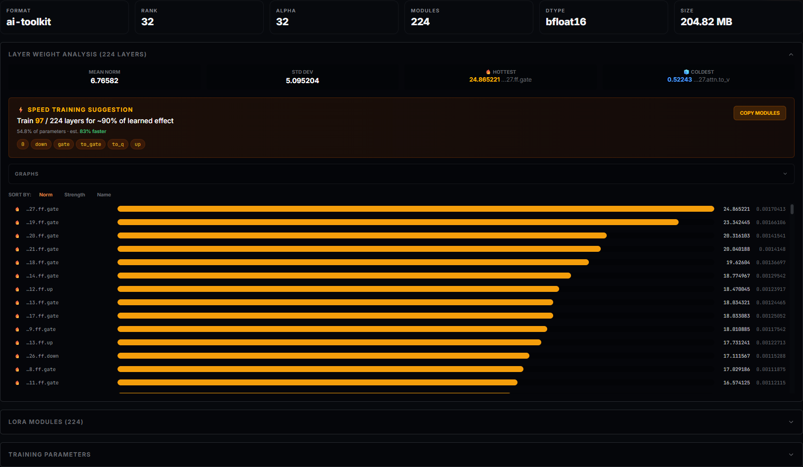
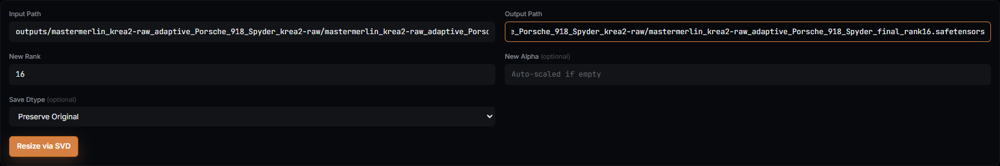

# Tools

The Tools tab is LoRA Tools: two utilities that work on `.safetensors` files
directly, outside any project or job. **Inspect** reads a LoRA's structure and
tells you which layers actually learned something; **Resize** re-factors a
LoRA to a different rank. Neither one trains anything or touches your
datasets — they read (and, for Resize, write) files on disk that you name by
path.

## What you can actually do with it

- **Inspect any `.safetensors` LoRA** — one you just trained, one you
  downloaded, one from a completely different tool — without loading a model
  or opening a training job. Format detection (Kohya, ai-toolkit/Ostris,
  PEFT), rank, alpha, dtype, module count and file size come back in under a
  few seconds.
- **See which layers carry the learned effect and which are dead weight** —
  a per-layer Frobenius-norm breakdown (`‖ΔW‖ = ‖B@A‖`) ranked and tiered into
  essential / contributing / negligible, with a **Speed Training Suggestion**
  naming the exact module list that reproduces ~90% of the effect.
- **Copy that module list** straight to the clipboard for [Targeted Layer
  Training](training-guide.md) on your next run.
- **Read back a LoRA's training metadata** — the Kohya-style `ss_*` keys
  (optimizer, learning rate, schedule, resolution, and whatever else the
  trainer that made it wrote) and, if present, `ss_tag_frequency` broken out
  by caption tag.
- **Resize a LoRA's rank via SVD** — reconstruct the effective weight delta,
  truncate to a new rank, re-save. Works in both directions (up or down);
  alpha auto-scales proportionally unless you set it explicitly, and dtype
  defaults to whatever the source file already uses.

## Inspect

Paste or type a path to a `.safetensors` file and click **Inspect**. The
backend resolves the path, loads the file's tensors and metadata, and returns
everything below in one response — there's no separate load step and nothing
is cached between inspections.

### Quick stats

A six-tile row: **Format**, **Rank**, **Alpha**, **Modules** (LoRA module
count), **Dtype**, **Size**. These come straight from the file's metadata or,
where a format doesn't carry them, are inferred from tensor shapes.

### Layer Weight Analysis

Collapsed by default; expand it to get:

- **Mean norm / std dev / hottest / coldest** — the aggregate spread of
  per-layer weight-delta norms across the whole LoRA, plus which single
  module is the strongest and which is the weakest.
- **Speed Training Suggestion** — every layer is tiered by how much of the
  LoRA's total learned "energy" it accounts for: **essential** (🔥, together
  they cover ~90%), **contributing** (⚡, the next slice out to ~97%), and
  **negligible** (🧊, the long tail below 3%). The card states how many
  layers are essential out of the total, what percentage of parameters that
  is, and an estimated training-speed gain from dropping the rest. **Copy
  Modules** puts the essential layers' full per-instance module paths (not
  just their type) onto the clipboard as JSON, ready to paste into a targeted
  layer list.
- **Graphs** — one small chart per block type (e.g. one for feed-forward
  layers, one for attention), plotting each layer's norm delta across the
  block so you can see where the spikes are, not just read them off a list.
- **The layer list** — every layer, sortable by **Norm**, **Strength** or
  **Name**, each row showing its tier icon, a shortened module path (hover
  for the full path), a proportional bar, and its raw norm-delta and
  strength values.

### LoRA Modules, Training Parameters, Tag Frequency

Three more collapsible cards, each empty and hidden if the source file
doesn't carry that data:

- **LoRA Modules** — the raw list of every module name the LoRA touches.
- **Training Parameters** — the file's embedded `ss_*` training metadata
  (whatever the tool that trained it wrote — optimizer, LR, schedule,
  resolution and so on), key-stripped of the `ss_` prefix for readability.
- **Tag Frequency** — parsed from `ss_tag_frequency`, grouped and sorted by
  count per tag group. Only present on LoRAs trained with tag-frequency
  logging enabled.

## Resize

Switch to the **Resize** tab. Inspecting a LoRA first pre-fills the input
path and suggests an output path (`<name>_resized.safetensors` next to the
source); you can also fill the form from scratch.

- **Input Path / Output Path** — both required. The output is always a
  separate file; Resize never overwrites the source.
- **New Rank** — the target rank, 1–256.
- **New Alpha** *(optional)* — leave blank to auto-scale proportionally to
  the rank change; set it explicitly to override.
- **Save Dtype** *(optional)* — Preserve Original, FP16, BF16 or FP32.

**Resize via SVD** reconstructs each module's effective delta `W = B @ A`,
decomposes it with truncated SVD, and re-factors the result at the new rank —
the same operation `kohya_ss`'s `resize_lora.py` and similar tools perform,
run in-app. On success the card reports old rank, new rank, modules resized
and the output file's size in MB.

## Where paths come from — and where they're allowed to point

Both tools take a plain filesystem path, not a picker — copy it from a job's
**Checkpoints** card, a **Download LoRA** link, or wherever else you keep
`.safetensors` files. The backend only accepts paths that resolve inside
`backend/outputs/`, `backend/models/` or `backend/datasets/`; anything else
comes back as a 403 naming the allowed roots. That's the same guard the rest
of the app's operator tools use — it exists so a path field can't be used to
read or overwrite something outside the app's own working directories.

## Recipes

**Decide what to target before your next run.** Inspect a LoRA from a similar
subject or a prior run on the same model family, expand Layer Weight
Analysis, and Copy Modules. Paste that list into [Targeted Layer
Training](training-guide.md) on your next job to train only the layers that
matter for that kind of effect — fewer parameters, faster steps, less VRAM.

**Shrink a LoRA before sharing it.** Train at a comfortable rank, then Resize
down once you're happy with the result — a lower rank means a smaller file
with (for most subjects) little visible quality loss, without retraining.

**Sanity-check a LoRA you didn't train yourself.** Format, rank, alpha and
training metadata tell you what you're actually loading before you commit
GPU time or a training slot to building on top of it.

## What survives an update

Inspect and Resize are stateless operations on files you already have — there
is nothing here that persists across an app update. A LoRA you resized stays
exactly where you told it to be written.

## Where things live

- Frontend: `frontend/src/app/screens/tools-screen/` (the tab shell) and
  `frontend/src/app/components/tools/lora-tools/` (Inspect + Resize).
- Service: `frontend/src/app/services/lora-tools.service.ts`.
- Backend: `backend/app/api/training/lora_routes.py`
  (`GET /tools/lora/inspect`, `POST /tools/lora/resize`) and
  `backend/app/engine/utils/lora_tools.py` for the actual tensor work.
