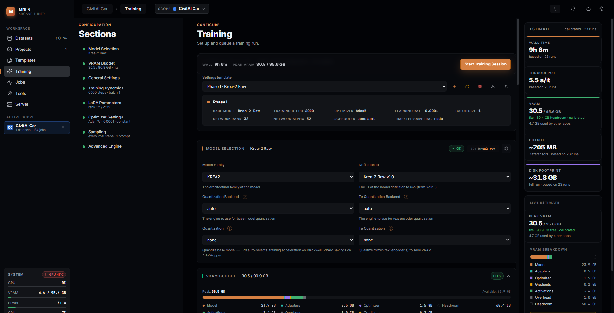

# Training

The Training screen is where a curated dataset and a saved way of working
turn into a queued job. It assumes you already have a dataset you trust (see
[`docs/datasets-guide.md`](datasets-guide.md)) and, ideally, a template for
this client and model already set up in a project (see
[`docs/projects-guide.md`](projects-guide.md) and
[`docs/templates-guide.md`](templates-guide.md)) — the Training screen is also
where those training templates get created and edited in the first place.
If you just want to fire off a run without touring the full form, a project's
**Quick Train** tab does the same job in three clicks — see the Projects
guide's Quick Train section; this page covers the full form it can hand off
to.

## What you can actually do with it

- Pick a model **family and definition**, apply a saved **training
  template** for it, and see every downstream field (LoRA parameters,
  optimizer, VRAM knobs, sampling) update to match.
- Attach one or more project-scoped **datasets** as training concepts, each
  with its own caption prefix, caption-dropout rate, repeat count and
  masking behavior — a single run can train on several datasets with
  different weighting.
- Read a **live VRAM estimate**, calibrated from your own past runs once
  you have some, before you queue anything — including a peak/available bar,
  a per-component breakdown, and any warnings the engine has about your
  configuration.
- Turn on **Adaptive Layer Targeting** so the run itself narrows which LoRA
  modules keep learning as training progresses, without hand-picking layers.
- Fine-tune training dynamics, LoRA rank/alpha, the optimizer, quantization,
  block-swap offloading, and sampling previews — every field the model's own
  schema declares, grouped and labeled exactly as the form shows them.
- Queue the run with **Start Training Session**, then track it on the Jobs
  screen.

## The shape of the screen

Three columns: a left **table of contents** that jumps to each schema-driven
group and tracks which one you're scrolled to (Template Selection is a fixed
card above the groups, not a TOC entry itself; a group like Expert Features
or Video Settings appears in the TOC only when the current model definition
declares fields for it); a center **form** built
from the model definition's own schema — every model family declares the
same base schema plus family-specific fields, so the form is identical in
structure across families and only its options and defaults change; and a
right **Estimate rail** with the live VRAM report. The launch bar sits above
the form and stays pinned to the bottom edge of the viewport as you scroll,
carrying a compact echo of wall time and peak VRAM plus the **Start Training
Session** button — reachable without scrolling back up — and, if any section
has an invalid field, a count with a jump-to-first-invalid shortcut.

## Set up the run

### Template Selection

The first card on the form. The **Settings template** dropdown applies any
training template for the currently selected model definition — factory
defaults marked `(Default)`, or one of your own project/global templates.
**Clone as New Template**, **Rename** and **Delete** work exactly as on the
`/templates` screen (rename/delete are disabled on a default template);
editing a non-default template's fields autosaves as you type, and editing a
default template instead creates (or reuses) a per-definition "Default by
User" copy scoped to the current project, so the factory template itself is
never overwritten. **Export** and **Import** move a single training template
as a `.template.zip` without leaving the form. See
[`docs/templates-guide.md`](templates-guide.md) for the full template system
— branching, the `/templates` library, and import plans.

### Model Selection

Choose the **family** and, once a family is picked, the **definition** — the
concrete checkpoint from that family's YAML. A family is an architecture with
its own loader, driver, trainer, sampler and saver; a definition is one
shipped checkpoint of it. The app ships **29 families, 54 definitions**
across image, video and audio, but the dropdown only enumerates the
definitions that have cleared their availability gate — today that's **28
families, 51 definitions**; the three gated ones (currently the MiniMax H3
definitions) stay hidden until they clear. Also on this card: the
**quantization backend** and **quantization** level for the base model, and
the same pair for the text encoder — quantizing either trades some quality
for VRAM, and the base-model quantization can also mean training
acceleration on newer GPUs depending on the level chosen. A badge next to the
model name flags a **Unified Transformer** architecture (different VRAM
characteristics than a diffusion model) and, when the model's weights come
from a local path instead of the Hub, a **LOCAL**/**SAFETENSORS**/**OFFLINE**
chip.

## Tune what this run needs

Below Model Selection and the VRAM Budget card, the rest of the form is
generated from the schema in the same grouping the form shows:

- **General Settings** — the dataset rows this run trains on (one per
  attached dataset, scoped to the current project when you're inside one):
  a **caption prefix**, **caption dropout rate** (the chance a caption is
  dropped entirely, which enables classifier-free guidance at inference), a
  **repeat count**, caption toggles (use captions at all, and whether to
  prefer the model-aware caption variant), and masking toggles (include
  masked variants, optionally regenerating them with a chosen opacity and a
  minimum probability of keeping the original) — multiple datasets can be
  attached to the same run, each weighted independently; this is the same
  picker documented from the dataset side in the Datasets guide's "Move on"
  section. Also on this card: LoRA filename (**LoRA Prefix** / **Suffix** /
  **Name**, the name field supporting `{placeholder}` substitution), a
  global trigger word, output directory, and data toggles (latent caching,
  horizontal/vertical flip augmentation).
- **Training Dynamics** — max steps, batch size, gradient accumulation,
  gradient checkpointing (VRAM for speed), checkpoint cadence and how many to
  keep, resume-from-checkpoint with cache re-use toggles, target
  **resolutions** for bucketing, and **bucketing mode** (`kohya`: one bucket
  per image; `multi`: an image appears in every qualifying bucket for more
  latent diversity), and **timestep sampling strategy** — including `radc`
  (see below).
- **LoRA Parameters** — **network rank** (adapter capacity), **network
  alpha** (scaling factor), whether to train the text encoder alongside the
  main model, and a **target layers** picker for training only specific
  transformer blocks.
- **Optimizer Settings** — the optimizer algorithm (AdamW/AdamW8bit, Prodigy,
  ProdigyPlusSF, Lion, Adafactor, StableAdamW, SophiaH/SophiaG, Shampoo,
  RAdam, AdEMAMix), learning rate, weight decay, and the LR schedule.
- **Expert Features** — advanced knobs specific to whichever optimizer is
  selected (e.g. ProdigyPlusSF's cautious-update/OrthoGrad/FOCUS/SPEED
  toggles, Sophia's Hessian sampling settings, Adafactor's relative-step
  behavior) — only the fields relevant to the chosen optimizer are shown.
- **Advanced Engine** — collapsed by default; EMA (with its decay rate),
  `min_snr_gamma`, noise offset, VAE/text-encoder offloading and unloading,
  the minimum-free-VRAM fraction the sampler waits for before it will run,
  and the Adaptive Layer Targeting card (below).
- **Video Settings** — shown only for video-capable definitions: frame rate,
  frame count, frame stride, sliding-window/temporal-coverage controls for
  long clips, first-frame-conditioning probability, MoE expert-swap settings
  where the family has dual experts, and audio training toggles for
  families that support joint audio.
- **Sampling** — the sample prompts and their cadence (every N steps, skip
  the first N), inference steps, guidance scale, and seed used for the
  periodic preview images shown while a job runs.

Each section header shows a live one-line summary (e.g. LoRA rank/alpha, step
count and batch size, optimizer and LR) and an OK/attention chip, so you can
see a section's state without opening it.

### VRAM Budget

Sits right under Model Selection, before the schema-driven groups, because it
reads from the live estimate rather than from form fields directly. It
carries the same peak-VRAM hero tile as the right-hand rail plus an
**Advanced** panel for **block swapping** — moving a percentage of
transformer blocks to CPU between steps to trade speed for VRAM headroom, at
a granularity finer than the model-level quantization above.

### Adaptive Layer Targeting

A full-width card inside Advanced Engine (collapsed by default — expand the
group to reach it), enabled by its own toggle. Periodically measures which
LoRA modules are still moving (an EMA-smoothed norm of each module's
effective weight change) and either **freezes** the cold ones in place or
**rebuilds** the adapter — checkpointing and relaunching the same job with
the optimizer rebuilt over only the parameters still active, which frees the
optimizer state of the parameters it dropped (on dual-expert families —
WAN 2.2, Bernini-R — this covers only the expert resident in memory). This
is a regularizer, not a speedup on its own: the forward pass still runs
every module (a frozen module's learned delta stays part of the model), so
freeze mode's savings are about training capacity, not wall time — rebuild
mode is the one that actually frees VRAM.

The ranking runs **per projection group**, not globally (`adaptive_heat.py`,
`select_active`): every block's `to_v` is ranked only against other `to_v`
projections, never against `ff.gate` or another shape entirely. A raw
weight-change norm is not comparable across matrix shapes — under
grouped-query attention a `to_v` delta has an order of magnitude fewer
elements than a feed-forward delta, so one global ranking would retire an
entire pathway (e.g. all attention value/output projections) on shape alone
rather than on whether it actually stopped learning. Each group also keeps
its own share of the floor below, so no pathway can be frozen out entirely.
A family whose module names carry no block index falls back to a single
global ranking across the whole model, and the run says so in its log.

Pick a **preset** (the same Conservative / Balanced / Aggressive factory
presets, or any of your own) to seed **Warm-up** (share of training left
untouched before measurement starts), **Energy kept** (share of a group's
weight-change norm that must remain active), **Floor** (`min_active_pct`,
the minimum fraction of each projection group that can never be frozen),
**Heat smoothing** (the EMA factor applied to each measurement — higher
reacts slower), the **measurement interval** in steps, and the **action**
(Freeze vs Rebuild — Rebuild adds a **minimum shrink to rebuild** threshold so
a marginal narrowing doesn't trigger a relaunch by itself). Editing any knob
after selecting a read-only factory preset branches it into your own template
copy automatically. Presets only seed values at selection time — the job
stores the knobs themselves, so editing a preset afterward never changes a
run that already queued. See the Templates guide's "Adaptive" domain for how
these presets live in the template system.

### Timestep sampling — Resolution-Aware Dynamic Curriculum (RADC)

**What.** `timestep_sampling` (in Training Dynamics) picks which noise levels
the run trains on and how their probability is shaped: `logit_normal`
(default), `uniform`, `sigmoid`, `cosmap`, `mode`, `flux_shift`, `model_shift`,
or `radc`. Every other mode does not change with training progress (some,
like `flux_shift`/`model_shift`, still vary per batch with sequence length,
but none track how far along the run is). `radc` — Resolution-Aware Dynamic
Curriculum — is the one mode that **moves with progress**: it shifts a
Gaussian sampling window across the noise range as the run advances
(`backend/app/engine/strategies/timestep_sampling.py`).

**Why.** Early in training, the model has nothing yet — there is no detail to
refine, only structure and composition to learn, which lives in the
high-noise steps. Late in training structure is settled and what is left to
improve is texture and fine detail, which lives in the low-noise steps. A
fixed distribution spends the same attention on both phases throughout;
RADC spends it where the run actually needs it at that point in training.

**How.** Four knobs, all in Training Dynamics once `timestep_sampling` is set
to `radc` (`backend/app/engine/models/base.py`):
- **Noise focus at training start** (`radc_start`, default `0.8`) — where the
  sampling window centers at step 0 (`1.0` = pure high-noise/structure,
  `0.0` = pure low-noise/detail).
- **Noise focus at training end** (`radc_end`, default `0.2`) — where it
  centers by the final step; the run interpolates linearly between the two.
- **Curve width** (`radc_width`, default `0.5`) — how broad the sampling
  window is around that center (`0.1` = tightly focused, `1.0` = broad).
- **Resolution cross-influence** (`radc_res_influence`, default `0.15`) — for
  multi-resolution datasets, nudges the center further toward detail for
  high-resolution images late in the run and keeps low-resolution images on
  structure longer, since a small image has less detail to refine in the
  first place (`0` disables the effect). Measured in transformer tokens, not
  pixels: images above roughly 1024² all count as full resolution, so the
  spread only shows up in datasets that mix clearly smaller images in too.

**What to expect.** The sampling center moves smoothly from `radc_start`
toward `radc_end` over the whole run — there is no discrete phase switch to
watch for, no log line that says "curriculum stage 2 begins now". If a
multi-resolution dataset is attached, higher-resolution images will
increasingly draw their training timesteps from the low-noise end as the run
progresses; this is a training-time internal, not something the sample
previews will visibly show you step to step.

**Limits.** On WAN 2.2 dual-expert and Bernini-R runs, the expert router (or
the band sampler) draws the timesteps itself and is never told the training
progress, so `radc` stays pinned at `radc_start` for the whole run on those
families. On FLUX2, the same curve also weights each sample's training loss,
not only which timesteps get drawn (`compute_loss_weight`,
`backend/app/engine/models/families/flux2/trainer.py:245-265`, applied at
`backend/app/engine/core/pipeline/pipeline_base.py:320`) — a timestep the
curriculum currently favours is both sampled more often and counted more in
the loss; the resolution cross-influence term applies to the sampling draw
only, not the loss weight.

## Read the estimate before you start

The **Estimate** card at the top of the right rail (the same one Quick Train
uses) shows wall time, throughput, VRAM, output size and disk footprint, each
with a confidence sub-label — `calibrated · N runs` once the backend has
history for this model, `estimated · defaults` before that. If no local runs
exist yet, an **Update stats from history** button backfills calibration from
past jobs and re-estimates. Below it, the **VRAM report** card breaks the
estimate down by component (model weights, text encoder, activations,
optimizer state, headroom, …) as a proportional bar plus a legend, with any
backend warnings about the configuration listed underneath, and — once a
learning-rate schedule is known — a one-line LR schedule readout.

## Start the run

**Start Training Session**, in the sticky bar at the bottom of the form, is
disabled until every section is valid. Queuing a job hands the whole
configuration to the [Jobs screen](jobs-guide.md), where you watch it run,
pause, resume or soft-stop it, and download the finished LoRA once it
completes.

## Recipes

**First run for a new model on a project.** Model Selection → pick the
family and definition → General Settings → attach the project's
dataset → check the VRAM estimate → Start. Once it's tuned the way you like,
Template Selection → **Clone as New Template** so the next dataset for this
client and model starts from it instead of a blank form.

**Reuse a client's setup.** Template Selection → pick their template for this
model → General Settings → swap in the new dataset → Start. Nothing
else needs re-deciding — that's the same "a new dataset arrives" arc the
Projects guide ends on.

**Recover VRAM headroom on a long run.** Turn on Adaptive Layer Targeting,
set the action to **Rebuild**, and give it a **minimum shrink to rebuild**
that only triggers on a real narrowing — the reclaimed optimizer-state VRAM
can go toward a larger batch size or resolution on the next attempt.

## What survives an update

A queued or running job's configuration is a snapshot taken at Start —
editing the template afterward, or upgrading the app, never changes a job
already in the queue or in history. Training templates themselves live in
the same database as everything else and are untouched by an update.

## Field reference (generated from the schema)

<!-- schema-explainers:INTRO start -->
Generated from the training schema and the in-app help texts, and regenerated whenever either changes. Where a field has a `?` icon in the form, the text below is that icon's tip, verbatim. Fields without one (currently 25, mostly Video Settings) are marked "From the schema:" and show the schema's own description instead, which the form does not display anywhere. Headings below are the form's own group names; fields within a group are alphabetical, not the form's own field order.
<!-- schema-explainers:INTRO end -->

### General Settings

<!-- schema-explainers:BASE start -->
- **Cache Latents** (`cache_latents`) — Pre-encode images through the VAE and cache to disk for speed. Placeholder: {cache_latents} *(schema: Cache latents to disk for speed)*. Default `True`.
- **Datasets** (`datasets`) — From the schema: List of datasets to train on. Default required, no default.
- **Global Triggerword** (`global_triggerword`) — A unique keyword prepended to every caption during training. Placeholder: {global_triggerword} *(schema: Global triggerword (e.g. 'CarConcepts'))*. Default `""` (empty).
- **H Flip** (`h_flip`) — Randomly flip images horizontally during training (50% chance per sample). Placeholder: {h_flip} *(schema: Random horizontal flip augmentation (50% chance per sample))*. Default `False`.
- **Lora Name** (`lora_name`) — Identifier used in filenames and checkpoint directories. Supports {placeholder} syntax. *(schema: LoRA filename — supports {placeholder} syntax for dynamic naming)*. Default `my_lora`.
- **Lora Prefix** (`lora_prefix`) — Prefix for LoRA filename. Placeholder: {lora_prefix} *(schema: Prefix for LoRA filename (auto-derived from dataset name))*. Default `""` (empty).
- **Lora Suffix** (`lora_suffix`) — Suffix for LoRA filename. Placeholder: {lora_suffix} *(schema: Suffix for LoRA filename (auto-derived from dataset name))*. Default `""` (empty).
- **Mixed Precision** (`mixed_precision`) — Precision used during training forward/backward passes. Placeholder: {mixed_precision} *(schema: Training precision)*. Default `fp16` (choices: `no`, `fp16`, `bf16`).
- **Output Dir** (`output_dir`) — Directory where checkpoints and final LoRA files are saved. Placeholder: {output_dir} *(schema: Where to save results)*. Default `./outputs`.
- **Save Precision** (`save_precision`) — Precision of the final saved LoRA weights. Placeholder: {save_precision} *(schema: Precision of the saved LoRA (FP32 = 2x Size))*. Default `fp16` (choices: `fp16`, `bf16`, `fp32`).
- **V Flip** (`v_flip`) — Randomly flip images vertically during training (50% chance per sample). Placeholder: {v_flip} *(schema: Random vertical flip augmentation (50% chance per sample))*. Default `False`.
<!-- schema-explainers:BASE end -->

### Training Dynamics

<!-- schema-explainers:STRATEGY start -->
- **Bucketing Mode** (`bucketing_mode`) — How images are assigned to resolution buckets. Placeholder: {bucketing_mode} *(schema: Kohya: single best resolution per image. Multi: image appears at every qualifying resolution (more latent diversity).)*. Default `kohya` (choices: `kohya`, `multi`).
- **Control Resolution** (`control_resolution`) — From the schema: Base resolution for control images in paired edit training (0 = follow the target's bucket). Qwen-Edit recommends 1024. Default `0` (range 0 to 2048, step 64).
- **Flux Shift Base** (`flux_shift_base`) — Shift factor applied to low-resolution images. Placeholder: {flux_shift_base} *(schema: Base shift for low-res images)*. Default `0.5` (range 0.0 to 2.0, step 0.1).
- **Flux Shift Max** (`flux_shift_max`) — Shift factor applied to high-resolution images. Placeholder: {flux_shift_max} *(schema: Max shift for high-res images)*. Default `1.16` (range 0.5 to 3.0, step 0.1).
- **Gradient Accumulation Steps** (`gradient_accumulation_steps`) — Accumulate gradients over N steps before updating weights. Placeholder: {gradient_accumulation_steps} *(schema: Steps before optimizer update)*. Default `1` (range 1 to 128, step 1).
- **Gradient Checkpointing** (`gradient_checkpointing`) — Trade compute for VRAM by recomputing activations during backward pass. Placeholder: {gradient_checkpointing} *(schema: Trade speed for VRAM savings by recomputing activations (disable on 96GB+ for faster training))*. Default `True`.
- **Keep Last Checkpoints** (`keep_last_checkpoints`) — From the schema: Keep only the last N checkpoints (0 = keep all). Default `0` (range 0 to 99, step 1).
- **Logit Normal Mu** (`logit_normal_mu`) — Mean of the logit-normal distribution (0.0 = centered). Placeholder: {logit_normal_mu}. Default `0.0` (range -2.0 to 2.0, step 0.1).
- **Logit Normal Sigma** (`logit_normal_sigma`) — Width of the logit-normal distribution (1.0 = standard spread). Placeholder: {logit_normal_sigma} *(schema: Std of the logit-normal distribution)*. Default `1.0` (range 0.1 to 3.0, step 0.1).
- **Max Train Steps** (`max_train_steps`) — Total number of optimizer steps before training ends. Placeholder: {max_train_steps} *(schema: Maximum number of steps)*. Default `1000` (min 1, step 100).
- **Mode Scale** (`mode_scale`) — Higher values increase emphasis on mid-range timesteps. Placeholder: {mode_scale} *(schema: Scale for mode sampling (>1 = more mid-range emphasis))*. Default `1.5` (range 1.0 to 5.0, step 0.1).
- **Model Shift Std** (`model_shift_std`) — From the schema: Std of the logit-normal draw for model_shift timestep sampling. Default `1.0` (range 0.1 to 3.0, step 0.1).
- **Persist Embeddings** (`persist_embeddings`) — Include the text embedding cache manifest in checkpoints for seamless resume. Placeholder: {persist_embeddings} *(schema: Store embedding cache manifest in checkpoints for resume)*. Default `True`.
- **Persist Latents** (`persist_latents`) — Include the latent cache manifest in checkpoints for seamless resume. Placeholder: {persist_latents} *(schema: Store latent cache manifest in checkpoints for resume)*. Default `True`.
- **Radc End** (`radc_end`) — Where the noise emphasis ends at the final training step. Placeholder: {radc_end} *(schema: Noise focus at training end (detail refinement))*. Default `0.2` (range 0.0 to 1.0, step 0.05).
- **Radc Res Influence** (`radc_res_influence`) — How much image resolution affects the noise focus at each training stage. Placeholder: {radc_res_influence} *(schema: Resolution cross-influence (0=off))*. Default `0.15` (range 0.0 to 0.5, step 0.05).
- **Radc Start** (`radc_start`) — Where the noise emphasis begins at the start of training. Placeholder: {radc_start} *(schema: Noise focus at training start (1.0=high noise, 0.0=clean))*. Default `0.8` (range 0.0 to 1.0, step 0.05).
- **Radc Width** (`radc_width`) — How broad or narrow the Gaussian sampling curve is. Placeholder: {radc_width} *(schema: Curve width (0.1=focused, 1.0=broad))*. Default `0.5` (range 0.05 to 1.0, step 0.05).
- **Resolutions** (`resolutions`) — Target pixel resolutions for aspect-ratio bucketing. Placeholder: {resolutions} *(schema: Target resolutions for bucketing)*. Default `[1024]`.
- **Resume From Checkpoint** (`resume_from_checkpoint`) — Path to a checkpoint directory to continue training from. Placeholder: {resume_from_checkpoint} *(schema: Path to a checkpoint directory to resume from)*. Default `""` (empty).
- **Save Every N Steps** (`save_every_n_steps`) — Save a full checkpoint every N optimizer steps (0 to disable). Placeholder: {save_every_n_steps} *(schema: Save a checkpoint every N steps (0 to disable))*. Default `0` (min 0, step 50).
- **Timestep Sampling** (`timestep_sampling`) — Distribution used to sample noise timesteps during training. Placeholder: {timestep_sampling} *(schema: Timestep sampling strategy for training)*. Default `logit_normal` (choices: `logit_normal`, `uniform`, `sigmoid`, `cosmap`, `mode`, `flux_shift`, `radc`, `model_shift`).
- **Timestep Uniform Prob** (`timestep_uniform_prob`) — From the schema: Fraction of timesteps drawn uniformly (mixed into shifted modes). Default `0.1` (range 0.0 to 1.0, step 0.05).
- **Train Batch Size** (`train_batch_size`) — Number of images processed per GPU in each forward pass. Placeholder: {train_batch_size} *(schema: Batch size)*. Default `1` (range 1 to 32, step 1).
- **Use Cached Embeddings** (`use_cached_embeddings`) — Re-use text embedding cache from the checkpoint instead of re-encoding all captions. Placeholder: {use_cached_embeddings} *(schema: Re-use embedding cache from prior run (only encode new captions))*. Default `False`.
- **Use Cached Latents** (`use_cached_latents`) — Re-use latent cache from the checkpoint instead of re-encoding all images. Placeholder: {use_cached_latents} *(schema: Re-use latent cache from prior run (only encode new/changed images))*. Default `False`.
<!-- schema-explainers:STRATEGY end -->

### LoRA Parameters

<!-- schema-explainers:NETWORK start -->
- **Network Alpha** (`network_alpha`) — Scaling factor that controls LoRA weight influence during training. Placeholder: {network_alpha} *(schema: Alpha scaling factor)*. Default `8.0` (range 0.1 to 256, step 0.5).
- **Network Rank** (`network_rank`) — Dimensionality of the LoRA adapter matrices (higher = more parameters). Placeholder: {network_rank} *(schema: Dimension of the LoRA network)*. Default `16` (range 1 to 256, step 1).
- **Train Text Encoder** (`train_text_encoder`) — Also apply LoRA to the text encoder for better prompt understanding. Placeholder: {train_text_encoder} *(schema: Train text encoder along with UNet)*. Default `False`.
<!-- schema-explainers:NETWORK end -->

### Optimizer Settings

<!-- schema-explainers:OPTIMIZER start -->
- **Beta1** (`beta1`) — First moment (momentum) coefficient for Adam optimizer. Placeholder: {beta1} *(schema: Adam beta1 (momentum))*. Default `0.9` (range 0.0 to 1.0, step 0.01).
- **Beta2** (`beta2`) — Second moment (variance smoothing) coefficient for Adam. Placeholder: {beta2} *(schema: Adam beta2 (variance smoothing))*. Default `0.999` (range 0.0 to 1.0, step 0.001).
- **D Coef** (`d_coef`) — Prodigy's adaptive learning rate scaling coefficient. Placeholder: {d_coef} *(schema: Prodigy adaptive LR coefficient)*. Default `0.8` (range 0.1 to 2.0, step 0.1).
- **Decouple** (`decouple`) — Use AdamW-style decoupled weight decay in Prodigy. Placeholder: {decouple} *(schema: Decoupled weight decay (AdamW-style))*. Default `True`.
- **Growth Rate** (`growth_rate`) — Maximum allowed growth of Prodigy's learning rate per step. Placeholder: {growth_rate} *(schema: Max growth factor for d-estimate per step (1.02 = safe warmup))*. Default `1.02` (range 1.0 to 2.0, step 0.01).
- **Learning Rate** (`learning_rate`) — Controls how much weights change per optimization step. Placeholder: {learning_rate} *(schema: Learning rate (Prodigy/PPSF recommend 1.0))*. Default `0.0001` (range 0 to 10, step 1e-05).
- **Lr Scale Mode** (`lr_scale_mode`) — Automatically scales LR by effective batch size to maintain consistent training dynamics. Placeholder: {lr_scale_mode} *(schema: Scale LR by effective batch size (batch×accum). 'batch'=linear, 'sqrt'=conservative)*. Default `none` (choices: `none`, `batch`, `sqrt`).
- **Lr Scheduler** (`lr_scheduler`) — How the learning rate changes over the course of training. Placeholder: {lr_scheduler} *(schema: Learning rate scheduler)*. Default `constant` (choices: `constant`, `cosine`, `linear`).
- **Lr Warmup Steps** (`lr_warmup_steps`) — Gradually increase LR from 0 to target over N steps. Placeholder: {lr_warmup_steps} *(schema: Warmup steps for scheduler)*. Default `0` (min 0, step 10).
- **Optimizer Type** (`optimizer_type`) — Algorithm used to update model weights during training. Placeholder: {optimizer_type} *(schema: Optimizer algorithm for weight updates)*. Default `AdamW8bit` (choices: `AdamW`, `AdamW8bit`, `Prodigy`, `ProdigyPlusSF`, `SophiaH`, `SophiaG`, `Lion`, `Adafactor`, `StableAdamW`, `Shampoo`, `RAdam`, `AdEMAMix`).
- **Ppsf D Coef** (`ppsf_d_coef`) — Multiplier for the adaptive learning rate estimate (higher = more aggressive). Placeholder: {ppsf_d_coef} *(schema: Prodigy d-estimate coefficient)*. Default `1.0` (range 0.1 to 2.0, step 0.1).
- **Ppsf Eps** (`ppsf_eps`) — Numerical stability constant for the Adam denominator. Placeholder: {ppsf_eps} *(schema: Numerical stability term)*. Default `1e-08` (range 1e-10 to 0.0001, step 1e-08).
- **Ppsf Factored** (`ppsf_factored`) — Use low-rank approximations for the second moment to save memory. Placeholder: {ppsf_factored} *(schema: Factored second moment — saves memory (Adafactor-like))*. Default `True`.
- **Ppsf Prodigy Steps** (`ppsf_prodigy_steps`) — Freeze the adaptive step size after N steps (0 = never freeze). Placeholder: {ppsf_prodigy_steps} *(schema: Steps to run Prodigy before switching to Adam (0 = always Prodigy))*. Default `0` (min 0, step 100).
- **Ppsf Use Bias Correction** (`ppsf_use_bias_correction`) — Enable RAdam-style automatic warmup instead of manual LR warmup. Placeholder: {ppsf_use_bias_correction}. Default `False`.
- **Ppsf Use Stableadamw** (`ppsf_use_stableadamw`) — Scale updates using RMS normalization for built-in gradient control. Placeholder: {ppsf_use_stableadamw} *(schema: StableAdamW gradient scaling (RMS-based))*. Default `True`.
- **Safeguard Warmup** (`safeguard_warmup`) — Prevents Prodigy from over-estimating the learning rate early. Placeholder: {safeguard_warmup} *(schema: Prevent early training instability)*. Default `True`.
- **Use Bias Correction** (`use_bias_correction`) — Corrects initialization bias in Prodigy's moment estimates. Placeholder: {use_bias_correction} *(schema: Enable bias correction for better convergence)*. Default `True`.
- **Weight Decay** (`weight_decay`) — L2 regularization to prevent weights from growing too large. Placeholder: {weight_decay} *(schema: Weight decay for regularization)*. Default `0.01` (range 0 to 1, step 0.001).
<!-- schema-explainers:OPTIMIZER end -->

### Expert Features

<!-- schema-explainers:OPTIMIZER_EXPERT start -->
- **Adafactor Clip Threshold** (`adafactor_clip_threshold`) — Clip the RMS of parameter updates to prevent large jumps. Placeholder: {adafactor_clip_threshold} *(schema: Clip threshold for root mean square of updates)*. Default `1.0` (range 0.1 to 10.0, step 0.1).
- **Adafactor Decay Rate** (`adafactor_decay_rate`) — Exponential decay for Adafactor's running average of squared gradients. Placeholder: {adafactor_decay_rate} *(schema: Coefficient to compute running averages of square)*. Default `-0.8` (range -1.0 to -0.1, step 0.1).
- **Relative Step** (`adafactor_relative_step`) — Scale the learning rate relative to parameter magnitude. Placeholder: {adafactor_relative_step} *(schema: Scale LR by parameter magnitude (set LR to 1.0 when enabled))*. Default `False`.
- **Adafactor Warmup Init** (`adafactor_warmup_init`) — Use Adafactor's built-in warmup schedule. Placeholder: {adafactor_warmup_init} *(schema: Use warmup initialization (only allowed if relative_step=True and LR=None))*. Default `False`.
- **Ademamix Alpha** (`ademamix_alpha`) — Mixing factor between fast and slow EMA in AdEMAMix. Placeholder: {ademamix_alpha} *(schema: AdEMAMix alpha (mix factor))*. Default `5.0` (range 1.0 to 10.0, step 0.5).
- **Ademamix Beta3** (`ademamix_beta3`) — Slow EMA momentum coefficient for AdEMAMix. Placeholder: {ademamix_beta3} *(schema: AdEMAMix beta3 (slow momentum))*. Default `0.9999` (range 0.9 to 1.0, step 0.0001).
- **Ppsf Split Groups** (`ppsf_split_groups`) — Adapt step size independently for each parameter group (e.g. UNet vs TE). Placeholder: {ppsf_split_groups} *(schema: Calculate d independently per parameter group)*. Default `True`.
- **Ppsf Use Adopt** (`ppsf_use_adopt`) — Delay second moment update for better convergence with any β2 value. Placeholder: {ppsf_use_adopt} *(schema: Partial ADOPT implementation (delayed moment update))*. Default `False`.
- **Ppsf Use Cautious** (`ppsf_use_cautious`) — Promote parameter updates aligned with the current gradient direction. Placeholder: {ppsf_use_cautious} *(schema: Cautious updates — isolate values aligning with gradient)*. Default `False`.
- **Ppsf Use Focus** (`ppsf_use_focus`) — Improve noise handling at large step sizes (incompatible with factored mode). Placeholder: {ppsf_use_focus}. Default `False`.
- **Ppsf Use Grams** (`ppsf_use_grams`) — Separate update direction from momentum for sign-based updates. Placeholder: {ppsf_use_grams} *(schema: Sign-based updates aligning with gradient)*. Default `False`.
- **Ppsf Use Orthograd** (`ppsf_use_orthograd`) — Update weights using only the gradient component orthogonal to current weights. Placeholder: {ppsf_use_orthograd} *(schema: Use gradient component orthogonal to weights)*. Default `False`.
- **Ppsf Use Speed** (`ppsf_use_speed`) — Replace Prodigy's ratio with a momentum-based directional progress estimate. Placeholder: {ppsf_use_speed} *(schema: Simplified momentum-based Prodigy estimate)*. Default `False`.
- **Radam N Sma Threshold** (`radam_n_sma_threshold`) — SMA length threshold for RAdam's automatic warmup. Placeholder: {radam_n_sma_threshold} *(schema: Length of SMA threshold (Rectified Adam))*. Default `5`.
- **Shampoo Preconditioning Compute Steps** (`shampoo_preconditioning_compute_steps`) — Steps between Kronecker factor updates for Shampoo. ⚠️ Shampoo stores large preconditioner matrices — may OOM on 9B+ models. Placeholder: {shampoo_preconditioning_compute_steps} *(schema: Steps between preconditioning matrix updates)*. Default `1`.
- **Sophia Capturable** (`sophia_capturable`) — Enable CUDA graph capture for SophiaG (experimental). Placeholder: {sophia_capturable} *(schema: Enable CUDA graph capture (experimental, CUDA-only))*. Default `False`.
- **Sophia Hessian Distribution** (`sophia_hessian_distribution`) — Distribution for Hutchinson trace sampling vectors. Placeholder: {sophia_hessian_distribution} *(schema: Distribution to initialize Hessian)*. Default `gaussian` (choices: `gaussian`, `rademacher`).
- **Sophia Maximize** (`sophia_maximize`) — Maximize the objective instead of minimizing (SophiaG). Placeholder: {sophia_maximize} *(schema: Maximize objective instead of minimize)*. Default `False`.
- **Sophia Num Samples** (`sophia_num_samples`) — Number of random vectors for Hutchinson trace estimation. Placeholder: {sophia_num_samples} *(schema: Times to sample z for Hessian trace)*. Default `1` (range 1 to 10, step 1).
- **Sophia P** (`sophia_p`) — Gradient clipping threshold for SophiaH. Placeholder: {sophia_p} *(schema: Clip effective gradient (p))*. Default `0.01` (range 0.001 to 0.1, step 0.001).
- **Sophia Rho** (`sophia_rho`) — Hessian clipping threshold — controls per-parameter LR adaptation. ⚠️ SophiaH needs extra VRAM for Hessian estimates — may OOM on 9B+ models. Placeholder: {sophia_rho} *(schema: Hessian clipping threshold (rho))*. Default `0.04` (range 0.001 to 0.5, step 0.01).
- **Sophia Update Period** (`sophia_update_period`) — Steps between Hessian diagonal re-estimations. Placeholder: {sophia_update_period} *(schema: Hessian update period)*. Default `10` (min 1, step 1).
- **Stableadamw Kahan Sum** (`stableadamw_kahan_sum`) — Use Kahan compensated summation for higher precision weight updates. Placeholder: {stableadamw_kahan_sum} *(schema: Enable Kahan summation for high precision (StableAdamW))*. Default `False`.
<!-- schema-explainers:OPTIMIZER_EXPERT end -->

### Advanced Engine

<!-- schema-explainers:ENGINE start -->
- **Adaptive Targeting** (`adaptive_targeting`) — Periodically freeze LoRA layers that stopped learning, so late training concentrates on the hot ones. *(schema: LoRA adaptive layer targeting — periodically freeze LoRA modules that stopped learning, confining late updates to the ones still moving. A regularizer, not a speedup: frozen modules stay in the model, so step time is unchanged.)*. Default `False`.
- **Adaptive Targeting Config** (`adaptive_targeting_config`) — From the schema: Adaptive targeting parameters (preset reference + knob values). Default none.
- **Block Swap Config** (`block_swap_config`) — Offload specific transformer blocks to CPU to fine-tune VRAM usage. Placeholder: {block_swap_config} *(schema: Per-block-group CPU offload percentage (0-100). Keys are block group names from model topology.)*. Default none.
- **Cache Text Embeddings** (`cache_text_embeddings`) — Cache text encoder outputs in memory to avoid re-encoding. Placeholder: {cache_text_embeddings} *(schema: Cache text embeddings and offload text encoders to CPU (frees VRAM for training))*. Default `True`.
- **Ema** (`ema`) — Maintain a smoothed copy of weights for more stable outputs. Placeholder: {ema} *(schema: Enable Exponential Moving Average)*. Default `False`.
- **Ema Decay** (`ema_decay`) — How slowly the EMA shadow weights update (higher = slower). Placeholder: {ema_decay} *(schema: EMA decay rate)*. Default `0.999` (range 0.9 to 1.0, step 0.001).
- **Low Vram** (`low_vram`) — Offload the VAE to CPU after latent caching to free GPU memory. Placeholder: {low_vram} *(schema: Offload VAE to CPU after caching (disable to keep VAE on GPU for sampling speed))*. Default `True`.
- **Min Snr Gamma** (`min_snr_gamma`) — Reduces the contribution of 'easy' (low-noise) timesteps to the loss. Placeholder: {min_snr_gamma} *(schema: Min-SNR Gamma weighting)*. Default `5.0` (range 0.0 to 20.0, step 0.5).
- **Noise Offset** (`noise_offset`) — Adds a global brightness shift to training noise for better dynamic range. Placeholder: {noise_offset} *(schema: Noise offset for dynamic range)*. Default `0.0` (range 0.0 to 0.2, step 0.005).
- **Offload To Cpu** (`offload_to_cpu`) — Move inactive model components to CPU RAM to free GPU VRAM. Placeholder: {offload_to_cpu} *(schema: Offload model blocks to CPU to save VRAM)*. Default `False`.
- **Unload Text Encoder** (`unload_text_encoder`) — Remove the text encoder from GPU after embeddings are cached. Placeholder: {unload_text_encoder} *(schema: Delete text encoders after caching (max VRAM savings, disables live prompt encoding for sampling))*. Default `False`.
- **Vram Safe Bucket Order** (`vram_safe_bucket_order`) — From the schema: Feed the largest aspect-ratio bucket first each epoch so the CUDA allocator reserves its peak segment up front; smaller buckets then reuse it. Eliminates the order-dependent fragmentation that makes reserved VRAM vary run-to-run and spill past the card. Order stays shuffled within each bucket. Disable for fully-random bucket order. Default `True`.
<!-- schema-explainers:ENGINE end -->

### Video Settings

<!-- schema-explainers:VIDEO start -->
- **Audio Loss Weight** (`audio_loss_weight`) — From the schema: Relative weight of the audio loss term. Default `1.0` (range 0.0 to 10.0, step 0.1).
- **Expert Mode** (`expert_mode`) — From the schema: Which WAN 2.2 experts to train: both (dual, default) or a single noise expert (high or low) — single-expert loads ONE transformer, halving VRAM (ai-toolkit style). Default `both` (choices: `both`, `high`, `low`).
- **Expert Swap Mode** (`expert_swap_mode`) — From the schema: Dual-expert placement: auto, swap (1 expert on GPU + pinned CPU) or resident (both on GPU). Default `auto` (choices: `auto`, `swap`, `resident`).
- **Expert Switch Interval** (`expert_switch_interval`) — From the schema: Steps between high/low expert swaps (swap mode only). Default `1` (range 1 to 1000, step 1).
- **First Frame Conditioning Probability** (`first_frame_conditioning_probability`) — From the schema: i2v: fraction of steps that condition on the first frame (the rest train unconditional generation). Default `0.5` (range 0.0 to 1.0, step 0.05).
- **Frame Stride** (`frame_stride`) — From the schema: Sample every Nth frame so a window spans N× the motion at 1/N the effective fps (1 = native rate). The model is told the effective fps. Keep target_fps at 0/native when using stride. Default `1` (range 1 to 8, step 1).
- **I2V Image Dropout** (`i2v_image_dropout`) — From the schema: Chance of dropping the conditioning image (enables CFG for I2V). Default `0.1` (range 0.0 to 1.0, step 0.05).
- **Max Windows** (`max_windows`) — From the schema: Upper bound on tiled windows emitted per clip. Default `10` (range 1 to 999, step 1).
- **Num Frames** (`num_frames`) — From the schema: Max frames per clip (snapped to the family's frame rule at runtime). Default `81` (range 1 to 257, step 1).
- **Sliding Max Clip Seconds** (`sliding_max_clip_seconds`) — From the schema: Sliding mode: clips longer than this (seconds) fall back to tiled windows instead of one full-clip latent (0 = no limit; the frame ladder still caps the cached length). Default `0.0` (min 0.0, step 1.0).
- **Still Resolutions** (`still_resolutions`) — From the schema: Resolutions for F=1 STILL images when mixing stills + video datasets in one video job. Empty list means INHERIT from `resolutions`. Lets stills train at higher resolution than the video buckets for extra detail. Default `[]`.
- **Target Fps** (`target_fps`) — From the schema: Training frame rate (0 = use the model's native fps). Default `0` (range 0.0 to 60.0, step 1.0).
- **Temporal Coverage** (`temporal_coverage`) — From the schema: How the LoRA sees the whole clip: first (opening window only, default/backward-compatible), tiled (K windows per clip across epochs), sliding (Phase 2 — full-clip cache + random slice). Default `first` (choices: `first`, `tiled`, `sliding`).
- **Train Audio** (`train_audio`) — From the schema: Jointly train the audio stream (audio-capable models only). Default `False`.
- **Video Mode** (`video_mode`) — From the schema: Text-to-video or image-to-video (first-frame conditioning). Default `t2v` (choices: `t2v`, `i2v`).
- **Window Overlap** (`window_overlap`) — From the schema: Fractional overlap between tiled windows (0 = abutting). Default `0.0` (range 0.0 to 0.95, step 0.05).
<!-- schema-explainers:VIDEO end -->

### Sampling

<!-- schema-explainers:SAMPLING start -->
- **Sample Every N Steps** (`sample_every_n_steps`) — Generate preview images at regular intervals to monitor training progress. Placeholder: {sample_every_n_steps} *(schema: Generate samples every N steps (0 = disabled, independent from checkpoint save))*. Default `0` (min 0, step 50).
- **Sample Prompts** (`sample_prompts`) — From the schema: Prompts to generate at each sample interval. Supports [triggerword] and [captionprefix] wildcards. Default none.
- **Sample Skip First N Steps** (`sample_skip_first_n_steps`) — Skip generating samples during the initial N steps. Placeholder: {sample_skip_first_n_steps} *(schema: Skip sampling for the first N steps)*. Default `0` (min 0, step 50).
- **Sampling Min Free Vram Fraction** (`sampling_min_free_vram_fraction`) — From the schema: Skip a training sample if free VRAM is below this fraction of total. Prevents the sampling spike from spilling into Windows shared system memory (a freeze). Training continues uninterrupted. 0 = never skip. Default `0.15` (range 0.0 to 0.9, step 0.05).
<!-- schema-explainers:SAMPLING end -->

## Where things live

The training form is driven by the model definition's own YAML plus the
shared base schema (`backend/app/engine/models/base.py`) — a new field on
either surfaces here automatically, with no frontend change needed. A queued
job's full configuration, step metrics, checkpoint locations and final LoRA
path are recorded in the app's database and surfaced on the Jobs screen.
