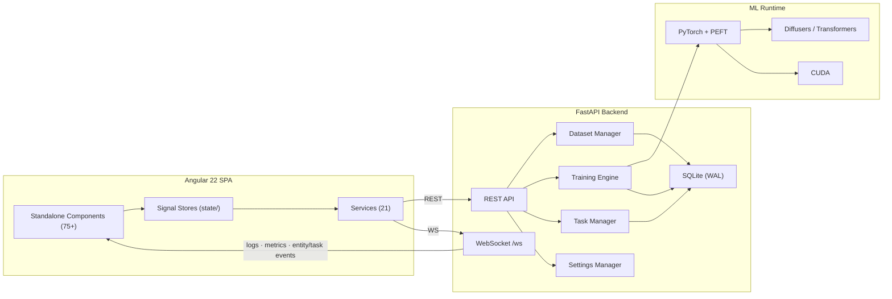

# Architecture

> Updated 2026-06-10 · App version `0.5.6-alpha`

## Overview

MRLN Arcane Tuner is a **dataset-first LoRA training studio** built as a full-stack web application. The backend is a **FastAPI** server that orchestrates dataset management, AI services (captioning, masking, scoring, restoration), background task processing, and PyTorch-based training. The frontend is an **Angular 22** SPA using Signals and Tailwind v4, organized around a project/dataset scope model.

## System Diagram



## Data Flow

1. **User** works within a **project** scope, managing datasets, templates, training config, and the job queue.
2. **Frontend signal stores** hold reactive state; **services** talk to the backend via REST + a single WebSocket.
3. **FastAPI routes** dispatch to domain managers (`DatasetManager`, `JobManager`, `TaskManager`, `SettingsManager`).
4. **Long-running, GPU-bound work** (captioning, masking, rescans, crops, harmonize, upscale) runs through the **background task framework**, streaming progress over WebSocket to the topbar Task Center.
5. **Training jobs** run in subprocesses and communicate with the backend via file-based IPC (JSON-Lines log + signal file); progress streams over WebSocket.
6. **SQLite (WAL)** persists projects, datasets, media items, job history, metrics, samples, templates, and definitions via a repository layer.
7. **settings.json** stores application-level config (ports, log level, auth); per-domain config now lives in templates/projects.

---

## Backend Architecture

### Entry Point

| File          | Purpose                                                                  |
| ------------- | ------------------------------------------------------------------------ |
| `main.py`     | FastAPI app, lifespan, CORS + optional token-auth + logging middleware, router mounts, `/media` + SPA static mounts |
| `__init__.py` | Version (`0.5.6-alpha`); applies diffusers + HPS-v2 compat patches at import |

**Lifespan** wires the shared event loop into `dataset_manager` / `job_manager` / `task_manager`, hydrates jobs from the DB, discovers plugins + initializes the model registry, recovers jobs whose subprocess died during downtime, optionally launches the frontend dev server, and warms cache-stats aggregation on a non-GPU background lane.

### API Route Domains

Routers are mounted under `/api` (settings under `/api/settings`).

#### Dataset Routes (`api/dataset/`, prefix `/api`)

| Module                 | Routes                                                            | Purpose                              |
| ---------------------- | ---------------------------------------------------------------- | ------------------------------------ |
| `crud_routes.py`       | CRUD, scan/rescan, upload, ZIP import/export, pairs, captions/masks enable | Core dataset operations              |
| `stats_routes.py`      | cross-dataset KPI aggregates, histograms, tag/aspect/style counts | Dataset analytics                    |
| `adjustment_routes.py` | adjust, adjust/batch, color-match, curves, cube-LUT, histogram, export-cube | Image manipulation pipeline          |
| `crop_routes.py`       | crop, crop/calc-target                                            | Resolution-aware smart cropping      |
| `analysis_routes.py`   | analysis, bump, harmonize/task                                    | Analysis + duplicate detection       |
| `upscale_routes.py`    | upscale, list-models                                             | Neural upscaling (ESRGAN/SwinIR)     |
| `overlay_routes.py`    | render-pipeline, overlay get/commit, restore models, model registry/download | Overlay rendering + restoration models |

#### Training Routes (`api/training/`, prefix `/api/training`)

| Module                 | Routes                                                       | Purpose                       |
| ---------------------- | ----------------------------------------------------------- | ----------------------------- |
| `job_routes.py`        | jobs CRUD, start/stop/pause/resume/soft-stop, sampling, auto-queue, samples | Job lifecycle                 |
| `definition_routes.py` | model definitions CRUD, enrich, VRAM estimation             | Model registry management     |
| `plugin_routes.py`     | plugins, schema (project-scoped)                            | Training plugin discovery     |
| `template_routes.py`   | domain-scoped template CRUD + export/import (plan/apply/rollback) | Captioning/masking/training templates |
| `history_routes.py`    | job stats, metrics, checkpoints, samples, rerun-config       | Persistent job tracking       |
| `lora_routes.py`       | inspect, resize                                             | LoRA analysis + rank resize   |
| `checkpoint_routes.py` | inspect                                                     | Checkpoint metadata reading   |

#### Other Route Modules

| Module                 | Prefix           | Purpose                                                          |
| ---------------------- | ---------------- | --------------------------------------------------------------- |
| `caption_routes.py`    | `/api/captions`  | AI captioning (Florence-2, JoyCaption, Qwen3-VL, Youtu-VL), batch, model unload |
| `masking_routes.py`    | `/api`           | Segmentation masking (SAM3, RemBG) — generate/batch/apply/delete |
| `project_routes.py`    | `/api/projects`  | Project CRUD, dataset membership, preferences, export + import (plan/apply/rollback) |
| `tasks_routes.py`      | `/api`           | Background task list + cancel (Task Center sync)                 |
| `io_routes.py`         | `/api/import`    | Archive `peek` — routes an import to project/template/dataset    |
| `cache_routes.py`      | `/api`           | Latent/embedding cache stats + purge                            |
| `settings_routes.py`   | `/api/settings`  | Module settings GET/PUT (training/captioning/masking migrated → templates, return 410) |
| `system_routes.py`     | `/api/system`    | restart, logs, **version**, health, status, GPU                 |
| `filesystem_routes.py` | `/api`           | Directory browsing for the file-picker UI                       |
| `websocket.py`         | `/api`           | WebSocket `/ws` for real-time log/metric/entity/task streaming  |

### Core Services (`app/core/`)

Top-level singletons and managers:

| Service                | Purpose                                                       |
| ---------------------- | ------------------------------------------------------------ |
| `settings_manager.py`  | JSON config singleton (ports, log level) with module isolation |
| `dataset_manager.py`   | Dataset registry, scanning, media ops, metadata, sync broadcasts |
| `job_manager.py`       | Training job queue, subprocess orchestration, log streaming, recovery |
| `plugin_manager.py`    | Training plugin discovery + schema enrichment                |
| `events.py`            | `EventManager` singleton — WebSocket connection + broadcast  |
| `entity_events.py`     | Typed entity-change event envelope + emit helpers            |
| `image_adjustments.py` | Color-space conversions and adjustment primitives            |
| `image_hash.py`        | Perceptual hashing for duplicate detection                   |
| `model_registry.py`    | Curated restore/upscale model registry + download URLs       |
| `system_monitor.py`    | GPU/CPU monitoring (VRAM, temp, power, utilization)          |
| `runtime_config.py`    | Writes `runtime-config.json` for dynamic port discovery      |
| `auth.py`              | Optional token-auth ASGI gate + login page (no-op if unset)  |
| `logger.py`            | Structured JSON logging (structlog) with WebSocket sink + trace IDs |

Subpackages:

| Package           | Purpose                                                                |
| ----------------- | --------------------------------------------------------------------- |
| `tasks/`          | **Background task framework** — `task_manager.py` (registry, FIFO lane workers, progress broadcast, cancellation) + `task.py` (task model with `user_visible` flag) |
| `db/`             | SQLite `engine.py` (WAL, thread-local, write serialization), `migrations.py`, `repositories/` (project, dataset, media, job, metrics, sample, checkpoint, template, definition repos) |
| `dataset/`        | Geometry/crop math, scan + rescan/crop/harmonize batch runners, thumbnails, overlay recipes, portable ZIP I/O |
| `image_processing/` | color/curves/HSL/spatial ops, color-match, restoration, tiled inference, composable + batch pipelines |
| `captioning/`     | Caption model loader + batch runner + per-model adapters (Florence2, JoyCaption, Youtu-VL, Qwen3-VL) |
| `masking/`        | Mask model loader + generate/apply batch runners + adapters (RemBG, SAM3) |
| `scoring/`        | HPS-v2 aesthetic/quality scoring service                              |
| `portable/`       | Generic archive writer + manifest envelope (kind/version validation) |
| `project/` · `template/` | Export/import manifest building + import orchestration         |
| `schemas/`        | Pydantic settings schemas (training, captioning, masking, scoring, overrides) |
| `stats/`          | Definition-usage analytics + backfill                                |

### Training Engine (`app/engine/`)

```
engine/
├── core/                  # Interfaces, definitions, pipeline composition
│   ├── interfaces.py      # IModelLoader, IModelSaver, IModelDriver, IDataPipeline
│   ├── archetypes.py      # Capability templates (latent_diffusion, unified_transformer)
│   ├── definitions.py     # ModelDefinition / ModelFamily base classes
│   ├── layer_manifest.py  # Layer topology for block swapping
│   ├── optimization/      # block_swapping, targeted_training
│   └── pipeline/          # GenericTrainingPipeline + loading/data/caching/optimization/train phases
├── components/            # bucketing, checkpoints, embedding/text caching, EMA, job log writer, signal manager
├── factories/             # Optimizer (12 impls) + quantization (bitsandbytes/quanto/torchao) factories
├── models/
│   ├── registry.py        # Model family registry (plugin-driven)
│   └── families/          # 8 families (see below)
├── strategies/            # EMA, timestep sampling, noise interpolation
└── utils/                 # LoRA tools + conversion, safe save, introspection, VRAM/cost estimators
```

**Model families** (`models/families/`):

| Family            | Model                                                        | Archetype             |
| ----------------- | ----------------------------------------------------------- | --------------------- |
| `sdxl`            | Stable Diffusion XL (1.0 / Turbo), dual CLIP, ε-prediction  | latent_diffusion      |
| `flux1`           | FLUX.1 (Dev / Schnell), flow-matching, T5 + CLIP            | latent_diffusion      |
| `flux2`           | FLUX.2 (Klein / Dev)                                         | latent_diffusion      |
| `qwen_image`      | Qwen-Image                                                   | latent_diffusion      |
| `zimage`          | Z-Image Base                                                 | latent_diffusion      |
| `ernie_image`     | Baidu ERNIE-Image (custom text encoder)                     | latent_diffusion      |
| `hidream_o1`      | HiDream-O1-Image (pixel-space, text-to-image LoRA)          | unified_transformer   |
| `microsoft_lens`  | Microsoft Lens (decoupled GPT-OSS, vendored DiT)            | latent_diffusion      |

Each family implements `Loader` (`IModelLoader`), `Saver` (`IModelSaver`), `Driver` (`IModelDriver`, phased forward pass), `Trainer` (`GenericTrainingPipeline` hooks), and `Sampler` (inference preview).

**Training IPC:** jobs run as subprocesses (1 process = 1 job). The trainer writes JSON-Lines to `{output_dir}/job_log.jsonl` (read by `JobManager`'s log tailer) and polls `{output_dir}/signal.json` each step for pause/resume/soft-stop. Jobs persist in SQLite and are re-attached or recovered after a backend restart.

### Database

| Store              | Technology   | Contents                                                            |
| ------------------ | ------------ | ------------------------------------------------------------------- |
| `settings.json`    | JSON file    | Application config, module settings                                 |
| `arcane_tuner.db`  | SQLite (WAL) | Projects, datasets, media items, job history, metrics, samples, checkpoints, templates, definitions |

---

## Frontend Architecture

### Stack

| Technology    | Version | Purpose                                          |
| ------------- | ------- | ------------------------------------------------ |
| Angular       | 22      | Standalone component framework                    |
| TypeScript    | 6       | Strict typing                                    |
| Tailwind CSS  | v4      | Utility-first styling                            |
| Signals       | —       | Reactive state (signal stores, no template subscribe) |
| uPlot         | —       | High-performance training charts                 |
| CodeMirror 6  | —       | JSON editor in config/template modals            |
| Lucide        | —       | Icon set                                         |
| Vitest · Playwright | —  | Unit + E2E testing                               |

### Screens & Routing

`app.routes.ts` lazy-loads eight top-level screens (default + wildcard → `/datasets`):

| Route             | Screen           | Purpose                                            |
| ----------------- | ---------------- | -------------------------------------------------- |
| `/datasets`       | DatasetsScreen   | KPI rail + dataset grid (search/filter/sort/upload) |
| `/projects`       | ProjectsScreen   | Project card grid + new-project dialog             |
| `/projects/:id`   | ProjectDetail    | Single project view                                |
| `/templates`      | TemplatesScreen  | Training/captioning/masking template library + import |
| `/training`       | TrainingScreen   | Config form (model, LoRA, hyperparams, dataset picker) + estimate rail |
| `/jobs`           | JobsScreen       | Live job queue + chart/metrics + job details       |
| `/tools`          | ToolsScreen      | LoRA inspect/resize                                |
| `/server`         | ServerScreen     | System health KPI rail + connection/model config + logs |

### Services (21)

| Service                        | Purpose                                              |
| ------------------------------ | --------------------------------------------------- |
| `runtime-config.service.ts`    | Dynamic port discovery (APP_INITIALIZER)            |
| `websocket.service.ts`         | WebSocket connection + entity/task event listener   |
| `dataset.ts`                   | Dataset CRUD, scanning, analysis, image ops         |
| `job.ts`                       | Job lifecycle, queue, live metrics                  |
| `project.service.ts`           | Project CRUD, membership, stats, import/export       |
| `template.service.ts`          | Template library across the three domains           |
| `import-archive.service.ts`    | Archive peek + multi-type (dataset/template/project) import |
| `project-export.service.ts`    | Project export selection + batching                 |
| `model.service.ts`             | Model definitions, enrichment, source overrides     |
| `model-capabilities.service.ts`| Per-model capability flags                          |
| `system.service.ts`            | GPU/system health snapshot, uptime                  |
| `system-control.service.ts`    | App-lock restart control + WS status sync           |
| `settings.service.ts`          | Module settings HTTP wrapper                        |
| `toast.ts`                     | Notification toasts + history                       |
| `dataset-sync.service.ts`      | Single reconciliation point for file-change ops (see below) |
| `training-handoff.service.ts`  | Carries training config/selection across screens    |

### State Stores (`state/`)

Injectable signal-based stores replace ad-hoc component state: `task.store` (Task Center queue + recent history), `job.store`, `dataset.store`, `media-item.store`, `caption-cache.store` (kept separate from media items to bound memory), `overlay.store`, `search.store`, `scope.store` (project/dataset context), `settings.store`, `theme.store`, `registry.store`, `model-download.store`, `topbar-panel.store`, `jobs-view.state`. Side-effect listeners (`caption-write`, `mask-apply-summary`, `harmonize-summary`) bridge WebSocket completions into dataset sync.

### Components (75+ standalone)

Grouped by domain:

- **Shell / layout** — `shell`, `sidebar`, `topbar`, `task-center` (background-task monitor), `notification-panel`, `workspace-layer`, `modal-layer`, `connection-banner`, `restart-overlay`, `context-switcher`, `download-indicator`.
- **Dataset workspace** — `dataset-workspace` (Browse/Details/Edit mode switcher + filmstrip), `browse-mode`, `details-mode`, `edit-mode`, `filmstrip-scrubber`, `viewer-grid-view`, `detail-media-container`.
- **Image editing panels** — `edit-canvas`, left/right panels, `pipeline-order-list`, plus per-op panels: curves, HSL, color-tone, color-match, white-balance, sharpen, vignette, lens, LUT, crop, denoising, face-restore, upscale, model-restore, histogram.
- **Captioning & masking** — `dataset-caption-settings`, `dataset-masking-settings`, `detail-caption-sidebar`, `detail-masking-sidebar`.
- **Training** — `training-dynamic-config`, `dynamic-form-group`/`dynamic-form-field`/`schema-node`, `training-template-selector`, `training-job-queue`, `training-chart`, `training-toc`, `training-estimate-rail`, `vram-budget-card`, `advanced-vram-card`, `vram-breakdown`, `target-layers-card`, `model-source-config`, `run-summary`.
- **Modals** — analyze, cache, confirm, crop-preview, dataset-form, export-options, import-archive, import-dataset, job-config, mask-preview, mass-caption, mass-edit, mass-mask, project-dialog, rescan, similar-images, template-edit, template-json, templates-library, version-edit.
- **System** — `system-monitor`, `server-control`, `live-log-viewer`, `lora-tools`.
- **UI primitives & shared** — `kpi-tile`, `sparkline`, `tabs`, `segmented`, `chip-tag`, `icon-button`, `ico`, `json-editor`, `task-queue-hint`, `template-info-card`, `toast-container`.

---

## Cross-cutting Concerns

### Background Task Framework

GPU-bound and long-running operations are dispatched as **tasks** rather than blocking requests. The backend `TaskManager` runs FIFO lane workers (a GPU lane plus a non-GPU `background` lane), tracks progress counters, supports cancellation, and broadcasts task events over WebSocket. Adopters include captioning, masking (generate + apply), dataset rescan, crop-all, mass-edit, harmonize, and per-image upscale/denoise; a `user_visible` flag hides silent tasks (e.g. cache-stats warmup). The frontend `TaskStore` + `TaskCenterComponent` surface active tasks and recent history in the topbar.

### Dataset Sync

Every file-changing operation funnels through `DatasetSyncService`, which performs a **replace-not-merge** refresh of the media-item + caption-cache stores against disk truth (evicting ghosts), driven by the backend's `dataset.invalidated` WebSocket broadcast. This keeps the grid consistent after rescans, harmonize, mask bake, and captioning across tabs.

### Export / Import

Projects and templates are portable as ZIP archives with a manifest envelope (`kind` + versions). `io_routes` `peek` inspects an archive and routes it to the right importer. Project export bundles preferences, nested template archives, and datasets (embed / reference / exclude modes). Import is a two-phase **plan → apply** flow with transactional rollback (and a user-triggered undo for projects).

---

## Conventions

- **Naming:** snake_case (Python), camelCase (TypeScript), kebab-case (file names)
- **DI:** `inject()` function only (no constructor injection)
- **State:** Signals only (`signal()`, `computed()`, `input()`, `output()`, `model()`); shared state in `state/` stores
- **Control flow:** `@if`, `@for`, `@switch` (no legacy `*ngIf`/`*ngFor`)
- **API URLs:** Dynamic via `RuntimeConfigService` (no hardcoded ports)
- **Logging:** Structured JSON via `structlog` with per-request trace IDs
- **Testing:** Vitest (unit) + Playwright (E2E); `data-testid` attributes for selectors

## Integration Points

| External Service     | Type           | Purpose                                       |
| -------------------- | -------------- | --------------------------------------------- |
| PyTorch / CUDA       | ML Runtime     | Model loading, training, inference            |
| Hugging Face Hub     | Model Registry | Diffusers, Transformers, PEFT model download  |
| safetensors          | File Format    | LoRA weight persistence                       |
| ComfyUI              | Inference      | BFL-format LoRA export compatibility          |
