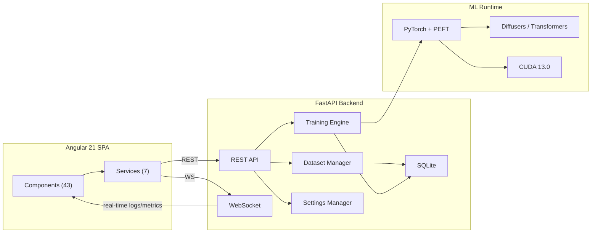

# Architecture

> Updated 2026-03-08

## Overview

MRLN Arcane Tuner is a **dataset-first LoRA training studio** built as a full-stack web application. The backend is a **FastAPI** server that orchestrates dataset management, AI services, and PyTorch-based training. The frontend is an **Angular 21** SPA using Signals and Tailwind v4.

## System Diagram



## Data Flow

1. **User** interacts with Angular frontend (datasets, training config, job queue)
2. **Frontend services** communicate via REST API + WebSocket
3. **FastAPI routes** dispatch to domain managers (DatasetManager, JobManager, SettingsManager)
4. **Training engine** runs jobs in subprocess, streams progress via WebSocket
5. **SQLite** persists dataset metadata, job history, metrics, templates
6. **settings.json** stores application config (ports, log level) and module settings

---

## Backend Architecture

### Entry Point

| File | Purpose |
|---|---|
| `main.py` | FastAPI app, lifespan, middleware, CORS, router mounts, static files |
| `__init__.py` | Version (`0.1.0-alpha`), diffusers compat patches |

### API Route Domains

All routes are mounted with `/api` prefix (except settings at root).

#### Dataset Routes (`api/dataset/`)

| Module | Routes | Purpose |
|---|---|---|
| `crud_routes.py` | CRUD, scan, upload, pairs, captions, media toggle | Core dataset operations |
| `adjustment_routes.py` | adjust, adjust-batch, color-match, histogram, export-cube | Image manipulation pipeline |
| `crop_routes.py` | crop, calc-crop-targets | Resolution-aware smart cropping |
| `analysis_routes.py` | analysis, bump, harmonize | Dataset analysis + duplicate detection |
| `upscale_routes.py` | upscale | Neural upscaling (ESRGAN/SwinIR) |

#### Training Routes (`api/training/`)

| Module | Routes | Purpose |
|---|---|---|
| `job_routes.py` | jobs CRUD, start/stop/pause/resume/soft-stop/restart, logs, samples | Job lifecycle |
| `definition_routes.py` | model definitions CRUD, enrich | Model registry management |
| `plugin_routes.py` | plugins, schema | Training plugin discovery |
| `template_routes.py` | templates CRUD, apply | Training config templates |
| `history_routes.py` | job history queries | Persistent job tracking |
| `lora_routes.py` | inspect, resize | LoRA analysis + SVD resize |
| `checkpoint_routes.py` | inspect | Checkpoint metadata reading |

#### Other Route Modules

| Module | Prefix | Purpose |
|---|---|---|
| `caption_routes.py` | `/api/captions` | AI captioning (Florence-2, JoyCaption, Qwen3-VL, Youtu-VL) |
| `masking_routes.py` | `/api` | Segmentation masking (SAM3, RemBG), mass-apply |
| `cache_routes.py` | `/api` | Latent/embedding cache listing + purge |
| `settings_routes.py` | *(root)* | Module settings GET/PUT |
| `system_routes.py` | `/api` | Restart, logs, GPU status, system status |
| `filesystem_routes.py` | `/api` | Directory browsing for file picker UI |
| `websocket.py` | `/api` | WebSocket `/ws` for real-time log/metric streaming |

### Core Services (`app/core/`)

| Service | Purpose |
|---|---|
| `settings_manager.py` | Singleton JSON config manager with module isolation |
| `dataset_manager.py` | Dataset scanning, directory pairing, metadata persistence |
| `job_manager.py` | Job queue, subprocess orchestration, status tracking |
| `plugin_manager.py` | Training plugin discovery and registration |
| `image_adjustments.py` | 9-stage image processing pipeline |
| `runtime_config.py` | Writes `runtime-config.json` for dynamic port discovery |
| `logger.py` | Structured JSON logging with WebSocket sink |

### Training Engine (`app/engine/`)

```
engine/
├── core/              # Generic training pipeline, interfaces, optimizers
│   ├── pipeline/      # GenericTrainingPipeline, precacher, dataloader
│   ├── interfaces.py  # Abstract ModelLoader, ModelSaver, ModelDriver
│   └── optimization/  # Targeted training, gradient strategies
├── components/        # Shared: embedding manager, text cache, EMA
├── factories/         # Model-family factory registration
├── models/
│   ├── registry.py    # V2 model definition registry (YAML-driven)
│   └── families/
│       ├── sdxl/      # SDXL 1.0/Turbo trainer
│       ├── flux1/     # Flux.1 trainer
│       ├── flux2/     # Flux.2 (Klein) trainer
│       ├── qwen_image/# Qwen3 image model
│       └── zimage/    # Z-Image model
├── strategies/        # EMA, timestep sampling, learning rate
└── utils/             # LoRA tools, safe save, model utilities
```

Each model family implements: `Trainer` (pipeline hooks), `Loader`, `Saver`, `Driver` (forward pass), `Sampler` (inference preview).

### Database

| Store | Technology | Contents |
|---|---|---|
| `settings.json` | JSON file | Application config, module settings |
| `arcane_tuner.db` | SQLite (WAL) | Datasets, media items, job history, metrics, templates |

---

## Frontend Architecture

### Stack

| Technology | Version | Purpose |
|---|---|---|
| Angular | 21 | Component framework |
| Tailwind CSS | v4 | Utility-first styling |
| Signals | — | Reactive state (no RxJS subscribe in templates) |
| uPlot | — | High-performance training charts |
| xterm.js | — | Live terminal log viewer |

### Services

| Service | Purpose |
|---|---|
| `runtime-config.service.ts` | Dynamic port discovery via `runtime-config.json` |
| `dataset.ts` | Dataset CRUD, scanning, analysis, image operations |
| `job.ts` | Job lifecycle, queue management |
| `model.service.ts` | Model definitions, VRAM estimation |
| `system.service.ts` | System settings, restart, GPU status |
| `websocket.service.ts` | WebSocket connection for real-time updates |
| `toast.ts` | Notification toasts |

### Components (43 Standalone)

#### Dataset Domain
| Component | Purpose |
|---|---|
| `dataset-manager` | Top-level dataset list + creation |
| `dataset-card` | Dataset card with thumbnail + metadata |
| `dataset-empty-state` | Empty state placeholder |
| `dataset-form-modal` | Create/edit dataset modal |
| `dataset-toolbar` | Manager toolbar actions |
| `dataset-rescan-options-modal` | Incremental vs full rescan choice |
| `dataset-single-rescan-modal` | Single dataset rescan dialog |
| `dataset-viewer` | Image grid/detail viewer orchestrator |
| `viewer-grid-view` | Grid view with thumbnails |
| `viewer-detail-view` | Detail view with sidebar panels |
| `viewer-toolbar` | Viewer toolbar (mode toggle, actions) |
| `viewer-analysis-modal` | Dataset analysis + duplicate detection |
| `viewer-similar-images-modal` | Perceptual hash similarity results |
| `viewer-crop-preview-modal` | Smart crop preview |
| `viewer-mass-caption-modal` | Batch AI captioning |
| `viewer-mass-masking-modal` | Batch AI masking |
| `viewer-mask-preview-modal` | Mask composite preview |
| `viewer-rescan-modal` | Rescan progress |
| `viewer-cache-admin-modal` | Latent/embedding cache management |

#### Image Editing
| Component | Purpose |
|---|---|
| `image-editor-modal` | Full image adjustment editor |
| `curves-editor` | Per-channel Bézier curves control |
| `hsl-panel` | HSL selective color adjustment |
| `histogram-display` | Real-time histogram visualization |
| `detail-media-container` | Canvas-based preview renderer |

#### Captioning & Masking
| Component | Purpose |
|---|---|
| `detail-caption-sidebar` | Per-image caption editing |
| `detail-masking-sidebar` | Per-image mask controls |
| `dataset-caption-settings` | Captioning model settings + templates |
| `dataset-masking-settings` | Masking model settings + templates |

#### Training
| Component | Purpose |
|---|---|
| `training-dynamic-config` | JSON Schema-driven config form |
| `dynamic-form-field` | Single configurable field (input, select, checkbox, browse) |
| `dynamic-form-group` | Array/object field group (datasets, phases) |
| `training-template-selector` | Save/load training templates |
| `training-job-queue` | Job list with status + sample images |
| `training-chart` | Live loss/LR chart (uPlot) |
| `vram-budget-card` | VRAM estimation display |
| `advanced-vram-card` | Block swap slider controls |
| `target-layers-card` | Transformer layer selection tree |

#### System
| Component | Purpose |
|---|---|
| `server-control` | Port config, log level, restart |
| `system-monitor` | GPU/CPU usage display |
| `live-log-viewer` | Structured log viewer |
| `live-terminal` | xterm.js terminal for raw logs |

#### Tools & Shared
| Component | Purpose |
|---|---|
| `lora-tools` | LoRA inspect + resize UI |
| `toast-container` | Notification display |

---

## Conventions

- **Naming:** snake_case (Python), camelCase (TypeScript), kebab-case (file names)
- **DI:** `inject()` function only (no constructor injection)
- **State:** Signals only (`signal()`, `computed()`, `input()`, `output()`, `model()`)
- **Control flow:** `@if`, `@for`, `@switch` (no legacy `*ngIf`/`*ngFor`)
- **API URLs:** Dynamic via `RuntimeConfigService` (no hardcoded ports)
- **Logging:** Structured JSON via `structlog` with per-request trace IDs
- **Testing:** `data-testid` attributes for E2E selectors

## Integration Points

| External Service | Type | Purpose |
|---|---|---|
| PyTorch / CUDA | ML Runtime | Model loading, training, inference |
| Hugging Face Hub | Model Registry | Diffusers, Transformers, PEFT model download |
| safetensors | File Format | LoRA weight persistence |
| ComfyUI | Inference | BFL-format LoRA export compatibility |