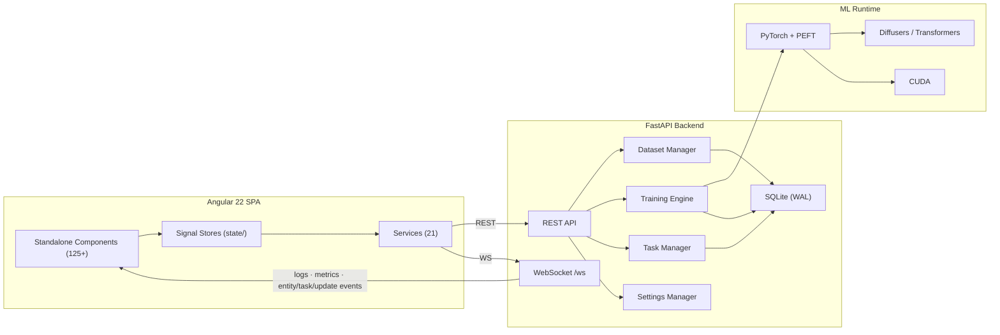

# Architecture

> Updated 2026-07-06 · App version `0.7.2-beta`

## Overview

MRLN Arcane Tuner is a **dataset-first LoRA training studio** built as a full-stack web application. The backend is a **FastAPI** server that orchestrates dataset management, AI services (captioning, masking, scoring, restoration, video prep, LLM caption-refine), background task processing, and PyTorch-based training across image and video model families. The frontend is an **Angular 22** SPA using Signals and Tailwind v4, organized around a project/dataset scope model.

## System Diagram



## Data Flow

1. **User** works within a **project** scope, managing datasets, templates, training config, and the job queue.
2. **Frontend signal stores** hold reactive state; **services** talk to the backend via REST + a single WebSocket.
3. **FastAPI routes** dispatch to domain managers (`DatasetManager`, `JobManager`, `TaskManager`, `SettingsManager`).
4. **Long-running, GPU-bound work** (captioning, masking, rescans, crops, harmonize, upscale, video split/scene-detect) runs through the **background task framework**, streaming progress over WebSocket to the topbar Task Center.
5. **Training jobs** run in subprocesses and communicate with the backend via file-based IPC (JSON-Lines log + signal file); progress and per-step sampling status stream over WebSocket.
6. **SQLite (WAL)** persists projects, datasets, media items, job history, metrics, samples, templates, and definitions via a repository layer.
7. **settings.json** stores application-level config (ports, log level, auth, LLM/API providers); per-domain training/captioning/masking config lives in templates/projects.

---

## Backend Architecture

### Entry Point

| File          | Purpose                                                                  |
| ------------- | ------------------------------------------------------------------------ |
| `main.py`     | FastAPI app, lifespan, CORS + optional token-auth + logging middleware, router mounts, error-envelope exception handlers, `/media` + SPA static mounts |
| `__init__.py` | Version (`0.7.2-beta`); applies diffusers + HPS-v2 compat patches at import |

**Lifespan** wires the shared event loop into `dataset_manager` / `job_manager` / `task_manager`, hydrates jobs from the DB, discovers plugins + initializes the model registry, recovers jobs whose subprocess died during downtime, initializes the self-update service, optionally launches the frontend dev server, and warms cache-stats aggregation on a non-GPU background lane.

**Error envelope:** exception handlers in `main.py` wrap `HTTPException` / validation / `DrainActive` errors into a consistent `ErrorResponse` (`api/schemas/common_schemas.py`) carrying `detail` + `error_code` + `context`.

### API Route Domains

Routers are mounted under `/api` (settings under `/api/settings`, system under `/api/system`).

#### Dataset Routes (`api/dataset/`, prefix `/api`)

| Module                 | Routes                                                            | Purpose                              |
| ---------------------- | ---------------------------------------------------------------- | ------------------------------------ |
| `crud_routes.py`       | CRUD, scan/rescan, upload, ZIP import/export, pairs, captions/masks enable | Core dataset operations              |
| `stats_routes.py`      | cross-dataset KPI aggregates, histograms, tag/aspect/style counts | Dataset analytics                    |
| `adjustment_routes.py` | adjust, adjust/batch, color-match, curves, cube-LUT, histogram, export-cube | Image manipulation pipeline          |
| `crop_routes.py`       | crop, crop/calc-target                                            | Resolution-aware smart cropping      |
| `analysis_routes.py`   | analysis, bump, harmonize/task                                    | Analysis + duplicate detection       |
| `upscale_routes.py`    | upscale, list-models                                             | Neural upscaling (ESRGAN/SwinIR)     |
| `overlay_routes.py`    | render-pipeline, overlay get/commit, restore models, model registry/download | Overlay rendering + restoration models |
| `control_routes.py`    | control-image list/get/delete/upload, assign/re-match, role patch | Paired edit control-image management |
| `video_routes.py`      | video probe, split, scene-detect, cutlist get/patch, trim, clip health | Video dataset prep (frames → clips)  |

#### Training Routes (`api/training/`, prefix `/api`)

| Module                 | Routes                                                       | Purpose                       |
| ---------------------- | ----------------------------------------------------------- | ----------------------------- |
| `job_routes.py`        | jobs CRUD, config PUT, start/stop/pause/resume/soft-stop, **restart**, **resume-from-checkpoint**, **reorder**, auto-queue + auto-resume settings, sampling pause/resume/cadence/status, samples, checkpoints list + download (zip) | Job lifecycle                 |
| `definition_routes.py` | model definitions CRUD, enrich, VRAM estimation             | Model registry management     |
| `plugin_routes.py`     | plugins, schema (project-scoped)                            | Training plugin discovery     |
| `template_routes.py`   | domain-scoped template CRUD + export/import (plan/apply/rollback) | Captioning/masking/training templates |
| `history_routes.py`    | job history + detail/metrics/replay/rerun-config, stats (read-only), **stats/recompute** backfill, **stats/{definition_id}** per-definition | Persistent job tracking       |
| `lora_routes.py`       | inspect, resize                                             | LoRA analysis + rank resize   |
| `checkpoint_routes.py` | inspect                                                     | Checkpoint metadata reading   |

#### Other Route Modules

| Module                       | Prefix              | Purpose                                                          |
| ---------------------------- | ------------------- | --------------------------------------------------------------- |
| `caption_routes.py`          | `/api/captions`     | AI captioning (Florence-2, JoyCaption, Qwen3-VL, Youtu-VL), batch, model unload |
| `api_provider_routes.py`     | `/api/captions`     | OpenAI-compatible API caption providers (status, enable, model list) |
| `caption_context_routes.py`  | `/api/caption-context` | Per-dataset caption context / trigger-word settings          |
| `caption_variant_routes.py`  | `/api`              | Per-definition caption variants + suggestions (accept/reject/all) |
| `llm_refine_routes.py`       | `/api/llm-refine`   | LLM caption-refine (Ollama / OpenAI-compat) — models, refine batch |
| `masking_routes.py`          | `/api`              | Segmentation masking (SAM3, RemBG) — generate/batch/apply/delete |
| `project_routes.py`          | `/api/projects`     | Project CRUD, dataset membership, preferences, export + import (plan/apply/rollback) |
| `tasks_routes.py`            | `/api`              | Background task list + cancel (Task Center sync)                 |
| `io_routes.py`               | `/api/import`       | Archive `peek` — routes an import to project/template/dataset    |
| `cache_routes.py`            | `/api`              | Latent/embedding cache stats + purge                            |
| `settings_routes.py`         | `/api/settings`     | Application module settings GET/PUT (training/captioning/masking config lives in templates) |
| `system_routes.py`           | `/api/system`       | restart, logs, **version**, health, self-update status/check/apply |
| `filesystem_routes.py`       | `/api`              | Directory browsing for the file-picker UI                       |
| `websocket.py`               | `/api`              | WebSocket `/ws` for real-time log/metric/entity/task/update streaming |

Shared route infra: `api/_deps.py` (the raise-404 helper `dataset_or_404`; each dataset-domain route module declares its own one-line `get_dataset_or_404(name)` dependency on top of it **by design** — the per-module wrapper resolves that module's own `dataset_manager`, which is what lets tests patch the manager per route module; don't "deduplicate" it), `api/_path_guard.py`, and `api/schemas/` (per-domain Pydantic `response_model` schemas + `common_schemas.ErrorResponse`).

### Core Services (`app/core/`)

Top-level singletons, managers, and helpers:

| Service                 | Purpose                                                       |
| ----------------------- | ------------------------------------------------------------ |
| `settings_manager.py`   | JSON config singleton (ports, log level, providers) with module isolation |
| `dataset_manager.py`    | Dataset registry, scanning, media ops, metadata, sync broadcasts |
| `job_manager.py`        | Training job queue, subprocess orchestration, log streaming, recovery, bounded auto-resume-on-GPU-fault |
| `job.py`                | Job model + state                                            |
| `plugin_manager.py`     | Training plugin discovery + schema enrichment                |
| `events.py`             | `EventManager` singleton — WebSocket connection + broadcast  |
| `entity_events.py`      | Typed entity-change event envelope + emit helpers (incl. project/template) |
| `log_tailer.py`         | Tails `job_log.jsonl`, drains + forwards lines to the WS sink |
| `drain.py`              | Restart-when-idle drain gate (`DrainActive`)                 |
| `self_update.py`        | git-pull + rebuild + restart-when-idle self-update service   |
| `naming.py`             | Canonical name/slug helpers                                  |
| `hf_auth.py`            | Hugging Face token resolution                                |
| `compat.py`            | diffusers / transformers compat shims                        |
| `container_config.py`   | Container/runtime environment config                         |
| `bucket_preview.py`     | Aspect-bucket preview computation                            |
| `gpu_unload.py`         | Shared GPU-plugin unload helper (`plugin.unload()` + `gc.collect()` + `synchronize` + `empty_cache`) for caption/masking/scoring services |
| `image_adjustments.py`  | Color-space conversions and adjustment primitives            |
| `image_hash.py`         | Perceptual hashing for duplicate detection                   |
| `model_registry.py`     | Curated restore/upscale model registry + download URLs       |
| `system_monitor.py`     | GPU/CPU monitoring (VRAM, temp, power, utilization)          |
| `runtime_config.py`     | Writes `runtime-config.json` for dynamic port discovery      |
| `auth.py`               | Optional token-auth ASGI gate + login page (no-op if unset)  |
| `logger.py`             | Structured JSON logging (structlog) with WebSocket sink + trace IDs |

Subpackages:

| Package           | Purpose                                                                |
| ----------------- | --------------------------------------------------------------------- |
| `tasks/`          | **Background task framework** — `task_manager.py` (registry, FIFO lane workers, progress broadcast, cancellation, `finish_cancelled`) + `task.py` (task model with `user_visible` flag) |
| `db/`             | SQLite `engine.py` (WAL, thread-local, write serialization), `migrations.py` (integer-versioned, through v17), `repositories/` (project, dataset, media, job, metrics, sample, checkpoint, preference, definition-stats, + captioning/masking/training template repos) |
| `dataset/`        | Geometry/crop math, scan + rescan/crop/harmonize/control batch runners, thumbnails, overlay recipes, tag analytics, media helpers, portable ZIP I/O |
| `image_processing/` | color/curves/HSL/spatial ops, color-match, restoration, tiled inference, composable + batch pipelines |
| `captioning/`     | Caption service + batch/refine-batch runners, variants + suggestions, tokenizer service, `models/` adapters (Florence2, JoyCaption, Youtu-VL, Qwen3-VL, api_model), `formats/` (schema-driven, incl. ideogram4), `processors/` (siglip2_fast) |
| `masking/`        | Mask model loader + generate/apply batch runners + adapters (RemBG, SAM3) |
| `scoring/`        | HPS-v2 aesthetic/quality scoring service                              |
| `llm/`            | LLM providers — `ollama_client`, `openai_compat`, `caption_refine`, provider settings |
| `video/`          | ffmpeg/probe wrappers, frame extraction, scene-detect + split batch runners, cutlist, clip health |
| `portable/`       | Generic archive writer + manifest envelope (kind/version validation) |
| `project/` · `template/` | Export/import manifest building + import orchestration         |
| `schemas/`        | Pydantic settings schemas (captioning, masking, model overrides)     |
| `stats/`          | Definition-usage analytics + backfill                                |

### Training Engine (`app/engine/`)

```
engine/
├── core/                  # Interfaces, definitions, pipeline composition
│   ├── interfaces.py      # IModelLoader, IModelSaver, IModelDriver, IDataPipeline
│   ├── archetypes.py      # Capability templates + field-visibility rules (image + video flags)
│   ├── definitions.py     # ModelDefinition / ModelFamily base classes
│   ├── layer_manifest.py  # Layer topology for block swapping
│   ├── sampling.py        # In-training preview sampler + VRAM headroom guard
│   ├── text_encoding.py   # Shared text-encoding seam
│   ├── video_contract.py  # 5D clip / video-batch shape contract
│   ├── caption_target.py · edit_validation.py
│   ├── optimization/      # block_swapping, targeted_training
│   └── pipeline/          # GenericTrainingPipeline + loading/data/caching/optimization/train phases
├── components/            # bucketing, checkpoints, latents, text_embeddings (disk cache), training_logger, job_log_writer, signal_manager, video
├── factories/             # Optimizer + quantization (bitsandbytes/quanto/torchao) factories + base/impl subdirs
├── models/
│   ├── registry.py        # Model family registry (plugin-driven) + count()
│   └── families/          # 13 families + wan_shared (see below)
├── strategies/            # EMA, timestep sampling, noise interpolation, sigma schedule/tracker
└── utils/                 # LoRA tools + conversion, safe save, introspection, VRAM/cost estimators, override manager
```

**Model families** (`models/families/`) — 13 shipped families plus the `wan_shared` support package (shared WAN text-encoding/cache mixin, driver/sampler/saver/trainer bases; WAN loaders build on the cross-family `engine/core/pipeline/loader_base.py`). Every family declares an `archetype` (`latent_diffusion` or `unified_transformer`); video families keep the `latent_diffusion` archetype and flip video capability flags via `capability_overrides`.

| Family            | Model                                                        | Archetype           | Video caps                       |
| ----------------- | ----------------------------------------------------------- | ------------------- | -------------------------------- |
| `sdxl`            | Stable Diffusion XL (1.0 / Turbo), dual CLIP, ε-prediction  | latent_diffusion    | —                                |
| `flux1`           | FLUX.1 (Dev / Schnell), flow-matching, T5 + CLIP            | latent_diffusion    | —                                |
| `flux2`           | FLUX.2 (Klein / Dev)                                         | latent_diffusion    | —                                |
| `qwen_image`      | Qwen-Image                                                   | latent_diffusion    | —                                |
| `zimage`          | Z-Image Base                                                 | latent_diffusion    | —                                |
| `ernie_image`     | Baidu ERNIE-Image (custom text encoder)                     | latent_diffusion    | —                                |
| `ideogram4`       | Ideogram 4 (structured-JSON captioning)                     | latent_diffusion    | —                                |
| `krea2`           | Krea2 (Raw train + Turbo deploy; vendored transformer, Qwen3-VL TE + Qwen VAE) | latent_diffusion | —                    |
| `microsoft_lens`  | Microsoft Lens (decoupled GPT-OSS, vendored DiT)            | latent_diffusion    | —                                |
| `hidream_o1`      | HiDream-O1-Image (pixel-space text-to-image LoRA)           | unified_transformer | —                                |
| `ltx2`            | LTX 2.3 video (Gemma3 TE, i2v + audio)                      | latent_diffusion    | `is_video`, `has_audio`          |
| `wan21`           | WAN 2.1 (T2V 1.3B/14B, I2V 14B; UMT5-XXL, CLIP i2v encoder) | latent_diffusion    | `is_video`, `has_image_encoder`  |
| `wan22`           | WAN 2.2 (dual-expert MoE, A14B T2V/I2V)                     | latent_diffusion    | `is_video`, `dual_expert`        |

Each family implements `Loader` (`IModelLoader`), `Saver` (`IModelSaver`), `Driver` (`IModelDriver`, phased forward pass), `Trainer` (`GenericTrainingPipeline` hooks), and `Sampler` (inference preview, with true cond+uncond CFG on image and video families). The `wan_shared` package holds the code wan21/wan22 share so the two stay byte-identical by construction.

**Training IPC:** jobs run as subprocesses (1 process = 1 job) launched from `run_trainer.py`, which sets `PYTORCH_CUDA_ALLOC_CONF=expandable_segments:True,gc_threshold:0.8` to bound reserved-pool fragmentation on Windows/WDDM. The trainer warms batches largest-bucket-first (worst-case allocation up front), writes JSON-Lines to `{output_dir}/job_log.jsonl` (read by `JobManager`'s log tailer), and polls `{output_dir}/signal.json` each step for pause/resume/soft-stop. `JobManager` runs a PID watchdog and, on a transient GPU fault (TDR/GpuRcReset), performs a bounded auto-resume when the toggle is enabled. Jobs persist in SQLite and are re-attached or recovered after a backend restart.

### Database

| Store              | Technology   | Contents                                                            |
| ------------------ | ------------ | ------------------------------------------------------------------- |
| `settings.json`    | JSON file    | Application config, module settings, providers                      |
| `arcane_tuner.db`  | SQLite (WAL) | Projects, datasets, media items, job history, metrics, samples, checkpoints, templates, definitions |

---

## Frontend Architecture

### Stack

| Technology    | Version | Purpose                                          |
| ------------- | ------- | ------------------------------------------------ |
| Angular       | 22      | Standalone component framework (zoneless)         |
| TypeScript    | 6       | Strict typing                                    |
| Tailwind CSS  | v4      | Utility-first styling                            |
| Signals       | —       | Reactive state (signal stores, no template subscribe) |
| uPlot         | —       | High-performance training charts                 |
| CodeMirror 6  | —       | JSON editor in config/template modals            |
| Lucide        | —       | Icon set                                         |
| Vitest · Playwright | —  | Unit + E2E testing                               |

### Screens & Routing

`app.routes.ts` lazy-loads eight top-level screens (default + wildcard → `/datasets`):

| Route             | Screen           | Purpose                                            |
| ----------------- | ---------------- | -------------------------------------------------- |
| `/datasets`       | DatasetsScreen   | KPI rail + dataset grid (search/filter/sort/upload) |
| `/projects`       | ProjectsScreen   | Project card grid + new-project dialog             |
| `/projects/:id`   | ProjectDetail    | Single project view                                |
| `/templates`      | TemplatesScreen  | Training/captioning/masking template library + import |
| `/training`       | TrainingScreen   | Config form (model, LoRA, hyperparams, dataset picker) + estimate rail |
| `/jobs`           | JobsScreen       | Live job queue + chart/metrics + job details + resume |
| `/tools`          | ToolsScreen      | LoRA inspect/resize                                |
| `/server`         | ServerScreen     | System health KPI rail + connection/model config + logs + self-update |

### Services (21)

Injectable HTTP/domain services in `services/`: `runtime-config.service`, `websocket.service`, `dataset`, `job`, `project.service`, `template.service`, `import-archive.service`, `project-export.service`, `model.service`, `model-capabilities.service`, `system.service`, `system-control.service`, `system-update.service`, `settings.service`, `llm-settings.service`, `caption-context.service`, `api-caption.service`, `dataset-upload.service`, `filesystem.service`, `resume-job.service`, `toast`. Two more domain services live in `state/`: `dataset-sync.service` (single reconciliation point for file-change ops) and `training-handoff.service`. Component-scoped services `VramEstimationService` + `TemplateAutosaveService` (both under `components/training/training-dynamic-config/`) keep the training config component thin.

### State Stores (`state/`)

Injectable signal-based stores: `task.store` (Task Center queue + recent history), `job.store`, `dataset.store`, `media-item.store`, `caption-cache.store` (kept separate from media items to bound memory), `overlay.store`, `search.store`, `scope.store` (project/dataset context), `settings.store`, `theme.store`, `registry.store`, `model-download.store`, `topbar-panel.store`, `jobs-view.state`, `llm-availability.store`, `model-context.store`, `system.store`. Entity-store infra (`entity-store.ts`, `entity-events.ts`) backs the typed stores; side-effect listeners (`caption-write`, `mask-apply-summary`, `harmonize-summary`) bridge WebSocket completions into dataset sync.

### Components (125+ standalone)

Grouped by domain:

- **Shell / layout** — `shell`, `sidebar`, `topbar` (+ `update-indicator`), `task-center` (background-task monitor), `notification-panel`, `workspace-layer`, `modal-layer`, `connection-banner`, `restart-overlay`, `context-switcher`, `download-indicator`; `shortcuts.service` for keyboard shortcuts.
- **Dataset workspace** (`workspace/`) — `dataset-workspace` + `modes/` (`browse-mode`, `details-mode`, `edit-mode` + `edit/`), `filmstrip-scrubber`, `project-membership-pill`, viewer grid/detail containers.
- **Image editing panels** — `edit-canvas`, left/right panels, `pipeline-order-list`, plus per-op panels: curves, HSL, color-tone, color-match, white-balance, sharpen, vignette, lens, LUT, crop, denoising, face-restore, upscale, model-restore, histogram.
- **Captioning & masking** — `dataset-caption-settings`, `dataset-masking-settings`, `dataset-refine-settings`, detail caption/masking sidebars.
- **Video** (`components/dataset/video/`) — `video-trim-editor`, `segment-preview-table`, frame rules.
- **Training** — `training-dynamic-config`, `dynamic-form-group`/`dynamic-form-field`/`schema-node`, `training-template-selector`, `training-job-queue`, `training-chart`, `training-toc`, `training-estimate-rail`, `estimate-wall`, `vram-budget-card`, `advanced-vram-card`, `vram-breakdown`, `target-layers-card`, `run-summary`.
- **Modals** (registered in `ModalKind`, opened via `OverlayStore.openModal` through `modal-layer`) — `mass-caption`, `mass-mask`, `mass-edit`, `dataset-form`, `rescan`, `analyze`, `cache`, `project-dialog`, `similar-images`, `mask-preview`, `crop-preview`, `confirm`, `input`, `version-edit`, `pair-order`, `pair-health`, `pair-role-chooser`, `templates-library`, `template-edit`, `template-json`, `job-config`, `import-dataset`, `export-options`, `import-archive`, `resume-job`, `config-help`, `model-source-config`, `scene-detect`, `cutlist-import`. (`structured-caption` is a modal-family component opened outside the registry.)
- **System** — `system-monitor`, `server-control`, `live-log-viewer`, `lora-tools`.
- **UI primitives & shared** — `kpi-tile` (+ opt-in `kpi-tween` count-up), `sparkline`, `tabs`, `segmented`, `chip-tag`, `icon-button`, `ico`, `json-editor`, `task-queue-hint`, `template-info-card`, `toast-container`; shared utils `format-bytes`, `job-metrics`, `media-preview`, `trigger-word`.

---

## Cross-cutting Concerns

### Background Task Framework

GPU-bound and long-running operations are dispatched as **tasks** rather than blocking requests. The backend `TaskManager` runs FIFO lane workers (a GPU lane plus a non-GPU `background` lane), tracks progress counters, supports cancellation (`finish_cancelled`), and broadcasts task events over WebSocket. Adopters include captioning, masking (generate + apply), dataset rescan, crop-all, mass-edit, harmonize, per-image upscale/denoise, and video split/scene-detect; a `user_visible` flag hides silent tasks (e.g. cache-stats warmup). The frontend `TaskStore` + `TaskCenterComponent` surface active tasks and recent history in the topbar.

### Dataset Sync

Every file-changing operation funnels through `DatasetSyncService`, which performs a **replace-not-merge** refresh of the media-item + caption-cache stores against disk truth (evicting ghosts), driven by the backend's `dataset.invalidated` WebSocket broadcast. This keeps the grid consistent after rescans, harmonize, mask bake, control assignment, and captioning across tabs.

### Export / Import

Projects and templates are portable as ZIP archives with a manifest envelope (`kind` + versions). `io_routes` `peek` inspects an archive and routes it to the right importer. Project export bundles preferences, nested template archives, and datasets (embed / reference / exclude modes). Import is a two-phase **plan → apply** flow with transactional rollback (and a user-triggered undo for projects).

### Self-Update

`self_update.py` + `system_routes` expose git/version status, an update check, and an apply that pulls, rebuilds the frontend, and restarts when the drain gate reports idle (in-process tasks only; training subprocesses survive the restart). The Server screen and top-bar `update-indicator` mirror the `update.status` WebSocket event.

---

## Conventions

- **Naming:** snake_case (Python), camelCase (TypeScript), kebab-case (file names)
- **DI:** `inject()` function only (no constructor injection)
- **State:** Signals only (`signal()`, `computed()`, `input()`, `output()`, `model()`); shared state in `state/` stores
- **Control flow:** `@if`, `@for`, `@switch` (no legacy `*ngIf`/`*ngFor`)
- **API URLs:** Dynamic via `RuntimeConfigService` (no hardcoded ports)
- **API responses:** Pydantic `response_model` on routes; `ErrorResponse` (`error_code`) envelope via `main.py` exception handlers; `api/schemas/` holds the shared models. See `docs/API_CONVENTIONS.md`.
- **Logging:** Structured JSON via `structlog` with per-request trace IDs
- **Testing:** Vitest (unit) + Playwright (E2E); `data-testid` attributes for selectors. See `docs/TESTING.md`.

## Integration Points

| External Service     | Type           | Purpose                                       |
| -------------------- | -------------- | --------------------------------------------- |
| PyTorch / CUDA       | ML Runtime     | Model loading, training, inference            |
| Hugging Face Hub     | Model Registry | Diffusers, Transformers, PEFT model download  |
| Ollama / OpenAI-compat | LLM / Caption | Caption refine + API captioning providers    |
| safetensors          | File Format    | LoRA weight persistence                       |
| ComfyUI              | Inference      | BFL-format LoRA export compatibility          |
