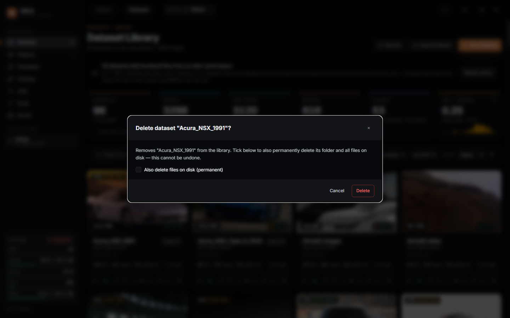
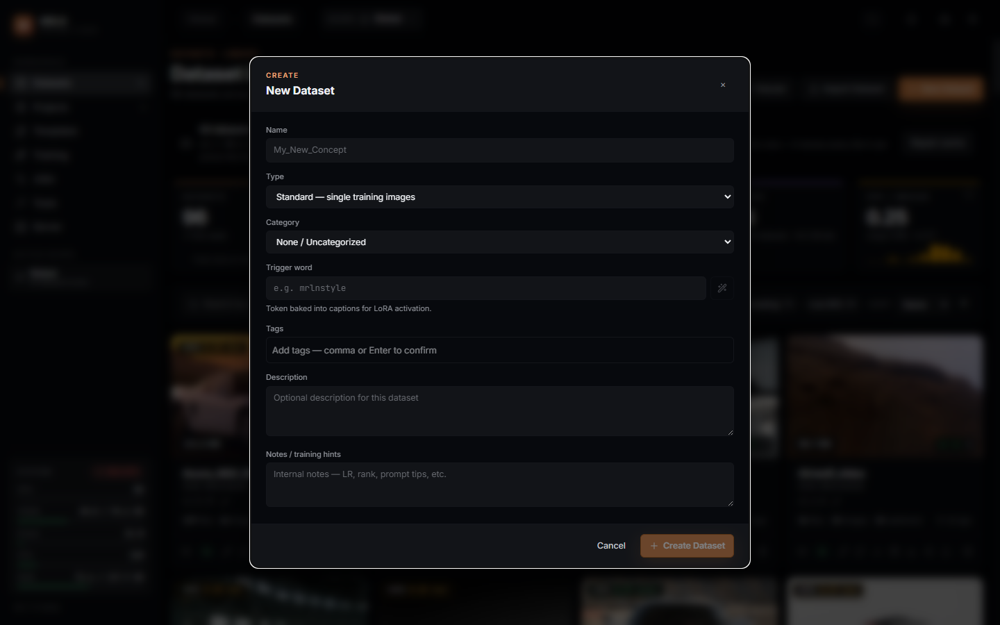
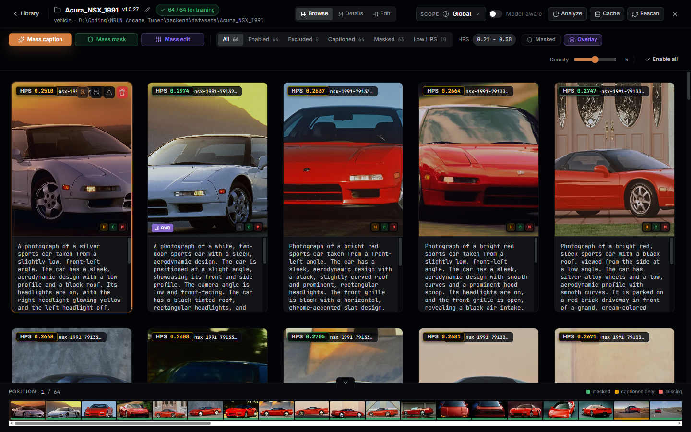
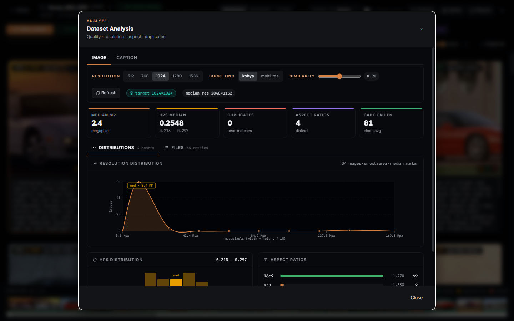
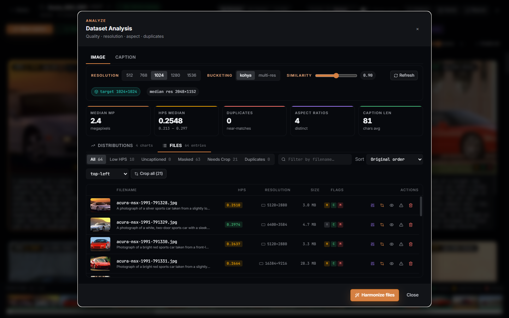
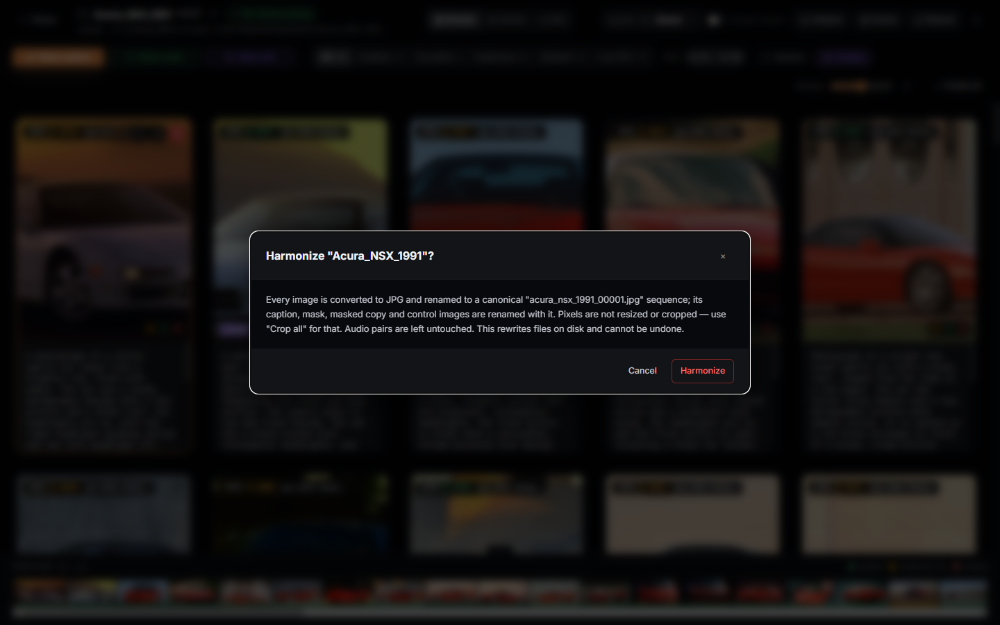
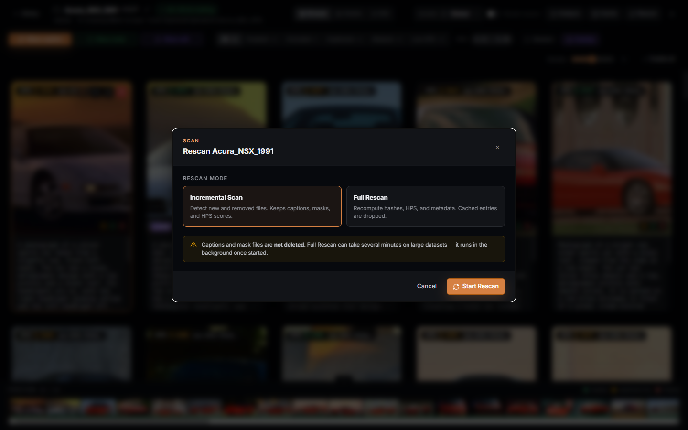
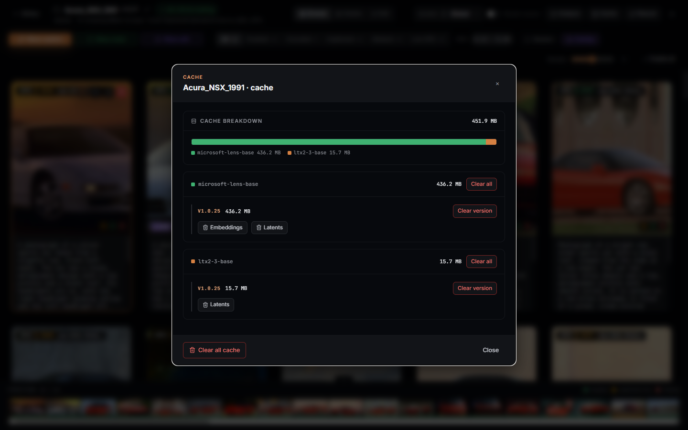
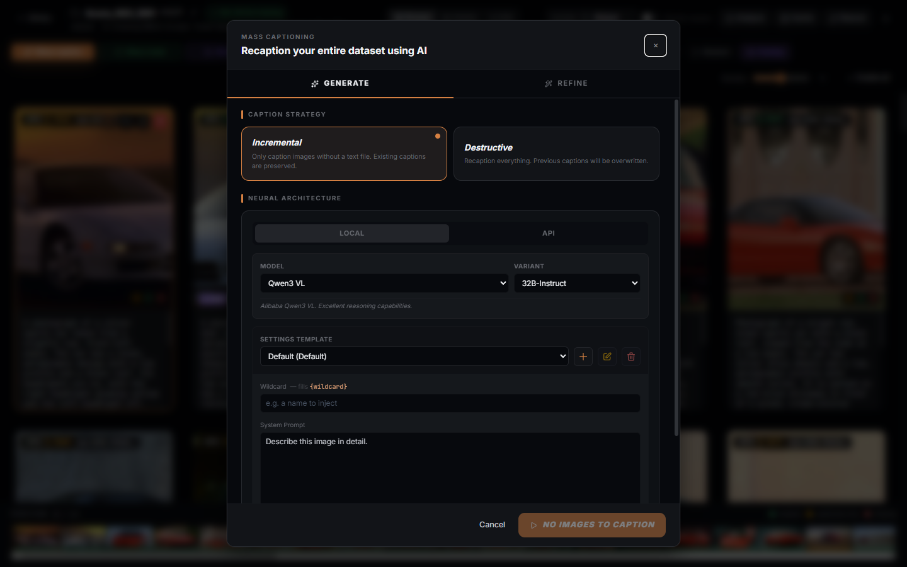

# Datasets

The Datasets tab is where every LoRA starts: bring images (or video, or audio)
into the app, caption them, mask them, score them, fix their color and crop,
and decide which ones are ready to train on. Nothing here touches your files
without telling you first — every operation that rewrites something on disk
says so, and the destructive ones ask you to confirm.

This guide covers the two screens that make up the Datasets tab (the
**Library**, where every dataset lives, and the **Workspace**, where you work
on one dataset at a time) and the modals reachable from both — captioning,
masking, cache administration, the Analyze panel, and the confirm dialogs
that guard anything permanent.

## What you can actually do with it

- Scan a folder of images (or a `.zip`) into a dataset, matching each image to
  its `.txt` caption automatically.
- Generate captions with a local vision model, an OpenAI-compatible API, or
  refine existing captions with a local LLM (Ollama) — one image or the whole
  dataset.
- Generate segmentation masks with SAM 3 (text-prompted) or remove backgrounds
  with RemBG, one image or the whole dataset.
- Apply non-destructive color and crop adjustments to one image and copy the
  same recipe onto many ("Mass edit").
- Harmonize a dataset's filenames and file format into a canonical sequence,
  and batch-crop every image to a shared target resolution.
- See where a dataset's quality, resolution and near-duplicates sit, per
  image, before you spend GPU time training on it.
- Track disk usage per model / version / cache type and clear exactly the
  slice you don't need anymore.

## The Library screen

Opens at `/datasets` (the app's default route). The header shows **Dataset
Library**, the dataset count and image count for the active scope, three view
buttons (grid density) and, when the library needs it, a **Repair cache**
button (see "Thumbnail cache repair" below).

### KPI rail

Six tiles, each aggregated over the datasets currently visible (scope +
search + filters all narrow this, so the tiles change as you filter):

- **DATASETS** — count in scope.
- **IMAGES** — total media files across those datasets.
- **CAPTIONED** — total files with a caption.
- **MASKED** — total files with a mask.
- **CACHED** — datasets with a training cache (latents / text embeddings) on
  disk. Its sub-line and the corner "calculating…" state come from
  `GET /datasets/cache/stats`, a whole-library disk sweep the backend answers
  once at startup; while it is running the tile honestly says "calculating"
  rather than showing a placeholder zero.
- **HPS — MEDIAN** — median HPSv2 quality score across visible datasets, with
  a mini-histogram and range. Scores cluster around 0.2–0.3; a score below
  0.27 counts as "low" everywhere in this screen (the Low HPS filter and the
  histogram tone both use that threshold).

### Search, filters and sort

The search box matches name, category, description, trigger word, notes and
tags — whatever you type is checked against all of those, not just the name.

Three smart filter chips appear only when they would match something in the
current scope: **Needs captioning** (at least one uncaptioned image),
**Needs masking** (at least one unmasked image), **Low HPS** (median score
below 0.27). The **+ Filter** picker adds category or tag chips on top of
those. Sort is Name / Created / Images / HPS, ascending or descending.

### Per-dataset card

Each card shows a cover thumbnail (served from a sized rendition, not the
full training source — the library never round-trips full-resolution images
just to draw a grid), an HPS badge, the dataset's total size on disk, three
readiness pills (**H**armonized / **C**aptioned / **M**asked, each with a
file-count tooltip), its name, category, version tag, and file/image/caption
counts with a "last scanned" timestamp.

A pinned cover (set from inside the workspace) survives a rescan and clears
itself automatically if the pinned file is ever deleted — you never see a
cover pointing at a file that no longer exists.

Hovering a card reveals its action row:

| Action | What it does |
| --- | --- |
| **Open workspace** | Opens the dataset for browsing/captioning/masking/editing (see below). |
| **Add to a project** | Links the dataset into a project without moving or copying files. |
| **Edit metadata** | Opens the dataset form (name, category, trigger word, tags, description, notes) pre-filled. |
| **Rescan files** | Opens the Rescan modal (incremental or full). |
| **Analyze dataset** | Opens the Analyze modal — distributions, near-duplicates, per-file table, Harmonize, Crop all. |
| **Cache administration** | Opens the Cache modal. Disabled ("No cache data") when the dataset has never been cached. |
| **Download as zip** | Streams a plain zip of the dataset's files. |
| **Export (portable zip + metadata)** | Opens the export-options modal — choose which extra data (captions, masks, templates) rides along, per group. |
| **Upload images to this dataset** | Adds files to the existing dataset (matches the same import path as drag-and-drop). |
| **Delete from library** | Opens the delete confirm (see below). Rewrites nothing until you confirm. |

Selecting one or more cards (the checkbox in the top-left corner) replaces
the per-card actions with a bulk bar: **Select all**, **Clear**, **Add to
project**, **Rescan** (each selected dataset gets an incremental/"safe"
rescan — bulk always uses the safe mode; a full rescan is a per-dataset
action only), and **Delete**.

### Delete — global scope vs. project scope

What "Delete" does depends on where you are. Inside a project scope it only
**removes the dataset from that project** — the dataset and its files are
untouched, and the confirm dialog says so.

In global scope, deleting opens one dialog with an opt-in checkbox instead of
a second confirmation click:

Left unticked, the dataset only disappears from the library (its folder and
files stay on disk — nothing is rewritten). Ticked, the folder and every file
in it are deleted permanently. **This is the one control in the Library
screen that destroys data outside the app's own database**, and the dialog's
wording reflects that.

### New Dataset / Import

**New Dataset** opens the dataset form to create an empty dataset (you add
files afterward). **Import Dataset** accepts a `.zip` either uploaded from
the browser or already sitting on the server's filesystem (path mode); on a
name collision it offers Rename or Overwrite instead of just failing.

#### Dataset form (Create / Edit)

| Field | Accepts | Notes |
| --- | --- | --- |
| **Name** | Letters, digits, space, `-`, `_` | Forbidden characters (`< > : " / \ | ? *`) are rejected inline; the sanitized name is also checked against existing dataset names so `"Foo (bar)"` and `"Foo bar"` are treated as the same folder name. |
| **Type** | Standard / Edit (paired) | Standard = single training images. Edit is for image-edit models (Kontext, Qwen-Edit): a `control/` folder holds the "before" image, matched by filename, and captions describe the edit rather than the subject. |
| **Category** | A standard list (vehicle / person / style / object / landscape), a previously-used category, or a typed custom one | Purely organizational — drives the "+ Filter" category chips. |
| **Trigger word** | Free text, or generated from the dataset name via the wand button | The token baked into captions for LoRA activation. |
| **Tags** | Free-form chips, comma or Enter to confirm | |
| **Description / Notes** | Free text | Notes are meant for training hints (LR, rank, prompt tips) — internal, not used by the trainer. |

### Thumbnail cache repair

If the library's thumbnail cache and the dataset files on disk disagree (a
rename the cache never followed, files removed outside the app), a banner
reports the affected dataset and byte counts. Its **Repair cache** action
adopts renames it can prove (a byte-identical file at a new path) and only
deletes the entries it cannot reconcile — it does not touch your source
images.

## The Workspace

Opened from a dataset's **Open workspace** action, or by clicking a card.
It is an overlay on top of the Library (closing it returns you to the same
scroll position), not a separate route.

The top bar shows the dataset's name, version (click the version tag to bump
the MAJOR version; the pencil opens a manual version editor), and a
"ready for training" count when the active model definition can tell you one.
To its right: the project-membership pill, the active project/model-context
switcher, and — always available regardless of mode — **Analyze**, **Cache**
(disabled with "No cache data" until the dataset has been cached once) and
**Rescan**. Edit-kind (paired) datasets also get a **Pairs** button (control/
target pairing health and manual re-match).

### Browse / Details / Edit modes

A segmented control switches the workspace body between three modes:

- **Browse** — the dataset as a grid (density-adjustable, 3–7 columns) with
  per-image caption editing inline, mass-action buttons, filter chips and a
  filmstrip at the bottom.
- **Details** — a single-image, larger view (loaded lazily) for closer
  caption/mask editing and per-image trim controls.
- **Edit** — the per-image, non-destructive adjustment pipeline (loaded
  lazily): stacked `.cube` LUTs, per-channel Bézier curves and per-range HSL
  adjustments. Nothing here is written until you export or run Mass edit /
  Harmonize / Crop all — edits are recipes, not in-place pixel writes, until
  one of those explicit actions applies them.

### Browse-mode toolbar

- **Mass caption**, **Mass mask**, **Mass edit** — open the corresponding
  batch modal (below).
- For datasets containing video: **Cut list** (split a video into clips from
  an imported cut list) and **Scene detect** (auto-detect cuts and split),
  plus a clip-health chip that reports frame-rule warnings per clip.
- Filter chips: **All / Enabled / Excluded / Captioned / Masked / Low HPS**,
  each with a live count.
- **Masked** / **Overlay** toggles — swap the grid to show masked images (or
  edited overlays) instead of originals. Disabled when the dataset has none.
- **Density** slider (3–7 columns) and **Enable all** (re-includes every
  excluded image — excluding an image keeps it in the dataset but skips it at
  training time; this is the bulk undo for that).

### Filmstrip

A scrubber along the bottom of the workspace, color-coded per image
(masked / captioned-only / missing), for jumping directly to any image's
position without scrolling the grid.

## Modals reachable from the Workspace

### Analyze

Opened via the **Analyze** button (top bar) or a card's **Analyze dataset**
action. Two tabs:

**Distributions** — resolution and aspect-ratio breakdowns, an HPS
histogram, and near-duplicate clusters (adjustable similarity threshold,
default 0.90). Bucketing controls (resolution 512/768/1024/1280/1536,
Kohya-bucket vs. multi-resolution mode) drive which crop targets the
"needs crop" flag and Crop-all compute against.

**Files** — every image as a row: resolution, orientation, HPS, caption
preview, flags, with its own filter chips (All / Low HPS / Uncaptioned /
Masked / Needs Crop / Duplicates), search-by-filename and sort. Per-row
actions: view near-duplicates, open the per-image adjust editor, open detail,
delete, or open the crop-preview modal for that one image.

Two destructive batch actions live here, both behind a confirm dialog and
both queued as a background task you can watch progress on:

- **Harmonize files** — converts every image to JPG and renames the whole
  dataset (plus captions, masks, masked copies and control images) to a
  canonical `<dataset>_00001.jpg` sequence. **It does not resize or crop
  pixels** — that is what Crop all is for. Audio pairs are left untouched.

  

- **Crop all** — crops every image the analysis pass flagged as needing it to
  its target resolution, from a chosen anchor (default: center). This is the
  one action that resizes pixels; Harmonize deliberately does not.

Both dialogs say, in the same sentence, that the action **rewrites files on
disk and cannot be undone** — read the message before confirming, since this
is exactly the least-discoverable, most-destructive corner of the product the
Analyze panel guards.

### Rescan

Opened via the **Rescan** button or a card's **Rescan files** action.

Two modes:

- **Incremental Scan** ("safe") — detects new and removed files; keeps
  captions, masks and HPS scores.
- **Full Rescan** — recomputes hashes, HPS and metadata; cached entries
  (latents / text embeddings) are dropped and will be rebuilt at next
  training. Captions and mask files are never deleted by either mode. Full
  Rescan can take several minutes on a large dataset and runs as a background
  task — closing the modal does not cancel it.

### Cache administration

Opened via the **Cache** button/action (disabled when the dataset has no
cache yet).

Shows disk usage broken down by **model → version → cache type**
(`.cache/{model}/{version}/{type}/…` on disk — latents, text-embeddings te1,
te2, etc.), so you can clear exactly the version or type you no longer need
instead of wiping the whole `.cache/` folder. Every purge is behind its own
confirm dialog and cannot be undone — the cache rebuilds automatically the
next time you train or analyze, just not for free.

### Mass caption

Opened via the workspace's **Mass caption** button.

Two tabs:

- **Generate** — pick a local vision model or an OpenAI-compatible API
  provider, its common parameters (temperature, top-p, max tokens — the exact
  set of extra parameters depends on the model you pick, since each captioning
  model defines its own schema), an optional system prompt and custom
  instructions, then run over the whole dataset (or just the images still
  missing a caption, depending on the strategy you choose — keep vs.
  overwrite). Progress is a background task with live per-image status.
- **Refine** — rewrite *existing* captions with a local LLM via Ollama.
  Presets: `standardize` and `synonym_merge`; style is auto (derived from the
  active model's text encoder — CLIP/SDXL-style models get tag-style
  captions, T5/large-context models get natural language) or an explicit
  override (natural language / tags). Requires Ollama reachable — the modal
  says so plainly when it isn't.

### Mass mask

Opened via the workspace's **Mass mask** button. Three tabs: **Generate**
(SAM 3 — text-prompted concept, multi-mask output toggle, hole-fill and
noise-removal area thresholds; or RemBG — model variant from a fixed list,
post-process smoothing, optional alpha matting with foreground/background
thresholds), **Apply** (apply an already-generated mask set), and **Caption**
(caption the *masked* images specifically — writes to a separate
`masked_captions/` target so it never overwrites the original captions).

### Mass edit

Opened via the workspace's **Mass edit** button, or from a single image's
adjust editor. Lets you pick one image whose non-destructive adjustment
recipe (LUT / curves / HSL) you want to clone, then apply that exact recipe
to many target images in one batch. This is how a color-grade you tuned on
one photo gets applied consistently across a dataset without re-tuning it
per image.

## Recipes

**Bring in a folder of photos and get them training-ready.** New Dataset →
name it → drag the folder in (or Upload images) → Open workspace → Mass
caption (Generate) → Mass mask (Generate, if the model family needs masks) →
Analyze to check HPS/resolution/duplicates before you train.

**Fix a dataset with mixed filenames and mixed resolutions.** Analyze →
Harmonize files (renames + normalizes format, does not touch pixels) → Crop
all (resizes to the bucket target) — in that order, since Harmonize's
canonical names are what the crop-target lookup and Analyze's Files tab key
off afterward.

**Clear disk space without losing work.** Cache administration → clear the
specific model/version/type you no longer train against. Captions and masks
are never touched by a cache purge; only the trainer's derived latents/text
embeddings are, and they regenerate automatically.

## What survives an update

Captions, masks, tags, categories, trigger words, notes, dataset version
numbers and pinned covers are stored in the app's own database and dataset
folders — an app update never touches them. A **Full Rescan** intentionally
drops the training cache (latents/text embeddings), which is expected to
regenerate; it never drops captions or masks.

## Where things live

Each dataset is a folder under the app's `datasets/` directory, named after
its sanitized dataset name. Captions live beside their images as `.txt`
files (or under a `captions/<definition>/` folder when a caption is tied to a
specific model-family variant rather than the general one). Masks, masked
captions, control images (for Edit-kind datasets) and the training cache each
have their own subfolder inside the dataset directory — nothing here reaches
outside the dataset's own folder.
